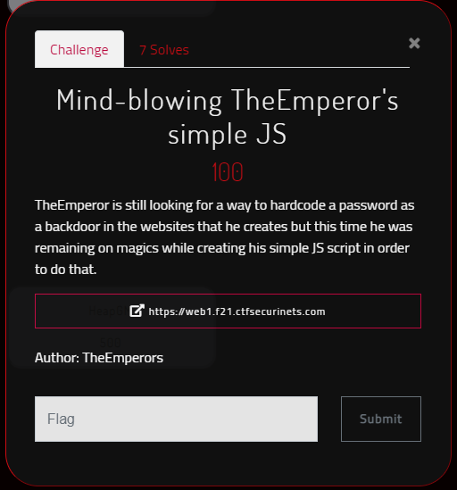
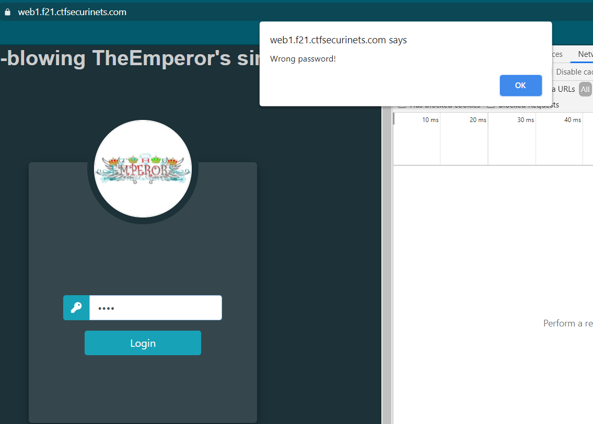
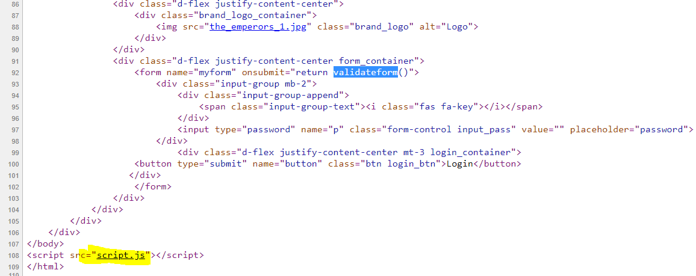
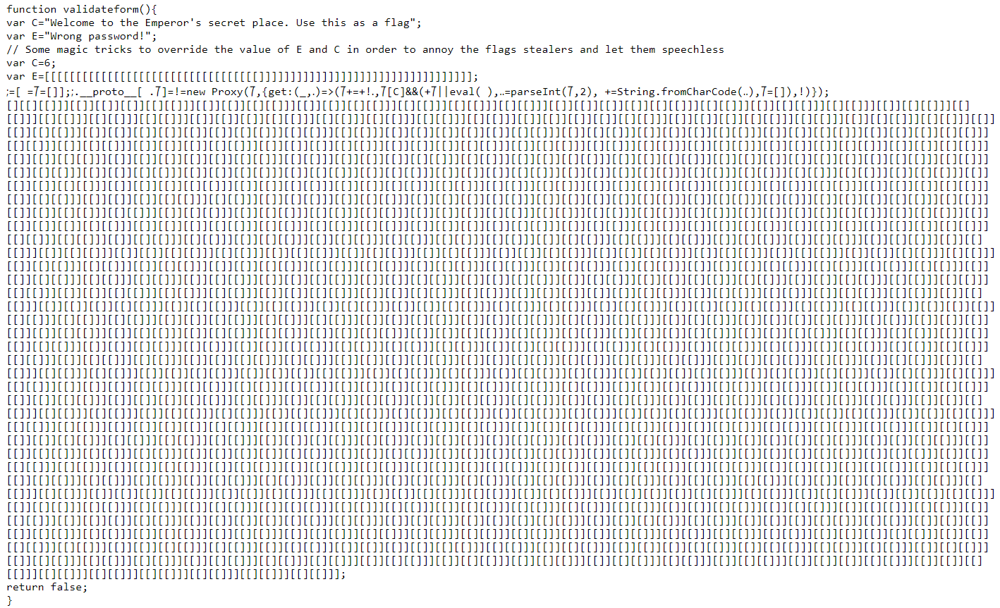
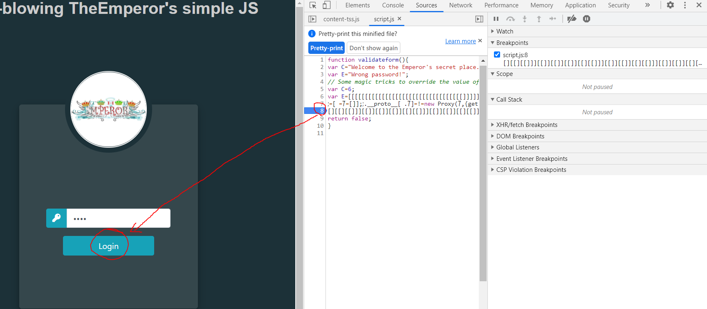
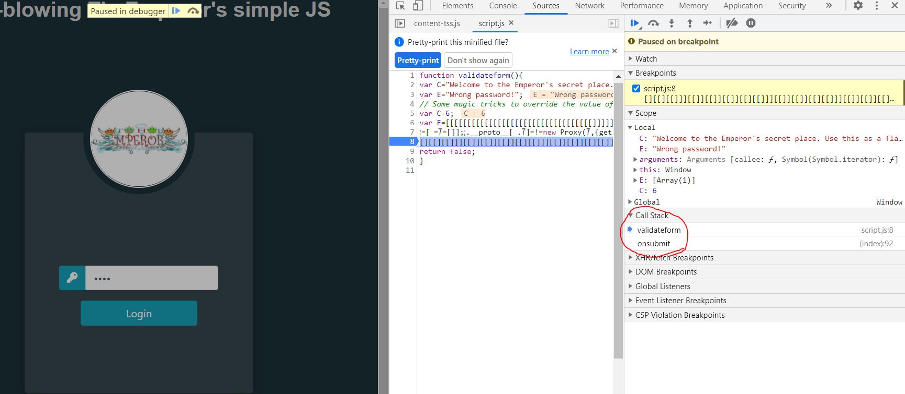
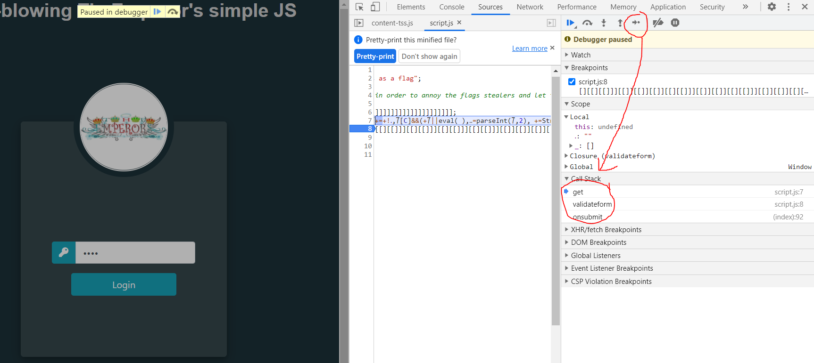
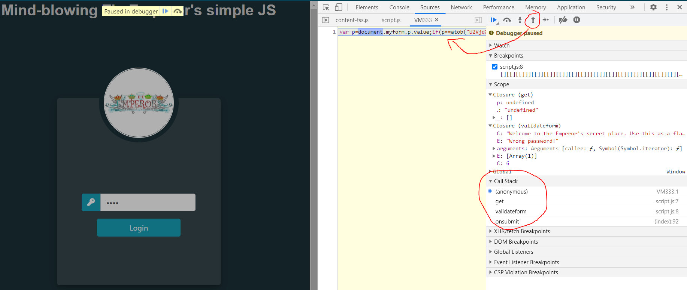
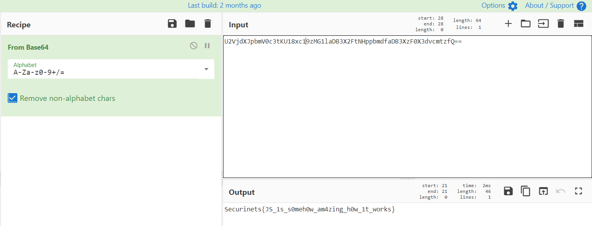

<p align="center">

</p>

# CTFSecurinets Quals 2021 Writeup
This repository serves as a writeup for CTFSecurinets Finals 2021

## Bypass TheEmperor's Guards

**Category:** Web
**Points:** 100
**Solves:** 7
**Author:** TheEmperors
**Description:**

>TheEmperor is still looking for a way to hardcode a password as a backdoor in the websites that he creates but this time he was remaining on magics while creating his simple JS script in order to do that.

>Link: https://web1.f21.ctfsecurinets.com/

**Hint:**

> No hint.

<p align="center">

</p>

### Write-up
When you visit the task page, you will get this page

<p align="center">

</p>

When we try to submit the form with a dummy password we get the following error popup

<p align="center">

</p>

When we look at the source code we can see a form that needs to be validated and there is a Javascript function that is responsible for this task. We can see also a script.js file included there:

<p align="center">

</p>

When we look at that JS file, we can confirm that this is really the script that we need:

<p align="center">

</p>

But the code seems to be a lot difficult. Well it's possible to understand it if we try harder but we'll be looking for the easy solution here which is by debugging the code's execution

<p align="center">

</p>

We set the breakpoint in the line 8 then we submit the form and we can see that we're inside the validationform() function from the Call Stack:

<p align="center">

</p>

But there is still no flag. We keep moving instruction by instruction:

<p align="center">

</p>

However, even if we move hundred of steps, we can't reach the end of the execution. But since we're inside the get(), we can exit the child stack call and move to the parent function:

<p align="center">

</p>

And that's how we get the code which is:

```
var p=document.myform.p.value;if(p==atob("U2VjdXJpbmV0c3tKU18xc19zMG1laDB3X2FtNHppbmdfaDB3XzF0X3dvcmtzfQ=="))alert(C);else alert(E);
```

So, we need to fulfill that condition and the password needs to be equal to the btoa("U2VjdXJpbmV0c3tKU18xc19zMG1laDB3X2FtNHppbmdfaDB3XzF0X3dvcmtzfQ==") which we can get it from any base64 decoder tool:

<p align="center">

</p>

So, the flag is ``Securinets{JS_1s_s0meh0w_am4zing_h0w_1t_works}``
___
