<p align="center">

</p>

# CTFSecurinets Quals 2018 Writeup
This repository serves as a writeup for CTFSecurinets Quals 2018

## IRC

**Category:** Misc
**Points:** 50
**Author:** CTF Team
**Description:**

>Join the IRC chat! You will find your lovely flag waiting for you.

**Hint:**

>The link to joining the IRC tab ;) Make sure you read the info channel.

<p align="center">
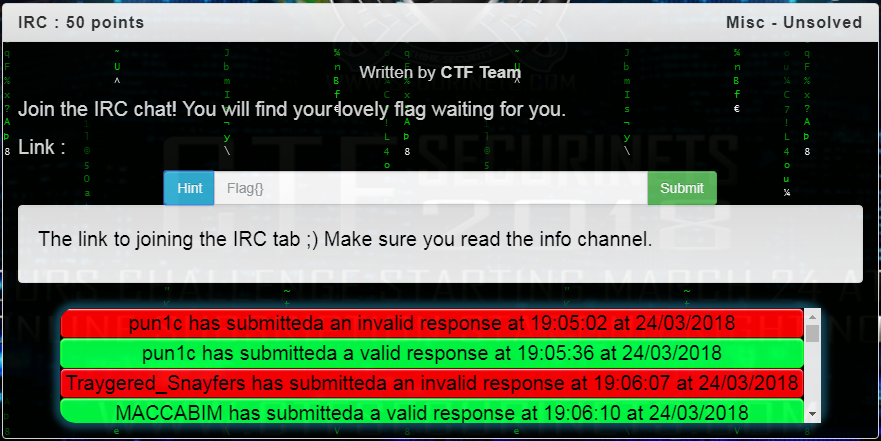
</p>

### Write-up
You have to join the IRC channel by clicking the IRC tab and then connecting to the [https://www.ctfsecurinets.com/irc](#ctf_securinets channel) to find the flag in the description.
<p align="center">
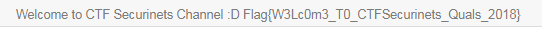
</p>

So the flag is : ```Flag{W3Lc0m3_T0_CTFSecurinets_Quals_2018}```.

___


## Service Hidden in the bush

**Category:** Network
**Points:** 200
**Author:** TheEmperors
**Description:**

>The Emperors wanted to hide their secret in a location where they can read it quickly, But they don't know anything about Security. Try to expose it: net1.quals18.ctfsecurinets.com

**Hint:**

>If this task will be absused by any of the teams, the flag will be published here !


<p align="center">
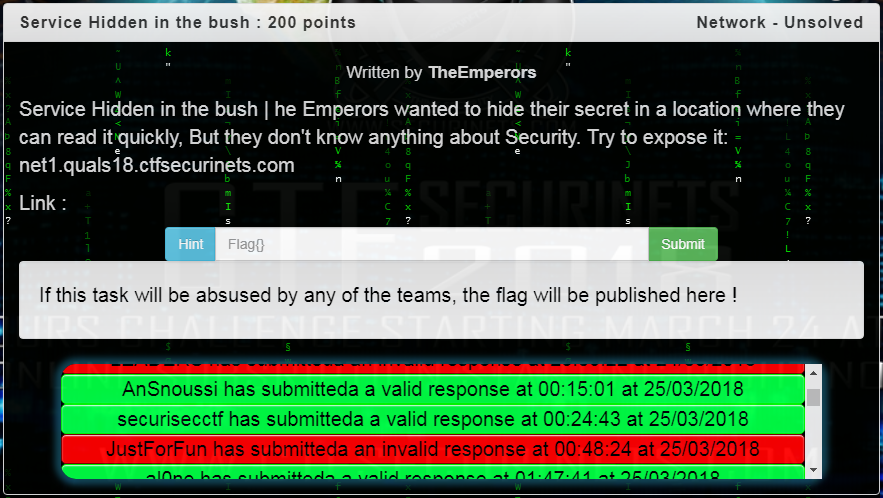
</p>

### Write-up
The name of the task contains the word service. And it's a network task. It seems that there is a network scan searching for a service.

To do that, we have to use a tool that scan the domain name ports to find out which service is.

So we have to launch a detailed scan targetting only the port discovery:

```
nmap net1.quals18.ctfsecurinets.com -p 1-20000
```

Output :
```
Nmap scan report for net1.quals18.ctfsecurinets.com (34.245.183.111)
Host is up (0.015s latency).
rDNS record for 34.245.183.111: ec2-34-245-183-111.eu-west-1.compute.amazonaws.com
Not shown: 11976 closed ports
PORT      STATE    SERVICE
22/tcp    open     ssh
445/tcp   filtered microsoft-ds
11211/tcp open     unknown

Nmap done: 1 IP address (1 host up) scanned in 2038.91 seconds
```

<p align="center">
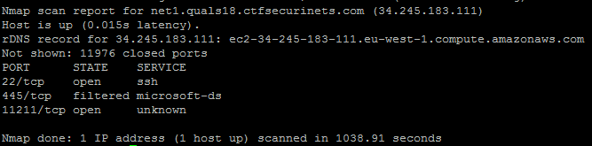
</p>

It shouldn't be SSH service.

Microsoft-ds ? Maybe. Bu what's that unknown service listening in the 11211/TCP port ?

After Googling it, we find out that Memcached is a cache service which listen on that port. And knowing that the title of the task is Service Hidden in the bush, we can understand that "hidden" means "caching". So maybe we can ignore that microsoft-ds service actually.

Let's try to netcat it:

```
netcat net1.quals18.ctfsecurinets.com 11211
```

No output, be we authenticated successfully without credentials. It's logic because cache servers doesn't needs credentials. But this service is exposed in a public network.

Let's try to dump the 100 first keys:

```
stats cachedump 1 100
```

Output :
```
ITEM flag [23 b; 1521997883 s]
END
```

Excellent ! Now let's dump that flag item:

```
get flag
```

Output :
```
Flag{M3mc4cH3d_3xp0s3d}
END
```

So the flag is : ```Flag{M3mc4cH3d_3xp0s3d}```.

___


## The worst RSA Joke

**Category:** Crypto
**Points:** 350
**Author:** TheEmperors
**Description:**

>The Emperors heard that the biggest weakness of RSA is when the attacker try to factorize the public modulous. That's why they ordered their security team to create pair keys using a single strong (big) prime modulous. Then, they started sending the first secret information. Given the public key and the ciphertext, can you decrypt the message ?
>Link : [resources/crypto-350-the_worst_rsa_joke/RSA_Worst_Joke.tar.gz](http://crypto.ctfsecurinets.com/2/RSA_Worst_Joke.tar.gz)

**Hint:**

>Learn about RSA.

<p align="center">
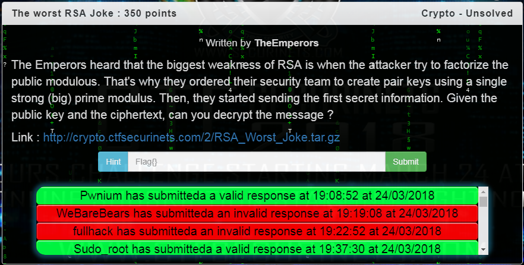
</p>

### Write-up

#### Understanding the problem

RSA is an asymmetric cryptography algorithm that require a public key (the modulus `n=p*q` and the public exponent `e`) and a private key (the modulus `n=p*q` and the private exponent `d`). 

But looking at the description, TheEmperors changed premises of this algorithm: the modulus `n` will not be the multiplication operation of the prime numbers `p` and `q` (`n=p*q`).

Instead, the modulus `n` will be a single prime `n=p`.

Wait ... What ?? But how the decryption process will be ?

The [encryption/decryption Operaion](https://en.wikipedia.org/wiki/RSA_(cryptosystem)#Encryption) will not change:

```
m = plaintext
public_key = (n,e)
private_key = (n,d)
c = ciphertext
encryption(public_key,m) = ciphertext
decryption(private_key,c) = plaintext
Encryption : c ≡ (m^e) (mod n)
Decryption : m ≡ (m^d) (mod n)
```

But when the modulus `n` change, the private modulus `d` will change.

The private modulus cas be extracted from this expression `d*e ≡ 1 (mod Φ(n))`; (the most important expression in RSA) where `Φ` is Euler's Totient function.

So, `d ≡ e−1 (mod Φ(n))`; where `d` is the modular multiplicative inverse of e (modulo λ(n)).

And to determine `Φ(n)`, we start using this expression : `Φ(n) = Φ(p*q) = Φ(p)*Φ(q) = (p−1)*(q−1)`.

When `n=p` instead of `n=p*q`, `Φ(n) = Φ(p) = Φ(p) = (p−1)`. Because there is no `q` and `p` is prime.

But ... As we know, `d` is the private exponent that no one should know it and it's calculated from `n`, `e` and `Φ(n)` which we know them all.

So we can regenerate the private key from any private key if `n=p`. That's what TheEmperors calls ***The single prime modulus attack***.

You can find here more detail about [How RSA works with examples](http://doctrina.org/How-RSA-Works-With-Examples.html).

#### Defining the goal

Now, you have the public key, you can extract the modulus `n=p` and the public exponent `e`.

You have also the ciphertext `c` and you need to decrypt it using the private key.

So from n, we calculate `Φ(n)=p-1`. Then, we calculate `d ≡ e−1 (mod Φ(n))`. And we get the private key with the modulus `n=p` and the private exponent `d`.

And finally we decrypt the ciphertext `c` using the private key.


#### Coding

In python, we can perform encryption using the public key from `Crypto.PublicKey` library while the encryption method is based on `(n,e)` (the public key is generated from (n,e)).

We can also calculate `Φ(n)` and `d`. But when we generate the private key, we have to provide `(n,e,d,p,q)`. And the decryption can't be performed with this library because we tricked the modulus `n`.

So, we have to skip using the `Crypto.PublicKey` library to create our custom decryption method in this [python script](resources/crypto-350-the_worst_rsa_joke/RSA_Worst_Joke/solve.py).


#### Execution

Let's execute this script :

```
chmod +x solve.py
./solve.py
```

Output:
```
public key: (MOD: 36511974694593690272644354864534934200522045623187752384823594729275730789191680514905027084950729514148679507005058047146031869995768765034876499069680202424692876360895377987654388335335689563844006584610187090074654410815638237841872991488680663410743679302763304922852173164820002226109196761249018548478251723505481964749218302723593776180246783117481280725673997940309717028451914887375722437833384305529884261542397905220138488012276363046571670926597766521674838665982314321651508118240682649024780239598188845543243957916954287138820155843952556411235376764737602711594439293285811102883736229645274092478611, E: 65537)
private key: (MOD: 36511974694593690272644354864534934200522045623187752384823594729275730789191680514905027084950729514148679507005058047146031869995768765034876499069680202424692876360895377987654388335335689563844006584610187090074654410815638237841872991488680663410743679302763304922852173164820002226109196761249018548478251723505481964749218302723593776180246783117481280725673997940309717028451914887375722437833384305529884261542397905220138488012276363046571670926597766521674838665982314321651508118240682649024780239598188845543243957916954287138820155843952556411235376764737602711594439293285811102883736229645274092478611, D: 6247543894672835844140467147579149978251281255144841162143701898074340373681973622444496600861154474139238781017665150078514448176336282269574516083546604055579381349635789992730157175220935086576234643633651800175430284616118638313605501114699558409571381352536547315331252115145513297276172734190556388034776001760692048044581443257127738622233050427688711446323576192114884214368368609289887413489533722968889667042074707556626531647308652138551577242944708390284291938909710130201260540426797308789903193720403584447288367549334351221061831143233348606063651296821146479207471233576561113687508095873202979584893)
Plaintext (from base64): The empire secret system has been exposed ! The top secret flag is : Flag{S1nGL3_PR1m3_M0duLUs_ATT4cK_TaK3d_D0wn_RSA_T0_A_Sym3tr1c_ALg0r1thm}
```

So the flag is : ```Flag{S1nGL3_PR1m3_M0duLUs_ATT4cK_TaK3d_D0wn_RSA_T0_A_Sym3tr1c_ALg0r1thm}```.

You can find here the full python script (encryption and decryption) of the [**The single prime modulus attack**](resources/crypto-350-the_worst_rsa_joke/create_task.py)
___


## Looser

**Category:** Crypto
**Points:** 150
**Author:** Anis_Boss
**Description:**

>Can you help me recover the picture ?
>Link : [resources/crypto-150-looser/flag.png.crypt](http://crypto.ctfsecurinets.com/0/flag.png.crypt)

**Hint:**

>No hint

<p align="center">
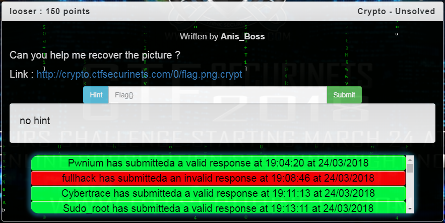
</p>

### Write-up
This file was a PNG file but now it's encrypted. And as we know, the header of image files having the same file extension are similar.

Let's compare the two first line of the hexdump of two normal PNG files:

```
diff <(hexdump -C file1.png | head -n2)  <(hexdump -C file2.png | head -n2)
```

Output:

```
0a1,2
> 00000000  89 50 4e 47 0d 0a 1a 0a  00 00 00 0d 49 48 44 52  |.PNG........IHDR|
> 00000010  00 00 01 f4 00 00 01 82  08 06 00 00 00 16 ad 31  |...............1|
```

This means, the first line may be the same in PNG files.

Let's create [resources/crypto-150-looser/key_extract.sh](a script that extract the xor key from the first line of an encrypted file and a normal file) (out of this task)

```
chmod +x key_extract.sh
./key_extract.sh
```

Output :

```
eeeeeeeeeeeeeeeeeeeeeeeeeeeeeeeeeeeeec3aeeeeed34eeeeeeeeee62
```

This is the hexadecimal representation of the key. It seems like the key is ```0xee```.

So let's decrypt the flag file right now [resources/crypto-150-looser/solve.sh](using this script) :

```
chmod +x solve.sh
./solve.sh
```

You will find the flag.png waiting for you.

<p align="center">

</p>

So the flag is : ```Flag{Hopefully_headers_are_constants}```.


___


# Scoreboard

This is the scoreboard and the rankin for the 100/216 teams that they solved at least one task in this CTF :

Summary:

<p align="center">
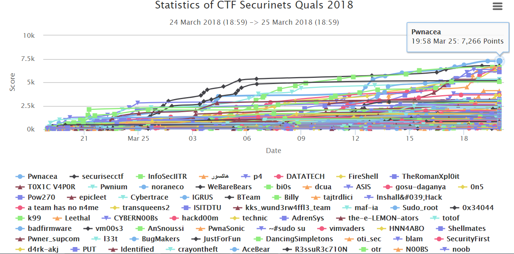
</p>
<p align="center">
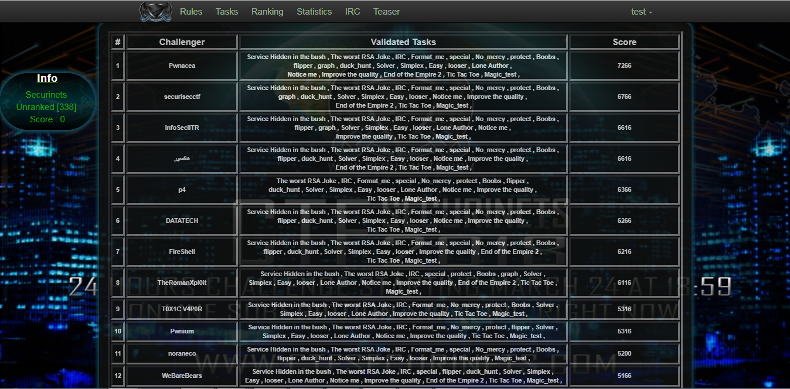
</p>

Detailed :

<p align="center">
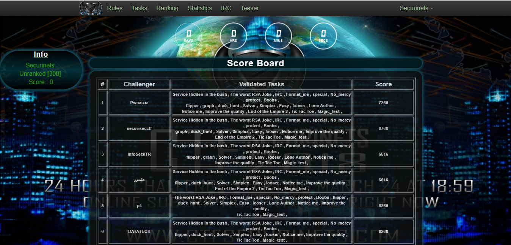
</p>
<p align="center">
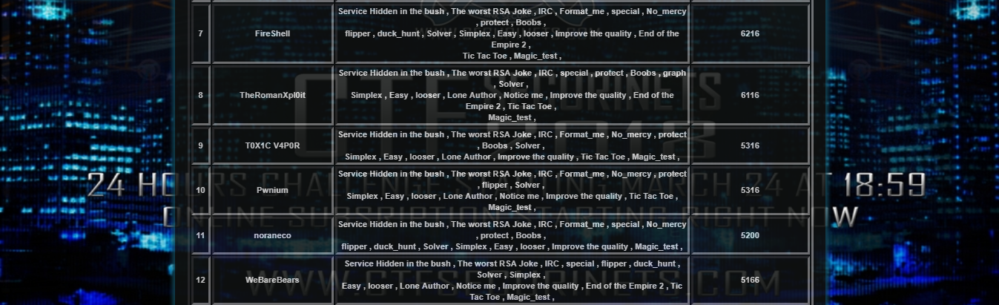
</p>
<p align="center">
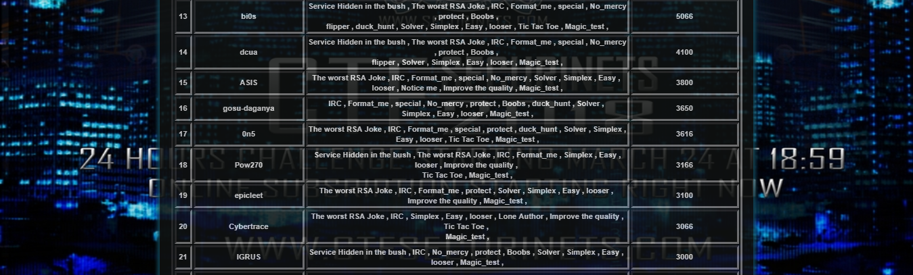
</p>
<p align="center">
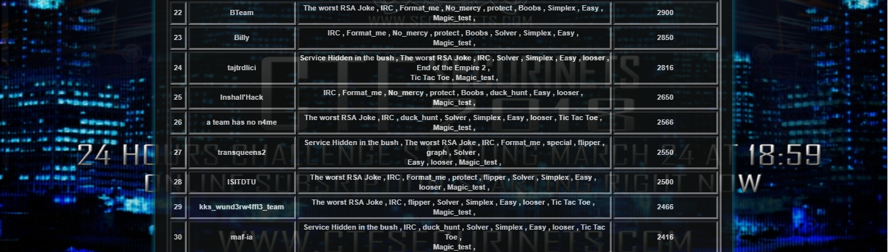
</p>
<p align="center">
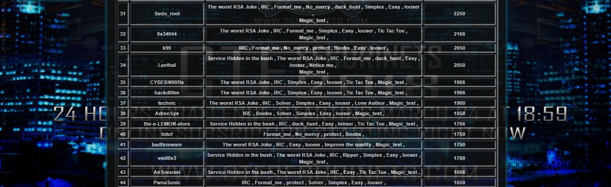
</p>
<p align="center">
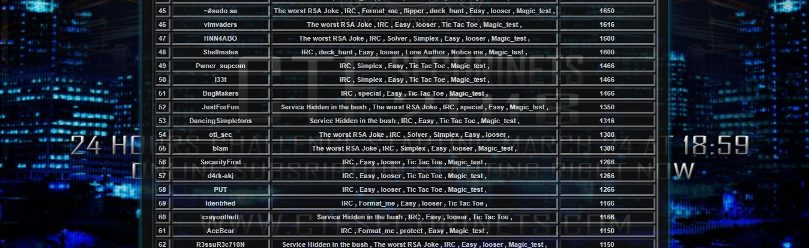
</p>
<p align="center">
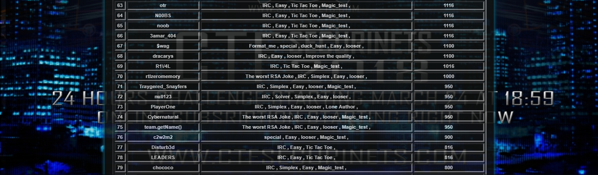
</p>
<p align="center">
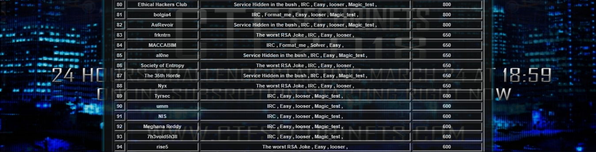
</p>
<p align="center">

</p>

If you need the Json file of the scoreboard, you can find it [scoreboard/jsonAdvanced.json](here)

