<p align="center">

</p>

# EasyCTF_V Writeup
This repository serves as a writeup for EasyCTF_V solved by TheEmperors's team

## Discord

**Category:** Misc
**Points:** 1
**Description:**

>Join the Discord chat! Maybe if you use it enough, you'll find the flag.

**Hint:**

>The link to joining the Discord is on our Updates page ;) Make sure you read the info channel.

<p align="center">
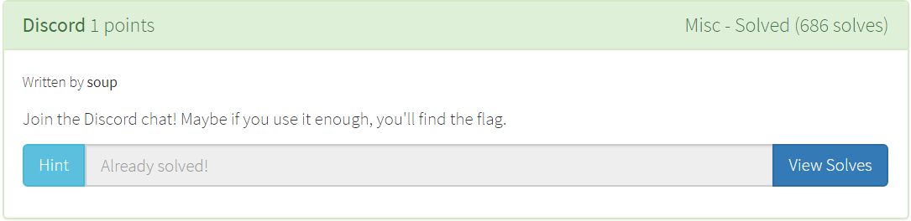
</p>

### Write-up
We joined the Discord #general channel related to the CTF and we saw the flag in the top of the page with the channel description
<p align="center">

</p>

So the flag is : ```easyctf{Is_this_really_a_D1sc0rd_fl4g?}```.

___


## Intro: Hello, world!

**Category:** Intro
**Points:** 10
**Description:**

>Using your favorite language of choice, print Hello, world! to the output.
> * For Python, consider the print function.
> * For Java, consider System.out.println.
> * For CXX, consider including stdio.h and using the printf function.

**Hint:**

>If you're not sure how to do this, try searching Google for how to make "Hello world!" programs in your language of choice.

<p align="center">

</p>

### Write-up
Using Python2

```python
print "Hello world!"
```
___


## Intro: Linux

**Category:** Intro
**Points:** 10
**Description:**

>Log into the shell server! You can do this in your browser by clicking on the Shell server link in the dropdown in the top right corner, or using an SSH client by following the directions on that page.
>Once you've logged in, you'll be in your home directory. We've hidden something there! Try to find it. :)

**Hint:**

>(no hint)

<p align="center">
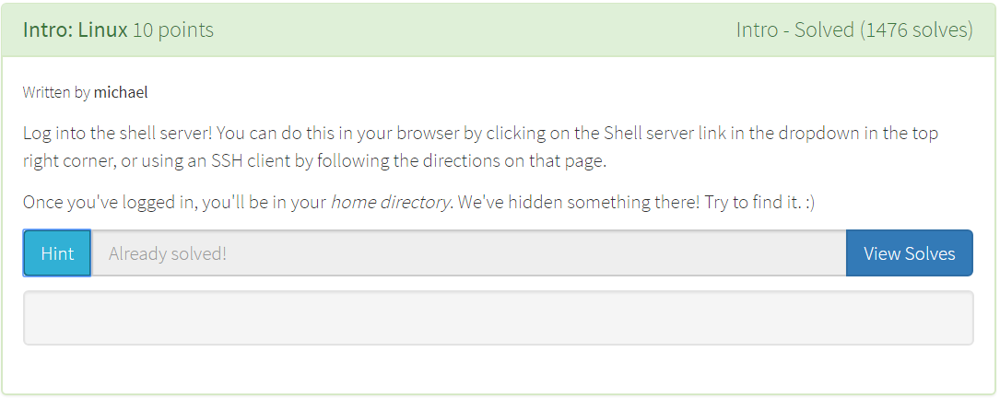
</p>

### Write-up
We should visit the [Shell Server](https://www.easyctf.com/chals/shell) section and connect to the remote server using our credentials or we just need to execute this command in a linux terminal:

```
ssh user666@s.easyctf.com
```

Then, we execute this command to list all the files located on our home directory:

```
ls -lA
```

Output:
```
user666@shell:~$ ls -lA
total 1
-rw-r--r-- 1 user666 ctfuser    41 Feb  7 13:41 .flag
```

We found the flag file. So we show its content using this command:

```
cat .flag
```

Output:
```
user666@shell:~$ cat .flag
easyctf{i_know_how_2_find_hidden_files!}
```

So the flag is : ```easyctf{i_know_how_2_find_hidden_files!}```.

___


## The Oldest Trick in the Book

**Category:** Intro
**Points:** 10
**Description:**

>This is literally one of oldest tricks in the book. To be precise, from the year AD 56.
>Crack me. ```lhzfjam{d3sj0t3_70_345fj7m_799h21}```

**Hint:**

>Et tu, Brute?

<p align="center">
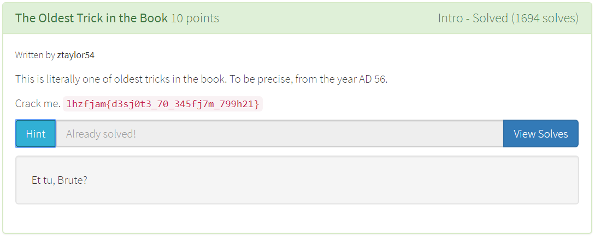
</p>

### Write-up
The flag format is easyctf{...} and we can see lhzfjam{...}. So it may be a caesar cipher.
We try to brute force it 26 times and we can easily find the flag in 19th rotation.

So the flag is: ```easyctf{w3lc0m3_70_345yc7f_799a21}```
___


## Intro: Web

**Category:** Intro
**Points:** 10
**Description:**

>The web goes well beyond the surface of the browser! Warm up your web-sleuthing skills with this challenge by finding the hidden flag on [this page](https://cdn.easyctf.com/328f49c7ab7b65a75c9e274f066435c6fe7fb0f207172a82da971348a7f05aec_index.html)!

Source code of this task: [here](resources/intro-10-web/index.html)

**Hint:**

>Not sure where to look? Try looking up 'source code', specifically related to web pages.

<p align="center">
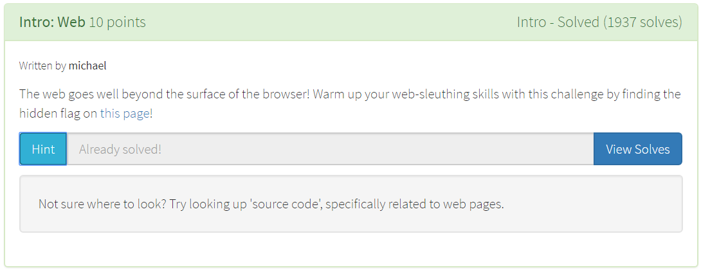
</p>

### Write-up
In this task the flag is not visible in the page:
<p align="center">

</p>
So we inspect the source code :
<p align="center">

</p>
And there we find the flag : ```easyctf{hidden_from_the_masses_11a8b2}```

___


## Soupreme Encoder

**Category:** Cryptography
**Points:** 20
**Description:**

>Decode this ```68657869745f6d6174655f3432386533653538623765623463636232633436```

**Hint:**

>It's encoded!

<p align="center">

</p>

### Write-up
It looks like a hex code.
Decoding it from hex to ascii, the plain text is: hexit_mate_428e3e58b7eb4ccb2c46
So the flag is: ```easyctf{hexit_mate_428e3e58b7eb4ccb2c46}```
___


## Intro: Netcat

**Category:** Intro
**Points:** 20
**Description:**

>I've got a little flag for you! Connect to ```c1.easyctf.com:12481``` to get it, but you can't use your browser!
>(Don't know how to connect? Look up TCP clients like Netcat. Hint: the Shell server has Netcat installed already!)
>Here's your player key: ```3770529```. Several challenges might ask you for one, so you can get a unique flag!

**Hint:**

>(No hint)

<p align="center">
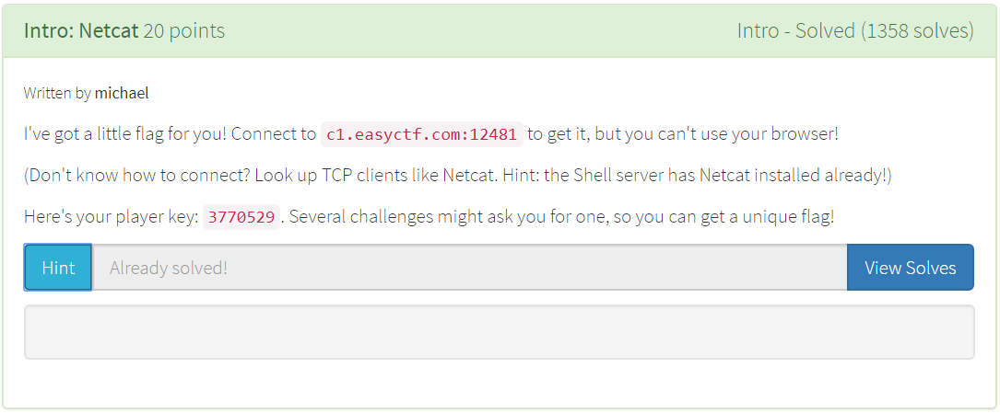
</p>

### Write-up
Just try to connect to that address using netcat in your shell terminal:

```
nc c1.easyctf.com 12481
```

Output:
```
enter your player key:
```
So you should provied the key:
```
enter your player key: 3770529
```

Output:
```
thanks! here's your key: easyctf{hello_there!_C06DFE0d60723Bec}
```

So the flag is : ```easyctf{hello_there!_C06DFE0d60723Bec}```
___


## Intro: Hashing

**Category:** Miscellaneous
**Points:** 20
**Description:**

>Cryptographic hashes are pretty cool! Take the SHA-512 hash of [this file](resources/miscellaneous-20-hashing/image.png), and submit it as your flag.

**Hint:**

>Try searching the web to find out what SHA-512 is.

<p align="center">
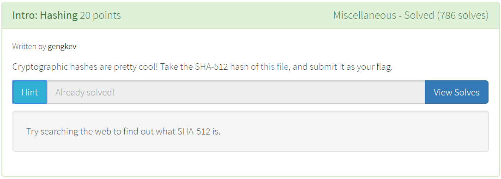
</p>

### Write-up
Just hash that file using an online tool : ```ce53d733c0d7738c7a390c21ef65e8b4746795d6d6c2b8269c810bc53784bfebfeaefbc6b66e95b84b5d2eed9ae72169b960ba5ee50846233935dc903476a20f```.

So the flag is : ```easyctf{ce53d733c0d7738c7a390c21ef65e8b4746795d6d6c2b8269c810bc53784bfebfeaefbc6b66e95b84b5d2eed9ae72169b960ba5ee50846233935dc903476a20f}```.

___


## Programming: Exclusive

**Category:** Programming
**Points:** 20
**Description:**

>Given two integers a and b, return a xor b. Remember, the xor operator is a bitwise operator that's usually represented by the ^ character.
>For example, if your input was 5 7, then you should print 2.

**Hint:**

>(No hint)

<p align="center">

</p>

### Write-up
The best solution was provided by the original write-up: [here](https://github.com/EasyCTF/easyctf-iv-problems/blob/master/prog_xor/grader.py):

```python
#Original EasyCTF_V write-up
a, b = map(int, input().split(" "))
print(a ^ b)
```

___


## Haystack

**Category:** Forensics
**Points:** 30
**Description:**

>There's a flag hidden in this [haystack](resources/forensics-30-haystack/haystack.txt).

**Hint:**

>(No hint)

<p align="center">

</p>

### Write-up
We search in that txt file the word "easyctf{" and so the flag found is : ```easyctf{iBfbRnwyuEImrogHTqVHFgMvL}```

___


## Look At Flag

**Category:** Forensics
**Points:** 30
**Description:**

>What is the flag? [flag](resources/forensics-30-look_at_flag/flag.txt)

**Hint:**

>What is this file?

<p align="center">
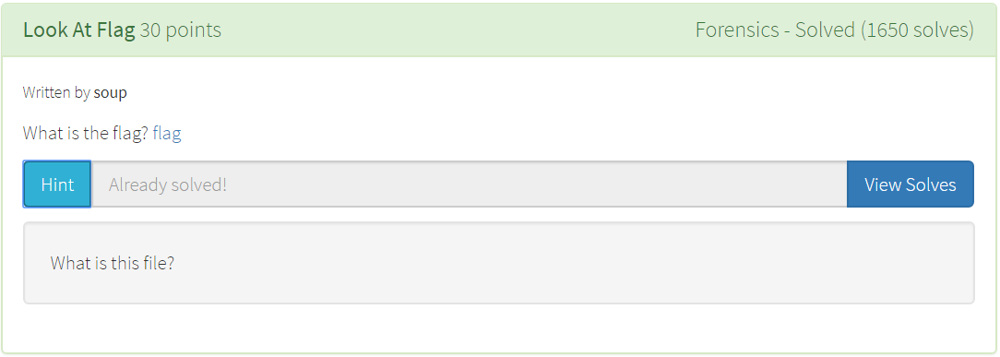
</p>

### Write-up
We open that txt file in the browser.

Fortunately the browser detects images even with the .txt extension.

If you can't see the flag, just you have to change the file extension to .png.

Why .png extension ? Just run the command ```file flag.txt``` to know the type of file from the header bytes.

So the flag is : ```easyctf{FLaaaGGGGGg}```.

___


## EzSteg

**Category:** Forensics
**Points:** 30
**Description:**

>There appears to be a message beyond what you can see in [soupculents.jpg](resources/forensics-30-ezsteg/soupculents.jpg).

**Hint:**

>The description is a hint.

<p align="center">
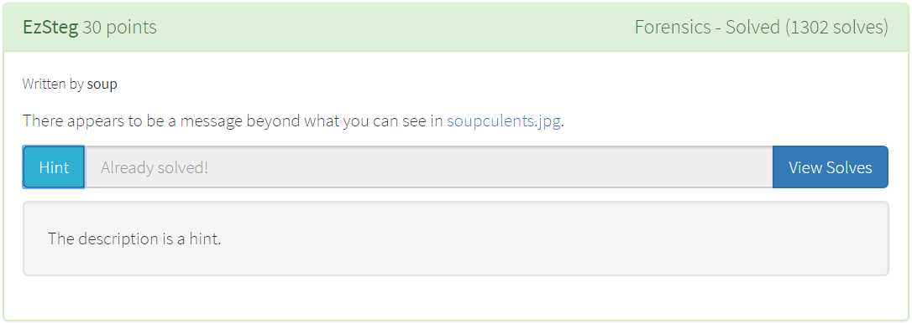
</p>

### Write-up
We have to run this command to extract the flag from image source code:
```
strings soupculents.jpg | grep easyctf
```
We can find the flag in the output:

<p align="center">

</p>

So the flag is ```easyctf{l00k_at_fil3_sigS}```.

___


## Intro: Reverse Engineering

**Category:** Intro
**Points:** 30
**Description:**

>What does this [Python program](resources/intro-30-reverse_engineering/mystery.py) do? And more specifically, what input would give this output?
>```6513c2b1c2bac3835f0cc28a5b6ac2abc2b9c2bfc381c39b7613c3bac2b3c2a17f7ac29f00c3aa46c2b9c2a6```

**Hint:**

>(No hint)

<p align="center">

</p>

### Write-up
We have to reverse that cipher text. So we need to add just one line to the python file:

**[solution.py](resources/intro-30-reverse_engineering/solution.py)**

```python
#!/usr/bin/env python3
import binascii
key = "graAhogG"
flag="6513c2b1c2bac3835f0cc28a5b6ac2abc2b9c2bfc381c39b7613c3bac2b3c2a17f7ac29f00c3aa46c2b9c2a6"
def mystery(s):
    r = ""
    # Adding this line
    t = binascii.unhexlify(s).decode("utf-8")
    for i, c in enumerate(t):
        r += chr(ord(c) ^ ((i * ord(key[i % len(key)])) % 256))
    return bytes(r, "utf-8")

#And this one
print(mystery(flag))
```

Then, we run it:
```
chmod +x solution
./solution
```

Output:
```
b'easyctf{char_by_char_aEaBdc}'
```

So the flag is : ```easyctf{char_by_char_aEaBdc}```.

___


## Programming: Taking Input

**Category:** Programming
**Points:** 30
**Description:**

>OK, OK, you got Hello, world down, but can you greet specific people?
>You'll be given the input of a certain name. Please greet that person using the same format. For example, if the given input is Michael, print Hello, Michael!.
> * For Python, consider the input() function.
> * For Java, consider System.in.
> * For C, consider including stdio.h and reading input using read.
> * For C++, consider including iostream and reading input using cin.

**Hint:**

>(No hint)

<p align="center">
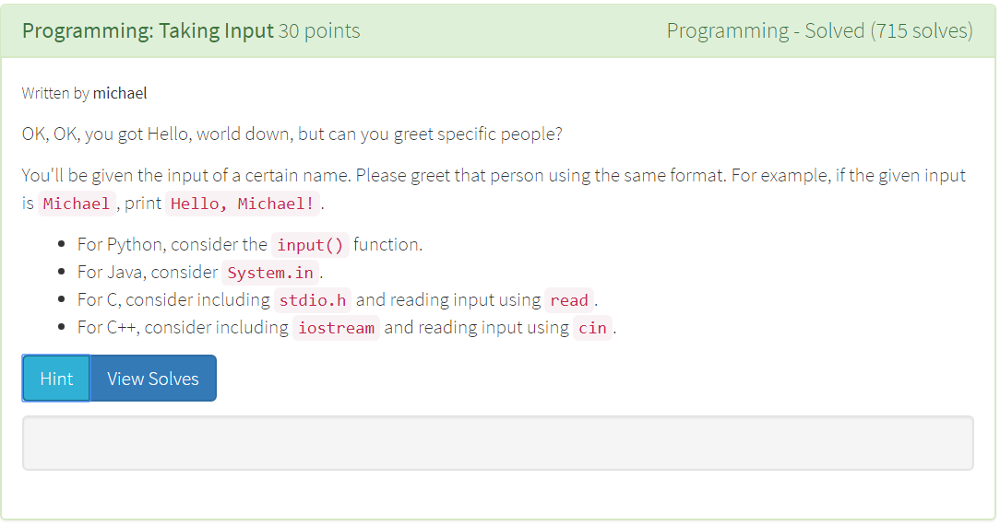
</p>

### Write-up
The best solution was provided by the original write-up: [here](https://github.com/EasyCTF/easyctf-iv-problems/blob/master/prog_input/grader.py):

```python
#Original EasyCTF_V write-up
name = input()
print("Hello, {}!".format(name))
```

___


## Programming: Over and Over

**Category:** Programming
**Points:** 40
**Description:**

>You can decode a Caesar cipher, but can you write a program to decode a Caesar cipher?
>Your program will be given 2 lines of input, and your program needs to output the original message.
> * First line contains N, an integer representing how much the key was shifted by. 1 <= N <= 26
> * Second line contains the ciphertext, a string consisting of lowercase letters and spaces.
>For example:
> * ```6```
> * ```o rubk kgyeizl```
>You should print
> * ```i love easyctf```

**Hint:**

>(No hint)

<p align="center">

</p>

### Write-up
The best solution was provided by the original write-up: [here](https://github.com/EasyCTF/easyctf-iv-problems/blob/master/prog_loop/grader.py):

```python
#Original EasyCTF_V write-up
n = int(input())
print(" and ".join(["over"] * n))
```

___


## hexedit

**Category:** Reverse Engineering
**Points:** 50
**Description:**

> Can you find the flag in this [file](resources/reverse_engineering-50-hexedit/hexedit)?

**Hint:**

>(No hint)

<p align="center">
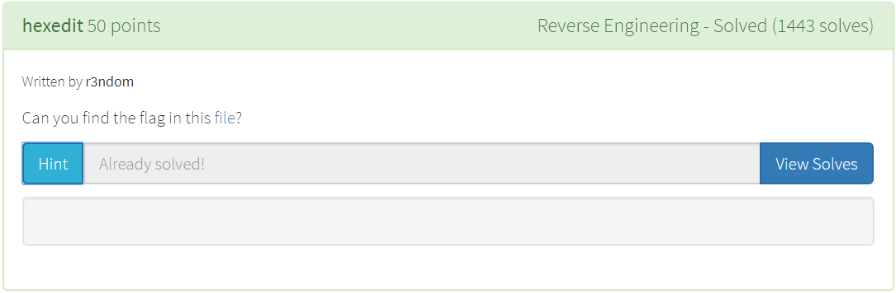
</p>

### Write-up
We have to execute this command in your shell terminal to find out the flag:
```
strings hexedit | grep easyctf
```

Output :
```
easyctf{eb04fadf}
```

So the flag is : ```easyctf{eb04fadf}```.

___


## Substitute

**Category:** Cryptography
**Points:** 50
**Description:**

>Nobody can guess this flag! [msg.txt](resources/cryptography-50-substitute/msg.txt)

**Hint:**

>Look at the title.

<p align="center">
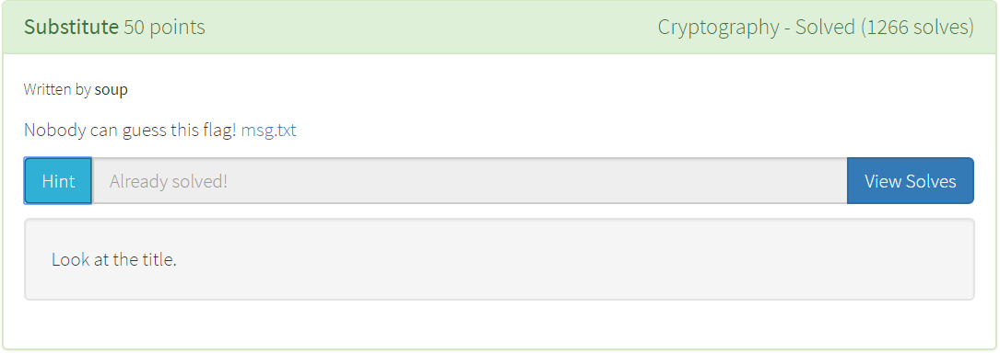
</p>

### Write-up
The cipher text is encrypted with the Substitution cipher.

So we have to break it using any tool solver.

We used this [online tool](https://www.guballa.de/substitution-solver).

The key found was : ```aywmcnopjqrstxihbdlegzukfv```.

And then, the plain text was:
```
YO! NICEBOWLOFSOUP JUST MADE A NEW FLAG FOR THE CTF AND IS TOTALLY PROUD OF ITS INGENUITY. THIS IS ALSO THE SECOND PROBLEM EVER MADE FOR EASYCTF. HERE: EASYCTF{THIS_IS_AN_EASY_FLAG_TO_GUESS} USE CAPITAL LETTERS.
```

So the flag is : ```EASYCTF{THIS_IS_AN_EASY_FLAG_TO_GUESS}```.

___


## Markov's Bees

**Category:** Linux
**Points:** 50
**Description:**

>Head over to the shell and see if you can find the flag at ```/problems/markovs_bees/``` !

**Hint:**

>Don't do this by hand!

<p align="center">

</p>

### Write-up
We have to connect to the remote server as explained in the [Intro : Linux](#intro-linux) task, and we have to execute this command to change the current working directory to the ```/problems/markovs_bees/``` directory:
```
cd /problems/markovs_bees/
```

Then, we search inside of all the files located (in the current directory or the sub-directories), the flag as we know that all the flag starts with "easyctf{":
```
grep -R "easyctf" .
```

Output :
```
bees/c/e/i/bee913.txt:easyctf{grepping_stale_memes_is_fun}
```

So, the flag is : ```easyctf{grepping_stale_memes_is_fun}```

___


## xor

**Category:** Cryptography
**Points:** 50
**Description:**

>A flag has been encrypted using single-byte xor. Can you decrypt it? [File](resources/cryptography-50-xor/xor.txt).

**Hint:**

>(No hint)

<p align="center">

</p>

### Write-up
We have to find the single-byte used to encrypt the plain text.

But, we know that the flag starts with ```easyctf{```. And we know the xor is a symetric cipher. So encrypting the cipher text with the plain text, we can find the key. We only need to know the single-byte key.

So let's print the file to the hexadecimal representation:
```bash
xxd -p xor.txt | tr -d "\n"
```

Output:
```
181c0e041e091b06050a13090c0b0b120c0f070d071f131707110e1513170c0f1200
```

The hexadecimal representation of ```easyctf{``` is:
```
echo -n "easyctf{" |xxd -p -u
```

Output :
```
656173796374667B
```

Now we have to xor the same length of the cipher text and the plain text starting from the first position.

* old cipher text = 181c0e041e091b06050a13090c0b0b120c0f070d071f131707110e1513170c0f1200
* old plain text  = 656173796374667B

* new cipher text = 181c0e041e091b06
* new plain text  = 656173796374667B

Using an online xor tool we can apply the xor. Otherwise, in the shell terminal we execute :
```
printf '%#x\n' "$((0x181c0e041e091b06 ^ 0x656173796374667b))"
```

Output :
```
0x7d7d7d7d7d7d7d7d
```

So the single-byte key in hexadecimal representation is ```7d```.

Now, we can decrypt the cipher text using this key (repeated with the cipher text length) and we convert the hexadecimal plain text result to an ascii string plain text :

* complete cipher text = 181c0e041e091b06050a13090c0b0b120c0f070d071f131707110e1513170c0f1200
* repeated key         = 7d7d7d7d7d7d7d7d7d7d7d7d7d7d7d7d7d7d7d7d7d7d7d7d7d7d7d7d7d7d7d7d7d7d

```
printf '%#x\n' "$((0x181c0e041e091b06050a13090c0b0b120c0f070d071f131707110e1513170c0f1200 ^ 0x7d7d7d7d7d7d7d7d7d7d7d7d7d7d7d7d7d7d7d7d7d7d7d7d7d7d7d7d7d7d7d7d7d7d))" | xxd -r -p
```

Output :
```
easyctf{xwntqvvoqrzpzbnjzlshnjqro}
```

So the flag is : ```easyctf{xwntqvvoqrzpzbnjzlshnjqro}```.

___


## Programming: Subset Counting

**Category:** Programming
**Points:** 55
**Description:**

>Given a set of numbers, print out how many non-empty subsets sum to a given integer.
>**Input Format**
>The first line contains two integers N and S. The second line contains N space-separated integers a_1, a_2, ..., a_N.
>1 <= N <= 20
>-100 <= S <= 100
>-1000 <= a_i <= 1000
>**Output Format**
>A single integer, the number of non-empty subsets which sum to S. Two subsets are different if an element appears in one and does not appear in the other. Note that a_1 is distinct from a_2, even if their values are identical.
>**Sample Input**
> * ```6 5```
> * ```2 4 1 1 1 2```
>**Sample Ouput**
> * ```8```

**Hint:**

>(No hint)

<p align="center">

</p>

### Write-up
Task not solved
___


## Liar

**Category:** Reverse Engineering
**Points:** 70
**Description:**

>Sometimes, developers put their source into their code with -g. Sometimes, they put another source into their code with -g.
>[executable](resources/reverse_engineering-70-liar/getflag)
>[source](resources/reverse_engineering-70-liar/getflag.c)

**Hint:**

>(No hint)

<p align="center">
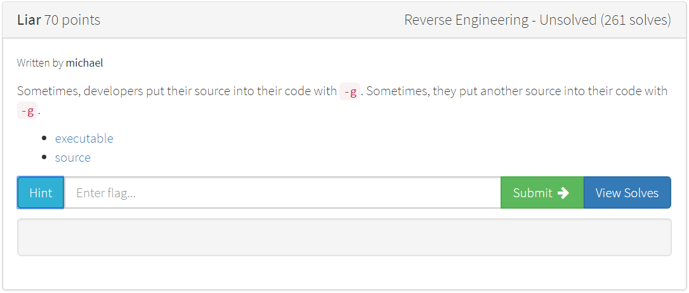
</p>

### Write-up
Task not solved
___


## In Plain Sight

**Category:** Web
**Points:** 70
**Description:**

>I've hidden a flag somewhere at [this](http://blockingthesky.com) site... can you find it?
>Note: There is not supposed to be a website. Nothing is "down". The YouTube link that some of you are finding is unintentional, please ignore it.

**Hint:**

>Dig around and see what you can find

<p align="center">
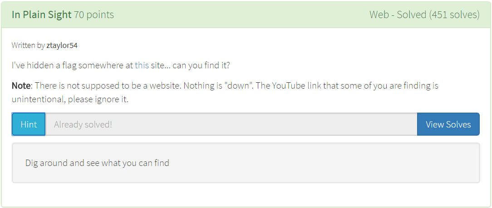
</p>

### Write-up
The domain name ```blockingthesky.com``` is not accessible in the browser. And considering the note and the hint, it may be a dns task.

But in the DNS records, the record in which we can hide a flag is the TXT record.

So, we execute this command in a shell terminal:
```sh
dig TXT blockingthesky.com
```

Output :
```
; <<>> DiG 9.8.2rc1-RedHat-9.8.2-0.62.rc1.el6_9.5 <<>> blockingthesky.com txt
;; global options: +cmd
;; Got answer:
;; ->>HEADER<<- opcode: QUERY, status: NOERROR, id: 35257
;; flags: qr rd ra; QUERY: 1, ANSWER: 2, AUTHORITY: 0, ADDITIONAL: 0

;; QUESTION SECTION:
;blockingthesky.com.            IN      TXT

;; ANSWER SECTION:
blockingthesky.com.     30      IN      TXT     "_globalsign-domain-verification=kXlECiyonFE_qsQR-8ki6BOIdVru3bzxpwMDZr334_"
blockingthesky.com.     30      IN      TXT     "easyctf{betcha_wish_you_could_have_used_ANY}"

;; Query time: 9 msec
;; SERVER: 213.186.33.99#53(213.186.33.99)
;; WHEN: Wed Feb 21 14:02:14 2018
;; MSG SIZE  rcvd: 180
```

So the flag is : ```easyctf{betcha_wish_you_could_have_used_ANY}```.

___


## Adder

**Category:** Reverse Engineering
**Points:** 80
**Description:**

>This program adds numbers. Find the flag! [adder](resources/reverse_engineering-80-adder/adder)

**Hint:**

>(No hint)

<p align="center">

</p>

### Write-up
Task not solved

___


## My Letter

**Category:** 
**Points:** 80
**Description:**

>I got a letter in my email the other day... It makes me feel sad, but maybe it'll make you glad. :( [file](resources/forensics-80-my_letter/myletter.docx)

**Hint:**

>the flag is not a rickroll

<p align="center">

</p>

### Write-up
Task not solved

___


## Nosource, Jr.

**Category:** Web
**Points:** 80
**Description:**

>I don't like it when people try to view source on my page. Especially when I put all this effort to put my flag verbatim into the source code, but then people just look at the source to find the flag! How annoying.
>This time, when I write my wonderful website, I'll have to hide my beautiful flag to prevent you CTFers from stealing it, dagnabbit. We'll see what you're [able to find](http://c1.easyctf.com:12486/jr/)...

**Hint:**

>Did you know that Chrome Developer Tools has a Network tab?

<p align="center">
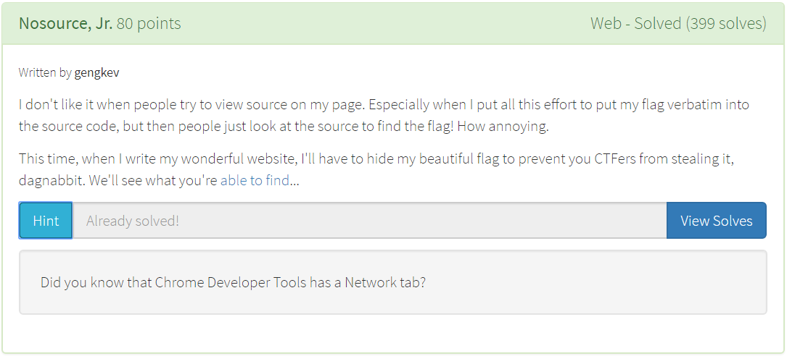
</p>

### Write-up
Task not solved
___


## Zippity

**Category:** Miscellaneous
**Points:** 80
**Description:**

>I heard you liked zip codes! Connect via ```nc c1.easyctf.com 12483``` to prove your zip code knowledge.

**Hint:**

>I wonder if you could write a program...

<p align="center">

</p>

### Write-up
Task not solved
___


## Flag Time

**Category:** Miscellaneous
**Points:** 80
**Description:**

>This problem is so easy, it can be solved in a matter of seconds. Connect to ```c1.easyctf.com:12482```.

**Hint:**

>time for u to get an ez flag

<p align="center">
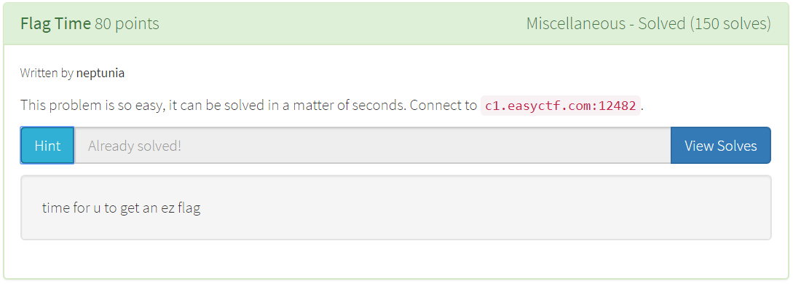
</p>

### Write-up
Starting by executing this command in a shell terminal:
```
nc c1.easyctf.com 12482
```

Output :
```
enter the flag:
```

But, whatever the data that we send, the socket connection exit immediatly. And knowing that the flag starts with ```easyctf{```, we send ```easyctf{```, and there the socket connection will take some seconds before exiting.

So this task is based on a timing attack: for each correct flag character, the server wait a specific time to return a response.

There, we have to create a script that find for each character the maximum of the time spent while receiving the server's response, character by character, building the flag until we find the flag from the "easyctf{" part until the "}" part.

**[solution.py](resources/miscellaneous-80-flag_time/solution.py)**

```python
#!/usr/bin/python
import socket
import time
import re

def netcat(hostname, port):
 # Maximum duration (total)
 max_duration=0
 # The first part of the flag (to skip waiting for finding this part of the flag)
 flag="easyctf{"
 char_found=''
 # The possible characters that we can find in a flag
 T=list("abcdefghijklmnopqrstuvwxyz_-0123456789{}")
 # Initiate the socket
 s = socket.socket(socket.AF_INET, socket.SOCK_STREAM)
 # Starting the connection
 s.connect((hostname, port))
 # Receiving the data : "enter the flag:"
 data = s.recv(10240)
 # Sending the flag to get the initial time of waiting
 print "Sending",flag
 s.send(flag+"\n")
 # Getting the current time before receiving the answser
 n1=time.time()
 # receiving the answer
 data = s.recv(10240)
 # Getting the current time after receiving the answer
 n2=time.time()
 # We should not forget to close the connection
 s.close()
 # Computing the duration of the operation
 max_duration=round(n2-n1,1)
 print "Initial duration",max_duration
 # Be carefull, you have to assist the script while running it
 # I'm too lazy to write something beautiful than an infinite loop especially in a CTF :p
 # So after guessing this part "easyctf{" and then this part "}", you have to stop the script (Ctrl+C)
 while 1:
  # For each supported character
  for i in T:
    # We repeat the previous operation
    s = socket.socket(socket.AF_INET, socket.SOCK_STREAM)
    s.connect((hostname, port))
    data = s.recv(10240)
    print "Sending",flag+str(i)
    s.send(flag+str(i)+"\n")
    n1=time.time()
    data = s.recv(10240)
    n2=time.time()
    duration=round(n2-n1,1)
    # Until getting the new greatter duration
    if duration>max_duration:
      # We save the position of the character
      char_found=str(i)
      # We compute the additionnal waiting time added when we send
      #  this character with the previous found characters
      # This help us to accelerate the operation of finding the character
      #  that might be the real character, part of the flag
      tmp=duration-max_duration
      #We update the max duration (total)
      max_duration=duration
      # If this character triggered a waiting time > 0.2 (in my server I have a high speed internet)
      if tmp>0.2:
        #So this is character is part of the flag. Then, we break the loop of finding the (i)th character of the flag
        break
    print "Received:", repr(data),"in",duration,"seconds"
    # We should not forget to close the connection
    s.close()
  # We build the flag character by character
  flag=flag+char_found
  # We print the actual flag
  print "Flag :",flag,"(duration=",max_duration,")"

netcat("c1.easyctf.com", 12482)
```

We run this script :
```
chmod +x solution.py
./solution.py
```

Output :
```
Sending easyctf{
Initial duration 5.5
Sending easyctf{a
Received: 'no\n' in 5.5 seconds
Sending easyctf{b
Received: 'no\n' in 5.5 seconds
Sending easyctf{c
Received: 'no\n' in 5.5 seconds
Sending easyctf{d
Received: 'no\n' in 5.5 seconds
Sending easyctf{e
Flag : easyctf{e (duration= 5.8 )
Sending easyctf{ea
Received: 'no\n' in 5.8 seconds
Sending easyctf{eb
Received: 'no\n' in 5.8 seconds
...
```

So the flag is : ```easyctf{ez_t1m1ng_4ttack!}```.
___


## Starman 1

**Category:** Programming
**Points:** 80
**Description:**

>Starman has taken off in search of a team to help him win EasyCTF! He's reached the asteroid belt, which everyone knows is the best place in the galaxy to find cybersecurity talent. Each asteroid is home to one superstar hacker. Starman wants to take all of the hackers back to Earth to help him with the competition, but unfortunately this isn't practical - all of the hackers are very attached to their asteroid homes, and won't go back to Earth unless Starman agrees to take the asteroids with him. Furthermore, each hacker has a skill rating r. To ensure a win in EasyCTF, Starman wants to maximize the sum of the rating values of his team members.

>There are N hackers, and Starman's Roadster can carry up to W pounds of additional weight. Help him decide which hackers to bring home.
>**Input Format**
>The first line contains two integers N and W. The following N lines each contain two integers r_i and w_i, representing the skill and weight of the ith hacker. (w_i is the sum of a hacker and their asteroid's weight).
>```1 <= N, W <= 2000```
>```1 <= r_i, w_i <= 10000```

>**Output Format**
>A single integer, the best sum-of-ratings Starman can achieve while keeping the total weight added to his Roadster less than or equal to W.

>**Sample Input**
> * ```5 15```
> * ```6 7```
> * ```3 4```
> * ```3 5```
> * ```10 11```
> * ```8 8```

>**Sample Ouput**
> * ```14```

**Hint:**

>If you run into issues with the time limit, try reading up on Dynamic Programming.

<p align="center">
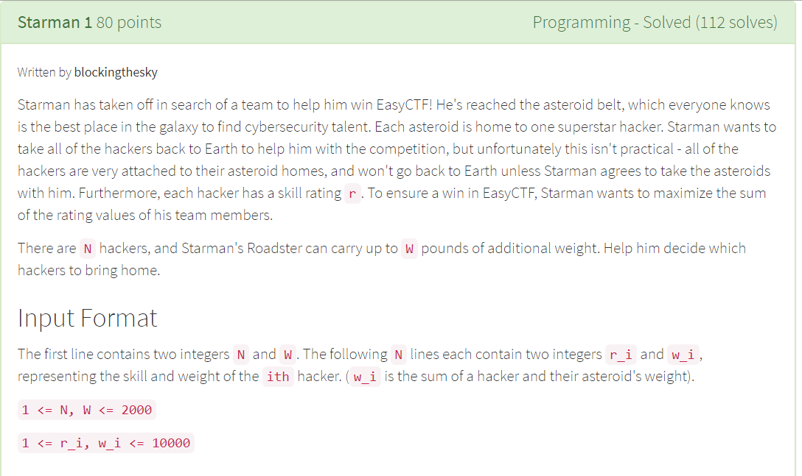
</p>
<p align="center">

</p>
<p align="center">
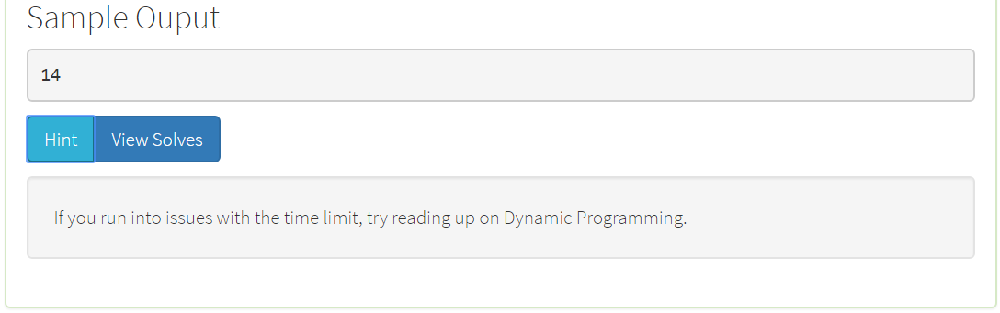
</p>

### Write-up
This task illustrate the Knapsack_problem
The best solution was provided by the original write-up: [here](https://github.com/EasyCTF/easyctf-iv-problems/blob/master/starman_1/grader.py):

```python
#Original EasyCTF_V write-up
import sys
sys.setrecursionlimit(5000)

N, W = map(int, input().split())

dat = [list(map(int, input().split())) for i in range(N)]

memo = [[-1] * (W + 1) for i in range(N)]

# https://en.wikipedia.org/wiki/Knapsack_problem

def ans(ind, wr):
    if ind == N:
        return 0
    if memo[ind][wr] != -1:
        return memo[ind][wr]
    best = ans(ind + 1, wr)
    if dat[ind][1] <= wr:
        best = max(best, dat[ind][0] + ans(ind + 1, wr - dat[ind][1]))
    memo[ind][wr] = best
    return best

print(ans(0, W))
```

___


## Keyed Xor

**Category:** Cryptography
**Points:** 100
**Description:**

>A flag has been encrypted using keyed xor. Can you decrypt it? [File](resources/cryptography-100-keyed_xor/keyed_xor.txt).
>The key was created by taking two words from [this](resources/cryptography-100-keyed_xor/words.txt) wordlist.

**Hint:**

>(No hint)

<p align="center">

</p>

### Write-up
We should decrypt the encrypted file like this : ```encrypted_file xor (key_part_1 + key_part_2)```.

So we created a python script that guess the first part of the key, the the second part:

**[solution.py](resources/cryptography-100-keyed_xor/solution.py)**

```python
#!/usr/bin/python

import re

# s1 xor s2
def sxor(s1, s2):
 return "".join([chr(ord(c1) ^ ord(c2)) for (c1,c2) in zip(s1,s2)])

# repeat s many time until the max length m
def rep(s, m):
    a, b = divmod(m, len(s))
    return s * a + s[:b]

# Open the encrypted file
f=open("keyed_xor.txt","r").read()

# Open the wordlist
f2=open("words.txt","r").readlines()

# For each word in the wordlist (searching for the first part of the xor key)
for x in f2:
  # If ( encrypted_file xor "easyctf{" ) starts with the selected word from the worlist
  if x.strip().startswith(sxor(f,"easyctf{")):
    # It can be the first part of the xor key
    # For each word in the wordlist (searching for the second part of the xor key)
    for y in f2:
      # we compute : encrypted_file xor ( (word1+word2) repeated to the encrypted_file length)
      xored2=sxor(f,rep(x.strip()+y.strip(),len(f)))
      # We extract the alpha-numeric string inside the "easyctf{...}"
      found=re.search('^[a-zA-Z0-9_\-]+$',xored2[8:-1])
      # If the xored string ends with "}" and inside the "easyctf{...}" we found an alpha-numeric string
      if xored2.endswith("}")  and found is not None:
        # Youpi ! it's probably a flag
        print x.strip(),y.strip(),"\t => ",xored2
```

Output :
```
reflecting imprisoned    =>  easyctf{flagflagflagflagudveghqbddudvucxgsewgfmvbtznycxjilppzurputskfvcfbk}
reflecting physically    =>  easyctf{flxbomawhnhzflagudveghhgmeutxwjegsewgfmvbtckpbxzgnymzurputskfvzckj}
```

So the flag is : ```easyctf{flagflagflagflagudveghqbddudvucxgsewgfmvbtznycxjilppzurputskfvcfbk}``` because it contains the word ```flag```.
___


## Not OTP

**Category:** Cryptography
**Points:** 100
**Description:**

>It seems we've intercepted 2 strings that were both encrypted with what looks like OTP! Is it possible to decrypt them? file

**Hint:**

>I think there's something about cribs in there...

<p align="center">

</p>

### Write-up
Task not solved
___


## Diff

**Category:** Forensics
**Points:** 100
**Description:**

>Sometimes, the differences matter. Especially between the files in [this archive](resources/forensics-100-diff/file.tar).
>Hint: This is a [TAR](https://en.wikipedia.org/wiki/Tar_(computing)) archive file. You can extract the files inside this tar by navigating to the directory where you downloaded it and running tar xf file.tar! If you don't have tar on your personal computer, you could try doing it from the Shell server. Once you extract the files, try comparing the hex encodings of the files against the first file.

**Hint:**

>Check the man page for diff by typing "man diff".

<p align="center">
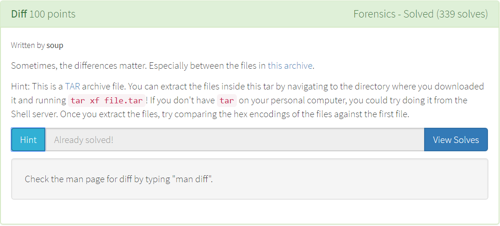
</p>

### Write-up
We have to download the tar file. Then we extract its content:

```
mkdir diff_dir
tar -xvf file.tar -C diff_dir
cd diff_dir
```

Now we start comparing ```file``` with ```file2```, ```file3``` and ```file4```:
```
diff <(xxd file) <(xxd file2)
diff <(xxd file) <(xxd file3)
diff <(xxd file) <(xxd file4)
```

Output :
```
1c1
< 0000000: 7f45 4c46 0201 0100 0000 0000 0000 0000  .ELF............
---
> 0000000: 7f45 4c46 0201 0100 0065 0000 0000 0000  .ELF.....e......
8c8
< 0000070: 0800 0000 0000 0000 0300 0000 0400 0000  ................
---
> 0000070: 0800 0000 0000 0000 0361 0000 0400 0000  .........a......
15c15
< 00000e0: 0000 2000 0000 0000 0100 0000 0600 0000  .. .............
---
> 00000e0: 0000 2000 0000 0000 0100 7300 0600 0000  .. .......s.....
18,19c18,19
< 0000110: 9802 0000 0000 0000 0000 2000 0000 0000  .......... .....
< 0000120: 0200 0000 0600 0000 f80d 0000 0000 0000  ................
---
> 0000110: 9802 0000 7963 7400 0000 2000 0000 0000  ....yct... .....
> 0000120: 0200 0000 0600 6600 f80d 0000 0000 0000  ......f.........
25c25
< 0000180: 4400 0000 0000 0000 0400 0000 0000 0000  D...............
---
> 0000180: 4400 0000 0000 007b 0400 0000 0000 0000  D......{........
31c31
< 00001e0: 0000 0000 0000 0000 0000 0000 0000 0000  ................
---
> 00001e0: 0000 0000 0000 0064 0000 0000 0000 0000  .......d........
59c59
< 00003a0: 0000 0000 0000 0000 0000 0000 0000 0000  ................
---
> 00003a0: 0000 0000 0000 0069 0000 0000 0000 0000  .......i........
558a559
> 00022e0: 0a                                       .

12c12
< 00000b0: 0100 0000 0500 0000 0000 0000 0000 0000  ................
---
> 00000b0: 0100 6600 0500 0000 0000 0000 0000 0000  ..f.............
17c17
< 0000100: e00d 6000 0000 0000 7c02 0000 0000 0000  ..`.....|.......
---
> 0000100: e00d 6000 6600 0000 7c02 0000 0000 0000  ..`.f...|.......
32c32
< 00001f0: 0000 0000 0000 0000 1000 0000 0000 0000  ................
---
> 00001f0: 0000 0000 0069 0000 1000 0000 0000 0000  .....i..........
50c50
< 0000310: 0000 0000 0000 0000 0000 0000 0000 0000  ................
---
> 0000310: 0000 0000 006e 6900 0000 0000 0000 0000  .....ni.........
61c61
< 00003c0: 0000 0000 0000 0000 8b00 0000 1200 0000  ................
---
> 00003c0: 0000 0000 0000 746c 8b00 0000 1200 0000  ......tl........
273c273
< 0001100: 5f72 002e 7265 6c61 2e64 796e 002e 7265  _r..rela.dyn..re
---
> 0001100: 5f72 002e 7265 795f 2e64 796e 002e 7265  _r..rey_.dyn..re
283c283
< 00011a0: 0000 0000 0000 0000 0000 0000 0000 0000  ................
---
> 00011a0: 0000 0000 0000 616e 5f00 0000 0000 0000  ......an_.......
558a559
> 00022e0: 0a                                       .

79c79
< 00004e0: 0200 0200 0200 0200 0200 0000 0000 0000  ................
---
> 00004e0: 657a 0200 5f70 726f 626c 656d 217d 0000  ez.._problem!}..
558a559
> 00022e0: 0a                                       .

```
___


## rop1

**Category:** Binary Exploitation
**Points:** 120
**Description:**

>Go to ```/problems/rop1``` on the shell server and tell me whats in flag.txt.

**Hint:**

>(No hint)

<p align="center">

</p>

### Write-up
Task not solved
___


## Remember Me

**Category:** Forensics
**Points:** 130
**Description:**

>I'm such a klutz! I know I hid a flag in [this file](resources/forensics-130-remember_me/scarboroughfair.mp3) somewhere, but I can't remember where I put it!
>Song is from sukasuka.

**Hint:**

>Sometimes I can't tell my left from my right, either.

<p align="center">

</p>

### Write-up
Task not solved
___


## EzReverse

**Category:** Reverse Engineering
**Points:** 140
**Description:**

>Take a look at [executable](resources/reverse_engineering-140-ezreverse/executable). Objdump the executable and read some assembly!

**Hint:**

>Time to read a bit of assembly! Did you know that characters are actually just integers? Take a look at an ASCII table for reference.

<p align="center">
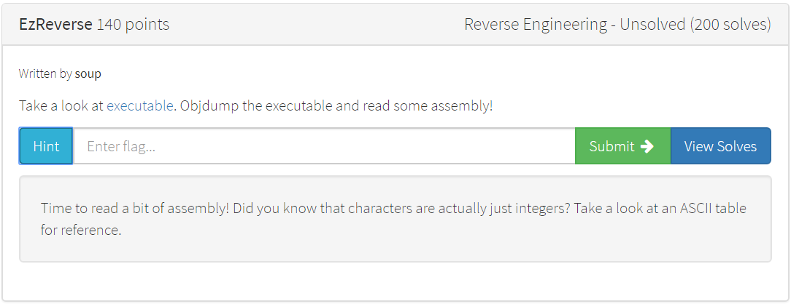
</p>

### Write-up
Task not solved
___


## Soupstitution Cipher

**Category:** Reverse Engineering
**Points:** 150
**Description:**

>We had a flag, but lost it in a mess of alphabet soup! Can you help us [find it](resources/reverse_engineering-150-soupstitution_cipher/soupstituted.py)?
>Connect to the server via ```nc c1.easyctf.com 12484```.

**Hint:**

>I love parsing characters!

<p align="center">

</p>

### Write-up
Task not solved

___


## Digging for Soup

**Category:** Web
**Points:** 150
**Description:**

>Perhaps this time I'll have hidden things a little better... you won't find my flag so easily now! ```nicebowlofsoup.com```

**Hint:**

>How do slave zones know when updates are made to the master?

<p align="center">

</p>

### Write-up
Task not solved
___


## AES

**Category:** Cryptography
**Points:** 160
**Description:**

>There's an AES challenge running at ```c1.easyctf.com 12487``` ([source](resources/cryptography-160-aes/aes_redacted.py)).

**Hint:**

>(No hint)

<p align="center">

</p>

### Write-up
Task not solved
___


## MalDropper

**Category:** Reverse Engineering
**Points:** 160
**Description:**

>Mind looking at this malware dropper I found?
>[File](resources/reverse_engineering-160-maldropper/maldrop.exe)
>Note: this isn't actually malware, it just borrows obfuscation techniques from low quality malware.

**Hint:**

>(No hint)

<p align="center">

</p>

### Write-up
Task not solved
___


## Zipperoni

**Category:** Miscellaneous
**Points:** 160
**Description:**

>I've created a dastardly chain of [zip files](resources/miscellaneous-160-zipperoni/zip_files.tar). Now you'll never find my flag!
>The first file is ```begin.zip```, with password ```coolkarni```.
>Hint: You need to guess the password of the next zip file. However, the underscores in the pattern appear in the same positions as they do in the actual password, so you don't need to guess them. For example, the first pattern is ```__0_0_```, which means that you need to guess the 3rd and 5th characters.

**Hint:**

>I love writing Python programs, don't you?

<p align="center">
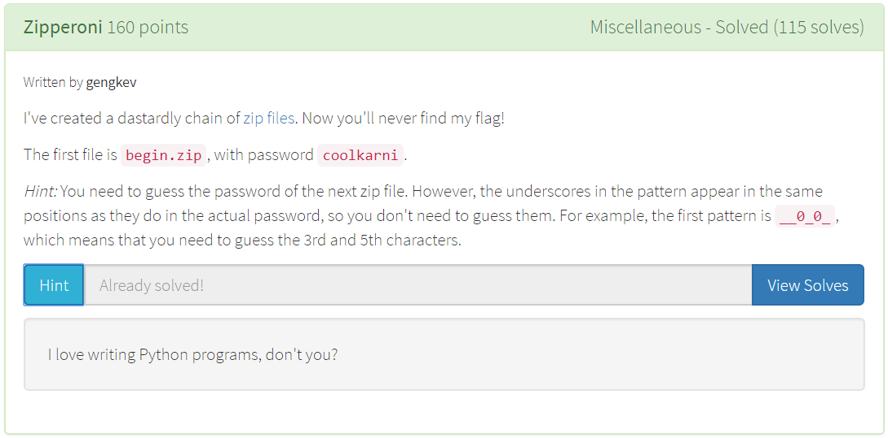
</p>

### Write-up
Task not solved
___


## format

**Category:** Binary Exploitation
**Points:** 160
**Description:**

>Go to ```/problems/format``` on the shell server and tell me what is in ```flag.txt```.

**Hint:**

>(No hint)

<p align="center">

</p>

### Write-up
Task not solved
___


## Starman 2

**Category:** Programming
**Points:** 175
**Description:**

>Starman is back at it again! Having successfully brought back several hackers from the asteroid belt, he wants to eliminate the possibility of competition from the hackers he left behind. He has equipped his Roadster with an asteroid-destroying laser, but unfortunately he's only able to fire it once. Asteroids can be represented as points in a 2D plane. The laser, when fired, sends a beam of width W straight forward, and destroys everything in its path. Starman can go anywhere to fire his beam. It's expensive to fire wider beams, so your job is to find out the smallest possible width of the beam.
>**Input Format**
>The first line contains a single integer N, representing the number of asteroids. The following N lines each contain two integers x_i and y_i, representing the x and y coordinates of the ith asteroid.
>```3 <= N <= 200000```
>```-10^8 <= x_i, y_i <= 10^8```
>**Output Format**
>A decimal printed to six decimal places (including trailing zeroes; this can be accomplished using printf or your language's equivalent) representing the minimum possible value of W.
>**Sample Input**
>```5```
>```12 4```
>```-2 5```
>```-8 -7```
>```-1 -11```
>```5 3```
>**Sample Ouput**
>```11.234578```

**Hint:**

>(No hint)

<p align="center">
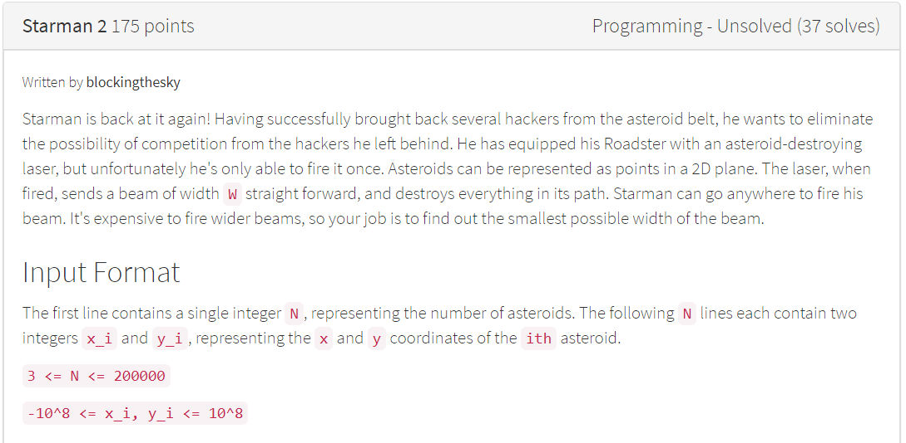
</p>

### Write-up
Task not solved
___


## RSA_v

**Category:** Cryptography
**Points:** 200
**Description:**

>Bob is extremely paranoid, so he decided that just one RSA encryption is not enough. Before sending his message to Alice, he forced her to create 5 public keys so he could encrypt his message 5 times! Show him that he still is not secure... [rsa.txt](resources/cryptography-200-rsa_v/rsa.txt).

**Hint:**

>(No hint)

<p align="center">

</p>

### Write-up
As we know in RSA to encrypt a message (m), we should use the public key (n,e) like this : c &equiv; (m^e) (mod n)

And to decrypt a ciphertext (c), we should use the private key (d,e,n) like this : c^d &equiv; ((m^e)^d) &equiv; m mod n

So to encrypt a message (m) using 5 public keys, we have to apply the encryption operation 5 times. In this problem we have the same modulus (n) and a different public exponent (e).

But when we encrypt a message using 2 public keys we have to apply this function : c1 &equiv; (m^e1) (mod n)

Then, c2 &equiv; (c1^e2) (mod n) &equiv; (((m^e1) (mod n))^e2) (mod n) &equiv; ((m^e1)^e2) (mod n) &equiv; m^(e1*e2) (mod n)

Maybe I did a wrong interpretation here because I'm not good in math, but this is what I think about this task and **if I did something wrong please edit and correct my answer**.

So we get this expression because we have the same modulus (n).

To generalise with the 5 public key, the final message is C &equiv; m^(e1*e2*e3*e4*e5) (mod n) &equiv; (m^E) (mod n)

Where E=e1*e2*e3*e4*e5

And the expression of "c" is the same as the encryption function of RSA cipher.

But, to decrypt this message we have to find the private exponent "d".

After some searches, we found an interesting thing using python

```
n=9247606623523847772698953161616455664821867183571218056970099751301682205123115716089486799837447397925308887976775994817175994945760278197527909621793469
e=11*41*67623079903*5161910578063*175238643578591220695210061216092361657427152135258210375005373467710731238260448371371798471959129039441888531548193154205671
c=7117565509436551004326380884878672285722722211683863300406979545670706419248965442464045826652880670654603049188012705474321735863639519103720255725251120
print "n =",n
print "e =",e
print "c =",c
```

Output :
```
n = 9247606623523847772698953161616455664821867183571218056970099751301682205123115716089486799837447397925308887976775994817175994945760278197527909621793469L
e = 27587468384672288862881213094354358587433516035212531881921186101712498639965289973292625430363076074737388345935775494312333025500409503290686394032069L
c = 7117565509436551004326380884878672285722722211683863300406979545670706419248965442464045826652880670654603049188012705474321735863639519103720255725251120L
```

So, n and e are almost in the same order of length. Maybe it's a coincidence, but this [remember me](https://en.wikipedia.org/wiki/Wiener%27s_attack#Example) the Wiener attack.

Let's check this possibility.

We have to install the owiner module in python3:
```
python3 -m pip install owiner
```

Then, we run this python3 code:

```python
#!/usr/bin/python3

import owiener

e1=11
e2=41
e3=67623079903
e4=5161910578063
e5=175238643578591220695210061216092361657427152135258210375005373467710731238260448371371798471959129039441888531548193154205671
e=e1*e2*e3*e4*e5
n=9247606623523847772698953161616455664821867183571218056970099751301682205123115716089486799837447397925308887976775994817175994945760278197527909621793469
d = owiener.attack(e, n)

if d is None:
    print("Failed")
else:
    print("d={}".format(d))
```

Output :
```
d=171330787932846372330977720182288808813
```

Youpi ! The attack worked perfectly.

Knowing the private exponent "d", we can decrypt the message.

It's the first time that I can't decrypt a message using python because of an error. I tried the decryption without or with the PKCS1.5 and it didn't work but I'm sure that I have the correct "d".

So I switched to an [online tool](http://extranet.cryptomathic.com/rsacalc/index) that require (n,e,d,c) in an hexadecimal representation.

That's what you need ? Challenge Accepted.

Using Python, I get what this online tool needs:

* n=b0915c0eb299cbd5d54d3a5c0dbe04932c6bcdd078cdb3ce1849a620e7196db22c97edfeb731a33aedbdeb28ccbb6533683c0e259d17e0308c48ba72e8d382bd
* d=80e51c075ffcbe945903af2e1075fb6d
* e=86d840a79a29eafc30ebb64fc18a6e55a24cf2bdb046dd9cc4271eef471da0c3e145296eb6e9667c2f05fde8d3afbab6803ed6139f8e938c4d07dc358b5fc5
* c=87e5ef7da5f0104abfdffdf497717b9324bc78f7bfa985b9d662da34ea1c8607cea3a88bb8fdc089bc2266818a00aa0b426ad7ec86056757b4c1b4630aa02a30

As a decrypted message (m) I get : m=656173796374667b6b65626c667466747a696261746473716d716f74656d6d74797d

Which is the plain text in the hexadecimal representation.

Using an online tool to convert it from hexadecimal to an ascii string, I get the flag.

So the flag is : `easyctf{keblftftzibatdsqmqotemmty}`

___


## Souper Strong Primes

**Category:** Cryptography
**Points:** 20
**Description:**

>Technically I used strong primes. But are they really strong in this case? They are big, but there might still be an issue here. [n.txt](resources/cryptography-200-souper_strong_primes/n.txt) [e.txt](resources/cryptography-200-souper_strong_primes/e.txt) [c.txt](resources/cryptography-200-souper_strong_primes/c.txt)

**Hint:**

>I chose "strong" primes, according to wikipedia. But are there strong primes that aren't cryptographically secure for RSA?

<p align="center">
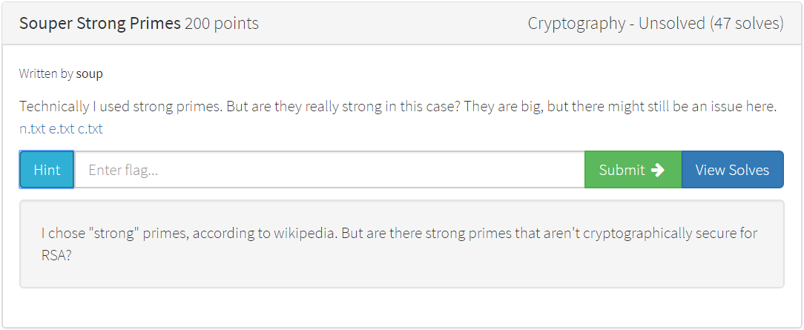
</p>

### Write-up
Task not solved
___


## Pixelly

**Category:** Reverse Engineering
**Points:** 220
**Description:**

>I've created a new [ASCII art generator](http://c1.easyctf.com:12489/), and it works beautifully! But I'm worried that someone might have put a backdoor in it. Maybe you should [check out the source](resources/reverse_engineering-220-pixelly/asciinator.py) for me...

**Hint:**

>How many characters do you really need, now?

<p align="center">

</p>

### Write-up
Task not solved
___


## Little Language

**Category:** Miscellaneous
**Points:** 250
**Description:**

>I want root access to this special programming portal, and this file is my only clue. Maybe the password is inside? Even if it is, I'm not sure how to enter it. encrypted
>```nc c1.easyctf.com 12480```
>Oh! Almost forgot... [this](resources/miscellaneous-250-little_language/parser.txt) might help.

**Hint:**

>One small step for man...

<p align="center">
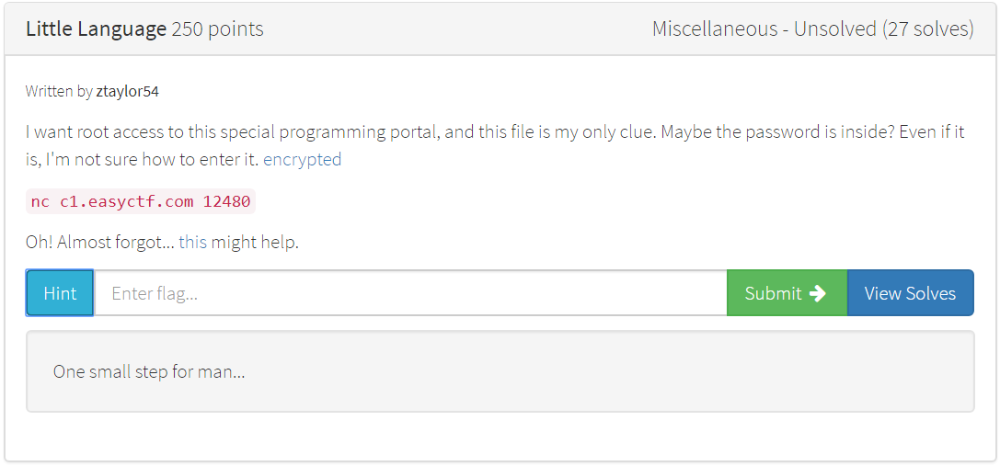
</p>

### Write-up
Task not solved
___


## Nosource

**Category:** Web
**Points:** 250
**Description:**

>All you CTFers are sure getting on my nerves with your source-viewing and developer tools-ing! Alas, despite my best wishes, the experienced programmers on the wonderful website StackOverflow tell me that it's [impossible](https://stackoverflow.com/q/6597224/689161) to keep you from looking at the HTML. But a disable right click script certainly won't stop an experienced CTFer like you! So finding the flag in the source of this problem should be no trouble, [right](http://c1.easyctf.com:12486/)?

**Hint:**

>If you can't beat 'em, maybe you can get around 'em somehow?

<p align="center">

</p>

### Write-up
Task not solved
___


## Hidden Key

**Category:** Cryptography
**Points:** 250
**Description:**

>Ugh, another RSA problem? Help me decrypt this message please [file](resources/cryptography-250-hidden_key/hiddenkey.txt).

**Hint:**

>i left an extra key in my back pocket

<p align="center">
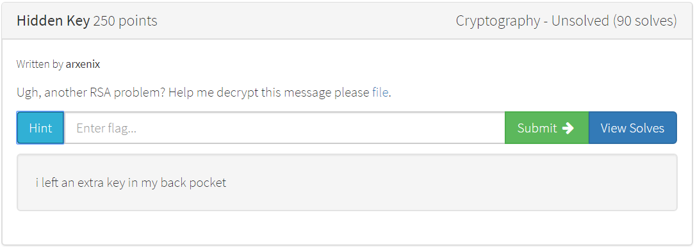
</p>

### Write-up
Task not solved
___


## fumblr

**Category:** Web
**Points:** 275
**Description:**

>Come check out the latest blogging platform all the cool kids are using! I tried my hardest to make it hack-proof. If you can read the admin's hidden posts, I'll even give you a flag!! [Good luck](http://c1.easyctf.com:12491/)!?

**Hint:**

>you wish

<p align="center">

</p>

### Write-up
Task not solved
___


## LicenseCheck

**Category:** Reverse Engineering
**Points:** 300
**Description:**

>I want a valid license for a piece of software, [here](resources/reverse_engineering-300-licensechecklicense_check.exe) is the license validation software. Can you give me a valid license for the email ```mzisthebest@notarealemail.com```?
>Note: flag is not in easyctf{} format.

**Hint:**

>(No hint)

<p align="center">

</p>

### Write-up
Task not solved
___


## Special Endings

**Category:** Forensics
**Points:** 350
**Description:**

>She taught us so much... [tribute](resources/forensics-350-special_endings/encrypted_lines.txt)

**Hint:**

>RFC 4648

<p align="center">

</p>

### Write-up
Task not solved
___


## Fanfic Studio

**Category:** Binary Exploitation
**Points:** 350
**Description:**

>Go to ```/problems/fanfic``` to check out my cool fanfic writing tool. I expect you to send me some steamy fanfics of michael.

**Hint:**

>(No hint)

<p align="center">

</p>

### Write-up
Task not solved
___


## RSA Returns

**Category:** Cryptography
**Points:** 400
**Description:**

> It's the return of everyone's favorite cryptosystem! Crack it for another flag. Help me decipher [file](resources/cryptography-400-rsa_returns/hardrsa.txt).

**Hint:**

>lolno

<p align="center">
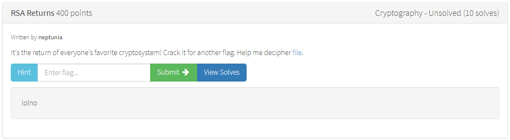
</p>

### Write-up
Task not solved
___


# Scoreboard

After solving all these tasks in a team of one player, my team **TheEmperors** get the score 2271 and get ranked 111/2146 :

<p align="center">
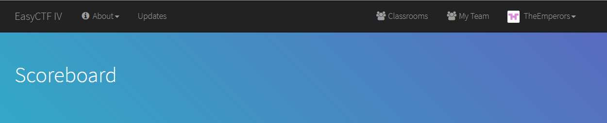
</p>
<p align="center">
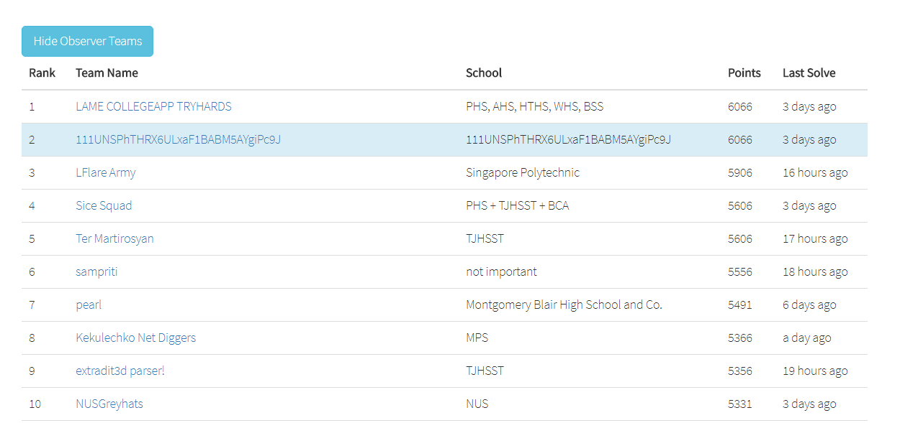
</p>
<p align="center">...<p>
<p align="center">
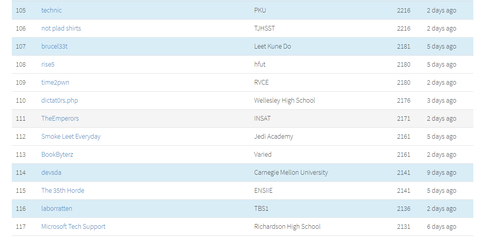
</p>
<p align="center">...<p>
<p align="center"> 
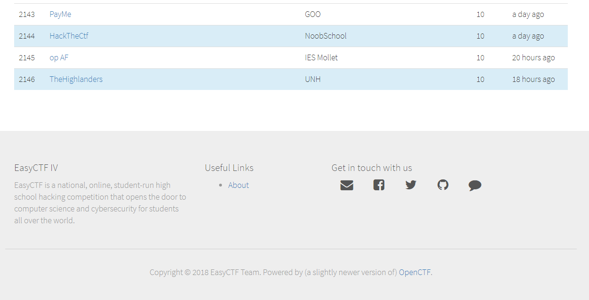
</p>

