<p align="center">
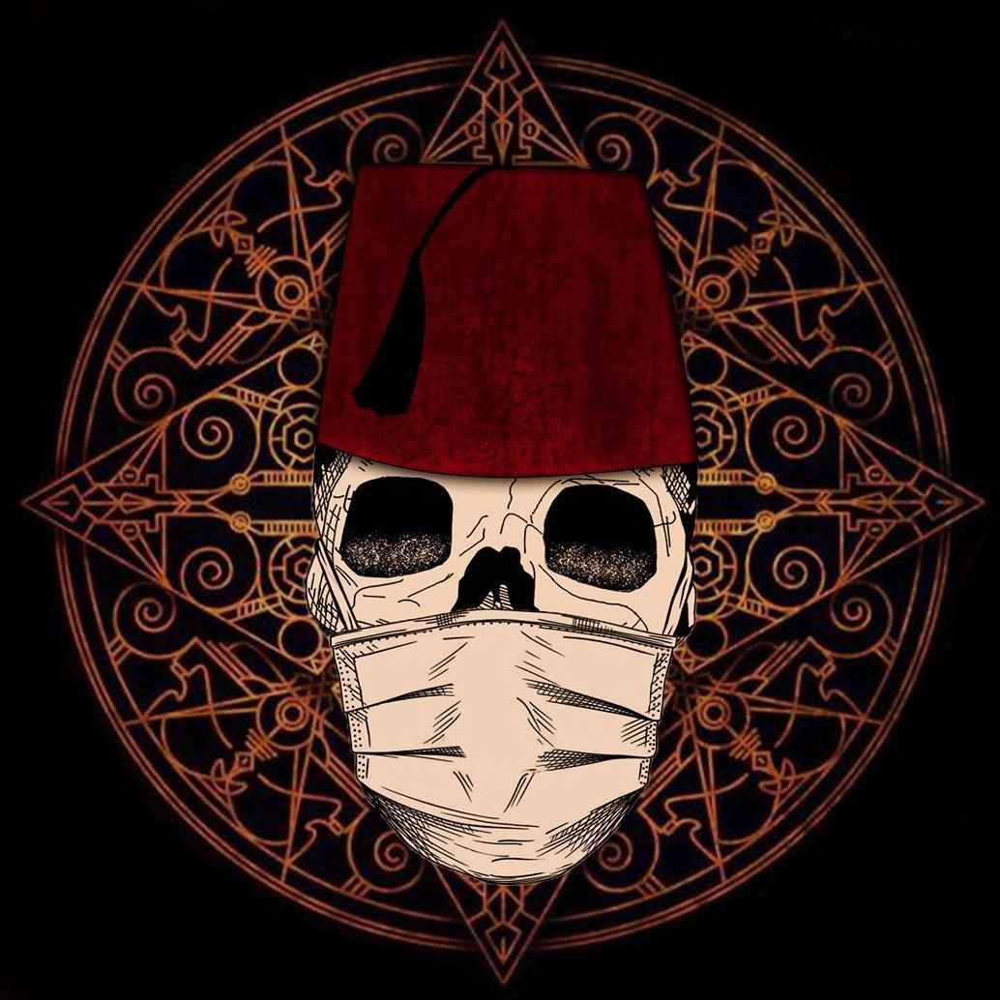
</p>

# Hack Zone CTF 2021 Writeup
This repository serves as a writeup for one of the Hack Zone CTF 2021

## Dyno

**Category:** Web
**Points:** 475
**Solves:** 3
**Author:** g0d3l
**Description:**

>Can you find Dino cheat code?

**Hint:**

> No hint.

### Write-up

When you visit the task page, you will get this page

<p align="center">
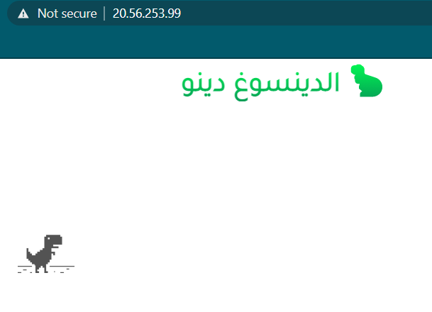
</p>

This is definitely the Dinosaur Game.

<p align="center">
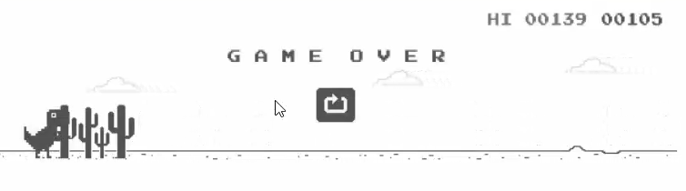
</p>

In the beginning I though we have to score the higher score and we will get the flag and I was not sure how the process is going to be done. So I looked to the source code and I found a Javascript file that is responsible for running the game:

<p align="center">
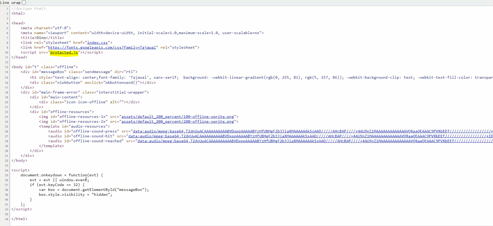
</p>

When I accessed this file, I found an obfuscated code.

<p align="center">
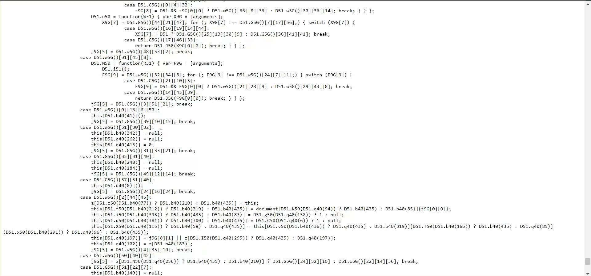
</p>

This sounds to be interesting especially when we play the game, we don't see any network communication with any other web page. So the flag is basically in the obfuscated Javascript code.

I tried to look at the code in order to understand how the game is loaded and then to follow where the flag can be but I ran through a lot of trouble when I was debugging one of the variables that contained a Matrix of 57x57 elements.

So I switched to the easiest solution: "the game is known so someone should have tried to solve it before".

And here we go, I found on one of the websites from Google a way to change the score to the highest score, maybe I can see the flag somewhere. So I pasted the following commands in the web browser's console (devtool):

```
// Turn off Gameover
Runner.prototype.gameOver = function (){};
// Change the score
Runner.instance_.distanceRan = 999950 / Runner.instance_.distanceMeter.config.COEFFICIENT
```

But when the score reached to 999995, it turned back to 0 and the game was not over and nothing was done.

<p align="center">
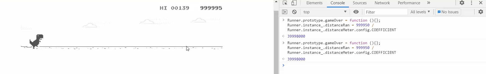
</p>

I though I made a mistake somewhere in these steps and I'm forced to go through the code anyways. So I get back to the obfuscated Javascript code.

I noticed something very important which is the strings were not located anywhere. The only strings that are available are located in a single function `L800()` and they looks not readable:

<p align="center">
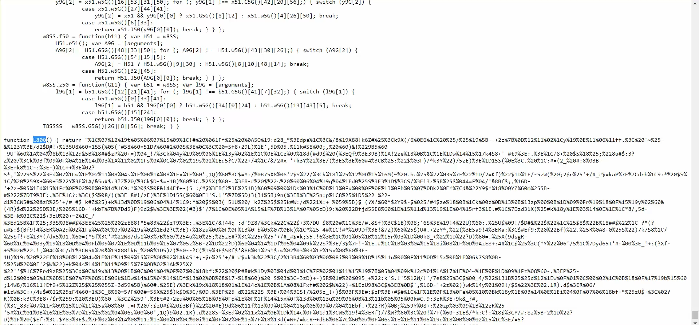
</p>

I noticed in many functions the usage of the method `q40()` with an integer as a first parameter.

<p align="center">
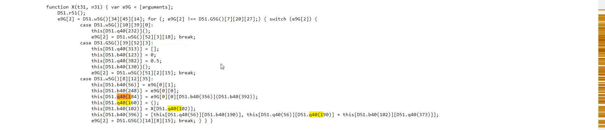
</p>
<p align="center">
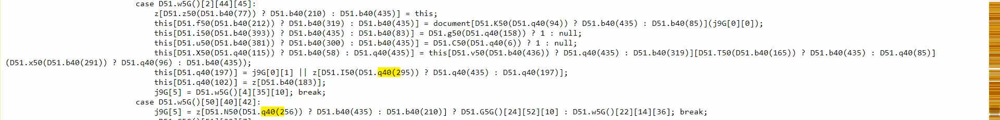
</p>
<p align="center">
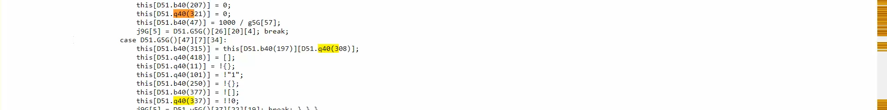
</p>
<p align="center">
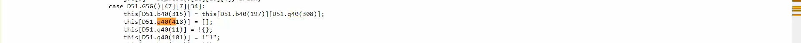
</p>
<p align="center">
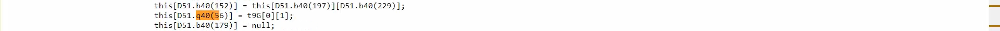
</p>
<p align="center">
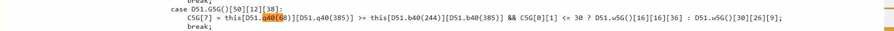
</p>
<p align="center">
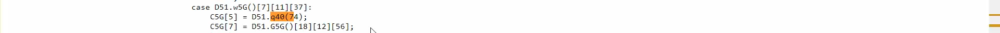
</p>
<p align="center">
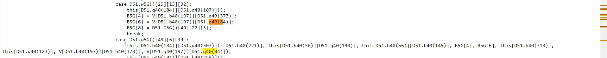
</p>
<p align="center">
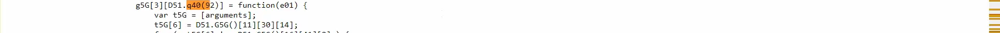
</p>

But there was 2 objects that were using this method: w8SS and D51 (the second object is a local variable that is the same as the global variable w8SS).

So if that method can show strings, we have to force it to show us all the strings.

I create a simple for loop to show all the strings in the web browser's console:

```
for(var i=0;i<1000;i++){
console.log(w8SS.q40(i));
}
```

<p align="center">
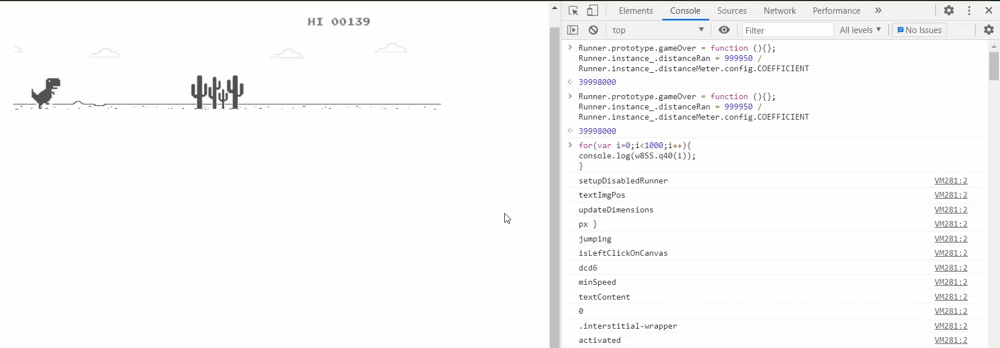
</p>

I searched then for `HZiXCTF` which is the flag format and I found it

<p align="center">
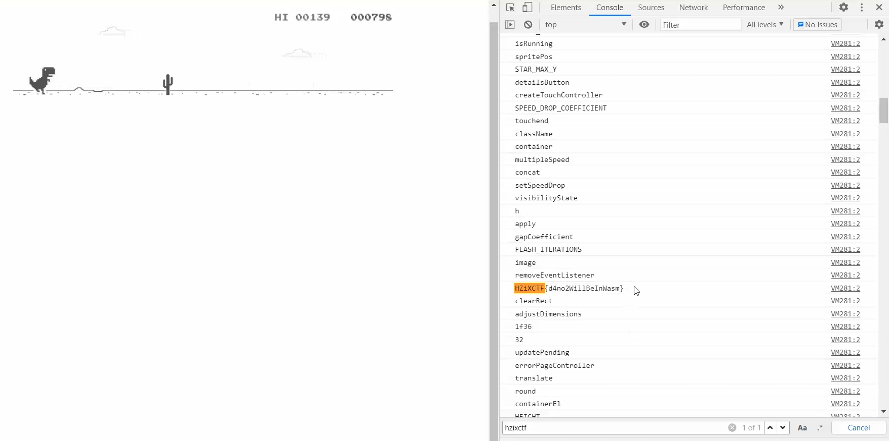
</p>

So the flag is `HZiXCTF{d4no2WillBeInWasm}`.

[Video Demo on Youtube](https://www.youtube.com/watch?v=N6R0XNwLYpw):

[](https://www.youtube.com/watch?v=N6R0XNwLYpw)

___


# Scoreboard

The CTF was published on [majorleaguecyber website](https://www.majorleaguecyber.org/events/424/hack-zone-tunisia-2021).
I participated with my team `S3c5murf` (4 participants) and we got ranked 3/42

<p align="center">
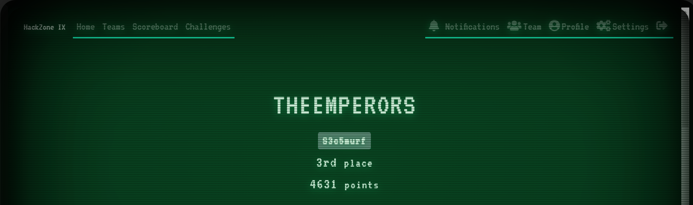
</p>
<p align="center">
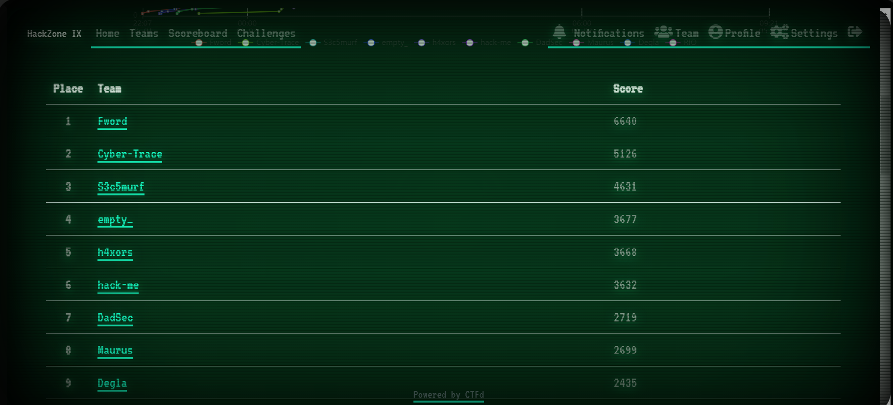
</p>
<p align="center">
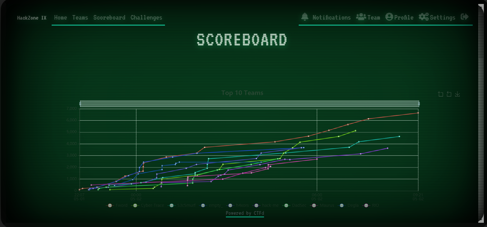
</p>
<p align="center">
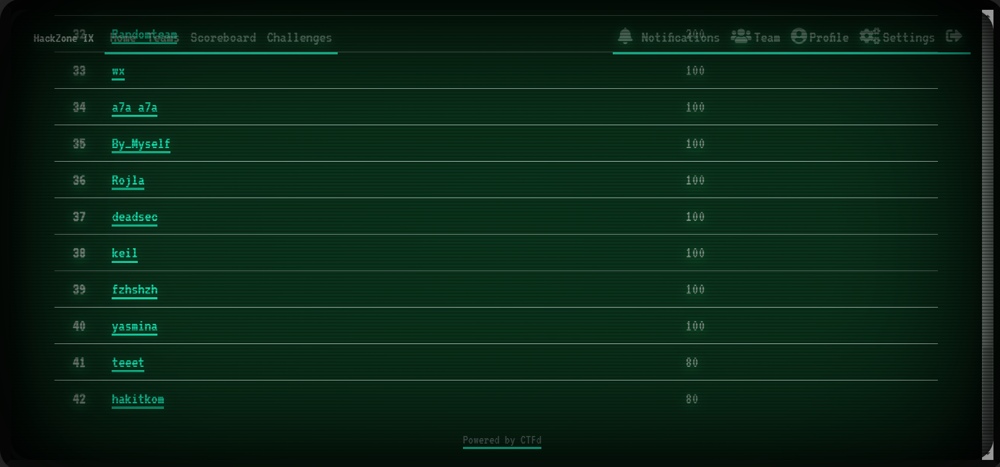
</p>
