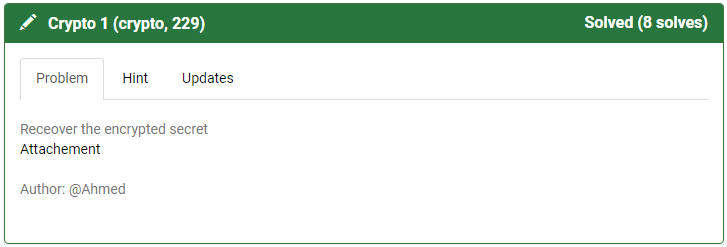
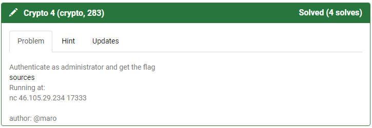

<p align="center">

</p>

# Hackfest Tunisia CTF 2018 Writeup
This repository serves as a writeup for Hackfest Tunisia CTF 2018 which are solved by Zhonya team

## Crypto 1

**Category:** Crypto
**Points:** 229
**Author:** Ahmed
**Description:**

>Receover the encrypted secret 
>(Attachement)[resources/crypto-229-crypto_1/crypto1.zip]


**Hint:**

> No hints

<p align="center">

</p>

### Write-up
After downloading and uncompressing the [crypto.zip](resources/crypto-229-crypto_1/crypto1.zip) file, we found a [python script](resources/crypto-229-crypto_1/crypto1.py) that we print an encrypted flag.

So we tried to reverse it and we got this [python script as a solution](resources/crypto-229-crypto_1/solution.py)

We executed this script and we got the flag:
```
chmod +x solution.py
./solution.py
```

Output:
```
hackfest{1119766327_2943342771}
```

To be sure that this is the flag, you can try running the crypto1.py script after setting ```x=[1119766327,2943342771]``` in the main block. And you have to get the same input as the task output.

So the flag is ```hackfest{1119766327_2943342771}```.
___


## Crypto 4

**Category:** Crypto
**Points:** 283
**Author:** maro
**Description:**

>Authenticate as administrator and get the flag
>(sources)[resources/crypto-283-crypto_4/crypto4.zip]
>Running at: 
>nc 46.105.29.234 17333


**Hint:**

> No hints

<p align="center">

</p>

### Write-up
In this task, we have the source code of a remote server which register or authenticate a user.

We should authenticate as an administrator user but we can't register using a username which have a length greater than 9 characters.

So, actually the best solution is to try solving this task locally, then we solve it remotely.

We found that in the register phase, the server encodes the username in hexdecimal encoding and it append the hash(secret_salt+username) as a user token.

And in the login phase, the server read the generated token and verify if the hash is correct or not by calculating it every time using the same salt and the username set in the token.

But we can't register the administrator user. So what to do ?

The exploit should be done in the login phase.

We tried to register an empty user in the remote server and we tried to crack the hash but it didn't work because the salt is too long.

So after reading some documents we found that the sha256() function is vulnerable to length extension attack. So we can generate the administrator token after generating its hash without registring it and without knowing the salt.

Very intresting ! Let's create our [shell/python exploit](resources/crypto-283-crypto_4/solution.sh)

We tried executing this script locally using the ```python server.py``` command in the begining of the script. And it successfully worked:
```
chmod +x solution.sh
./solution.sh
```

Output:
```
Cloning into 'hlextend'...
remote: Counting objects: 11, done.
remote: Compressing objects: 100% (8/8), done.
Unpacking objects: 100% (11/11), done.
remote: Total 11 (delta 3), reused 11 (delta 3), pack-reused 0
Checking connectivity... done.
What do you want to do?
[1] Register
[2] Login
Enter your choice: Enter your token: Invalid Token!
Closing connection.
What do you want to do?
[1] Register
[2] Login
Enter your choice: Enter your token: Invalid Token!
Closing connection.
What do you want to do?
[1] Register
[2] Login
Enter your choice: Enter your token: Invalid Token!
Closing connection.
What do you want to do?
[1] Register
[2] Login
Enter your choice: Enter your token: Invalid Token!
Closing connection.
What do you want to do?
[1] Register
[2] Login
Enter your choice: Enter your token: Invalid Token!
Closing connection.
What do you want to do?
[1] Register
[2] Login
Enter your choice: Enter your token: Invalid Token!
Closing connection.
What do you want to do?
[1] Register
[2] Login
Enter your choice: Enter your token: Invalid Token!
Closing connection.
What do you want to do?
[1] Register
[2] Login
Enter your choice: Enter your token: Invalid Token!
Closing connection.
What do you want to do?
[1] Register
[2] Login
Enter your choice: Enter your token: Invalid Token!
Closing connection.
Cloning into 'hlextend'...
remote: Counting objects: 11, done.
remote: Compressing objects: 100% (8/8), done.
Unpacking objects: 100% (11/11), done.
remote: Total 11 (delta 3), reused 11 (delta 3), pack-reused 0
Checking connectivity... done.
What do you want to do?
[1] Register
[2] Login
Enter your choice: Enter your token: Invalid Token!
Closing connection.

... (repeated output of invalid token)

What do you want to do?
[1] Register
[2] Login
Enter your choice: Enter your token: Welcome test▒padministrator!
Here's the flag: [REDACTED]
Closing connection.
What do you want to do?
[1] Register
[2] Login
Enter your choice: Enter your token: Invalid Token!
Closing connection.

... (repeated output of invalid token)

What do you want to do?
[1] Register
[2] Login
Enter your choice: Enter your token: Invalid Token!
Closing connection.
```

Next, we did the same in the server using the ```nc``` command in the begining of the script and it also worked after 15 attemps.

And then, we get the real flag.


# Scoreboard

This is the scoreboard and the ranking for the first 20 teams in this CTF :

Summary:

<p align="center">

</p>

Detailed :

<p align="center">

</p>
<p align="center">

</p>

If you need the Json file of the scoreboard, you can find it [scoreboard/jsonAdvanced.json](here)

