

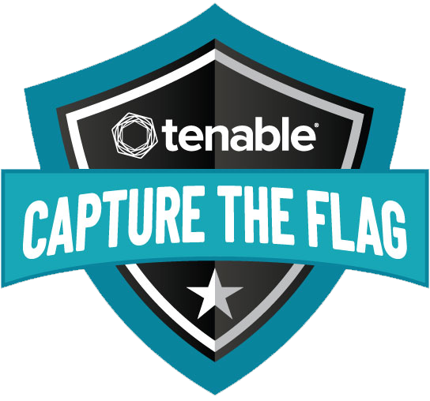

# Tenable CTF 2021 Writeup
This repository serves as a writeup for Tenable CTF 2021

## The ultimate mutant marvel taem-up

**Category:** Tenable
**Points:** 25
**Description:**

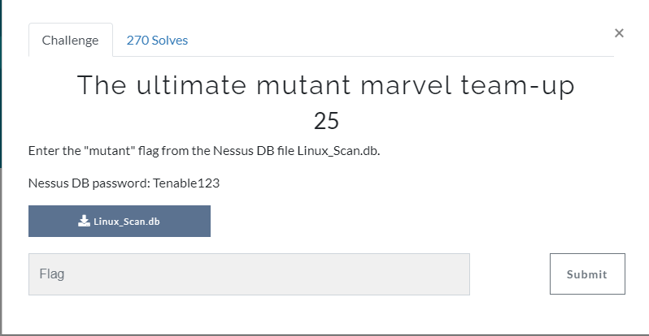

File: [resources/tenable-25-the_ultimate_mutant_marvel_team_up/Linux_Scan.db](Linux_Scan.db)

### Write-up
In this task, we need  to install Nessus scanner and use it to read the encrypted database, so I've installed its community version (free with a trial version).

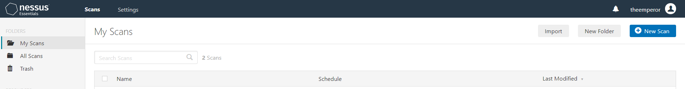

In the main page, there was an "Import" button that I've used to upload the Nessus Database "Linux_Scan.db" with the required password.

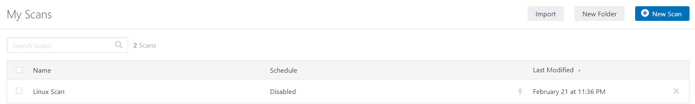

And that's how we got the scan results called "Linux Scan". When we access this scan:

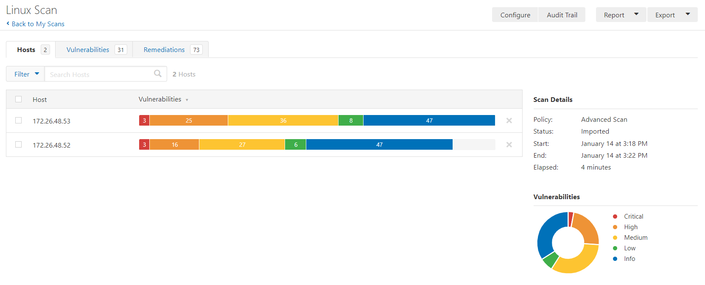

I tried to search for the flag in the Filter input but I wasn't be able to find it.

But I found something that could be interesting which is the Export button:

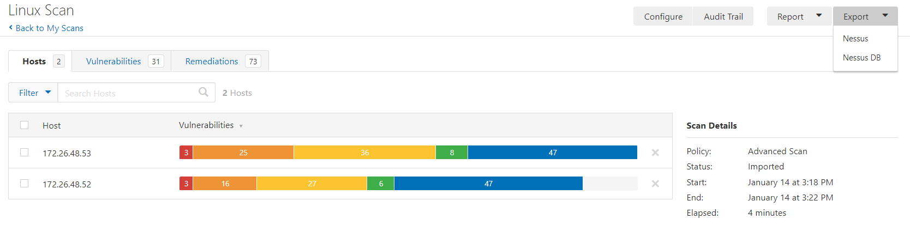

We know that the file that we've imported was a Nessus DB but what about the Nessus export?

After I exported the file and I downloaded it I got a text file [resources/tenable-25-the_ultimate_mutant_marvel_team_up/Linux_Scan_uuo914.nessus](Linux_Scan_uuo914.nessus) which contains the flag.

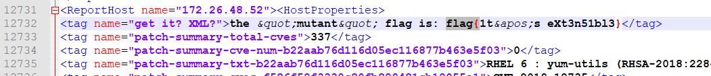

The flag contains an encoded HTML character which is the "'".

So the flag is ``flag{1t's eXt3n51bl3}``.

_____

## Knowledge is knowing a tomato is a fruit

**Category:** Tenable
**Points:** 25
**Description:**

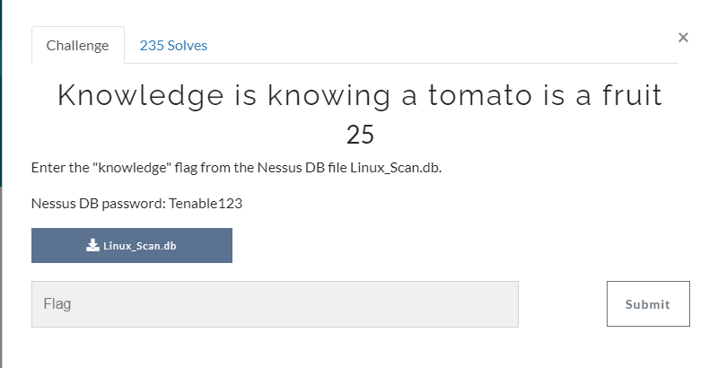

File: [resources/tenable-25-the_ultimate_mutant_marvel_team_up/Linux_Scan.db](Linux_Scan.db)

### Write-up
This is the continuity of the previous task.

In this task, I tried to download the scan results for the host `172.26.48.53` using the "Download" link:

I searched for the flag in the downloaded .txt [resources/tenable-25-knowledge_is_knowing_a_tomato_is_a_fruit/kb_172.26.48.53.txt](kb_172.26.48.53.txt) file and I found it:

So, the flag is ``flag{bu7 n07 putt1ng 1t 1n 4 fru17 s@l4d, th@t5 W1SD0M}``.
___

# Scoreboard

In this CTF, we played as a team ``S3c5murf`` with [Likkrid](https://twitter.com/RidhaBejaoui1) and [v3rlust](https://twitter.com/dal0ul) and we got ranked 100th/1762:

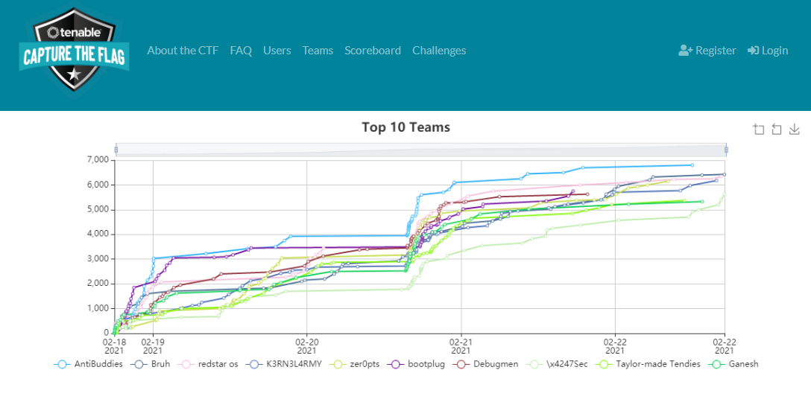

...

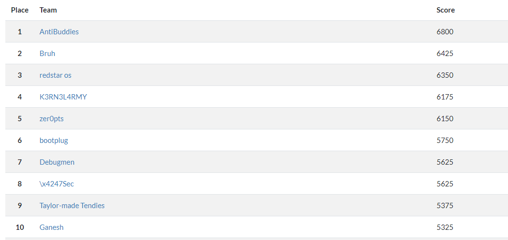

...

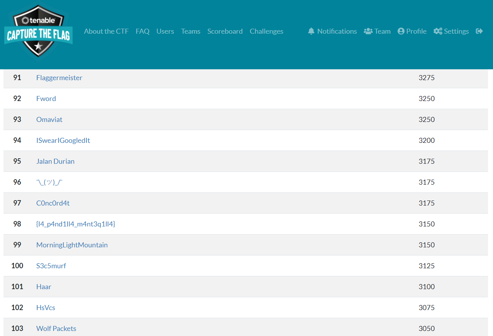

The tasks that I've solved

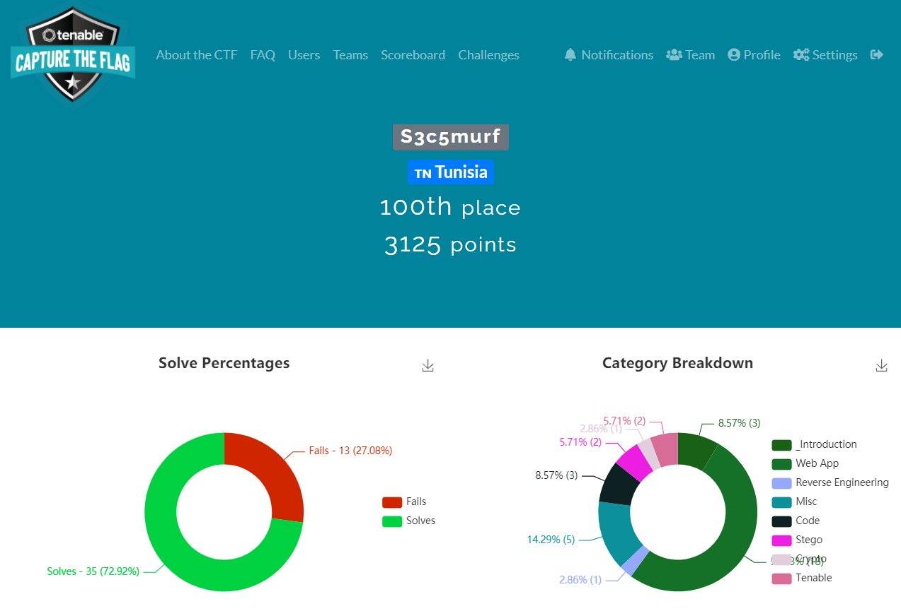

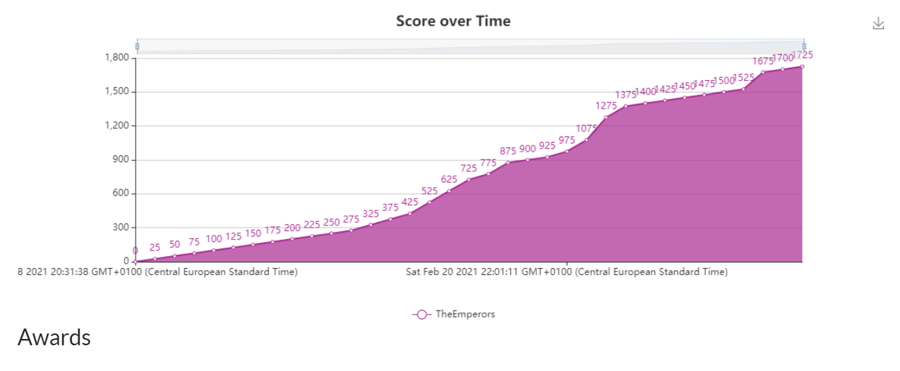

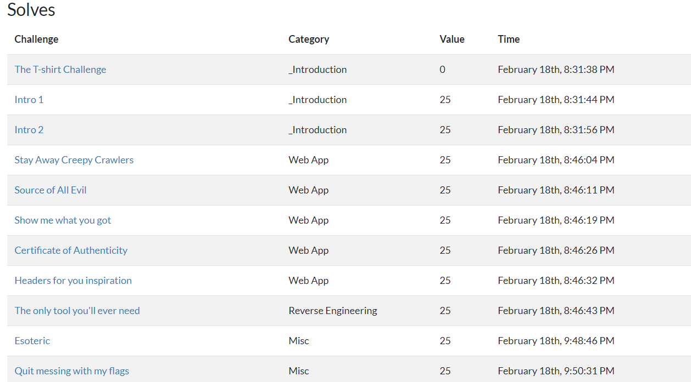

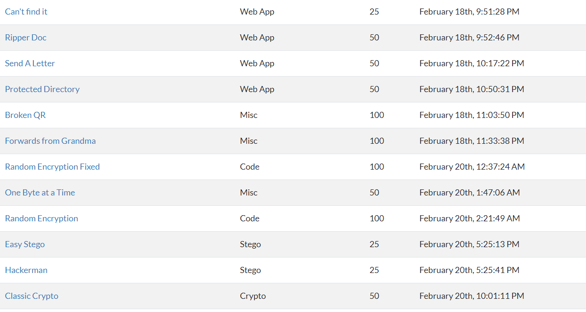

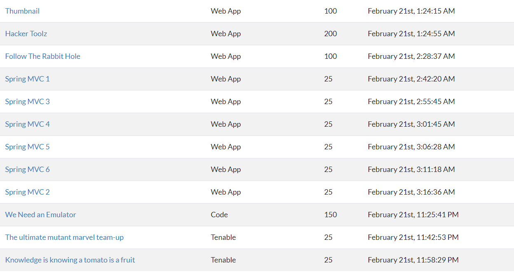

All the tasks that we've solved and we didn't solved as a team:

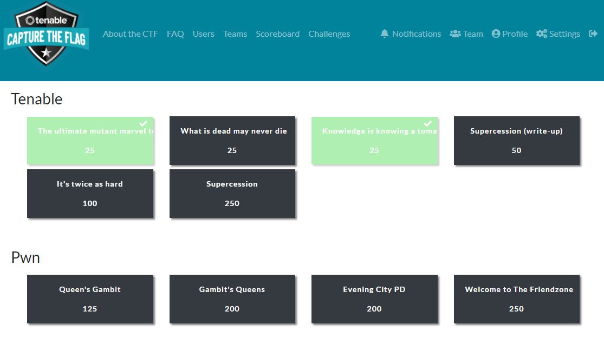

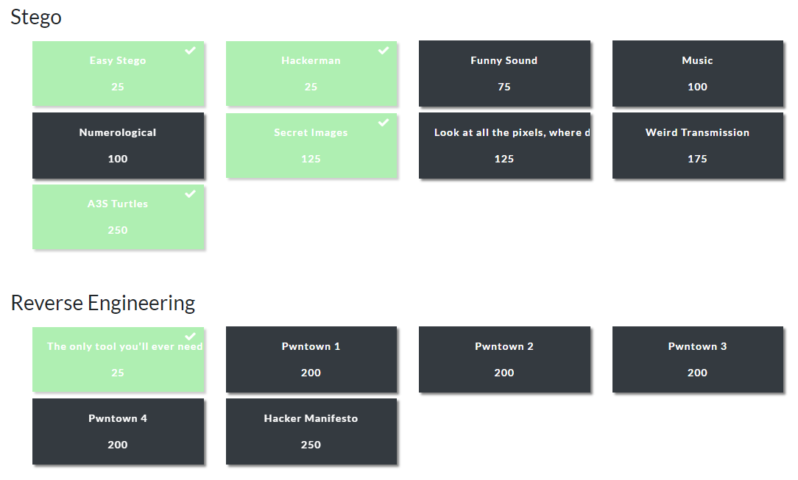

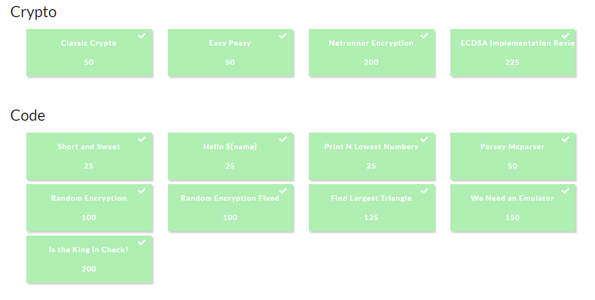

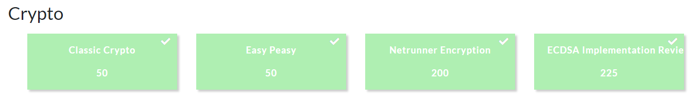

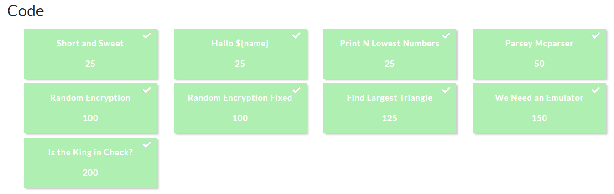

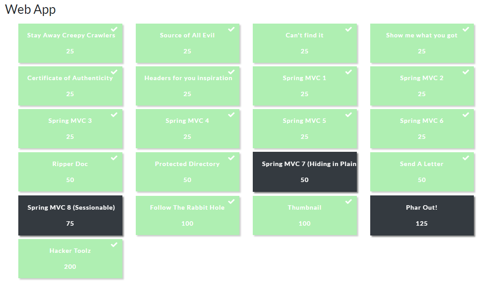

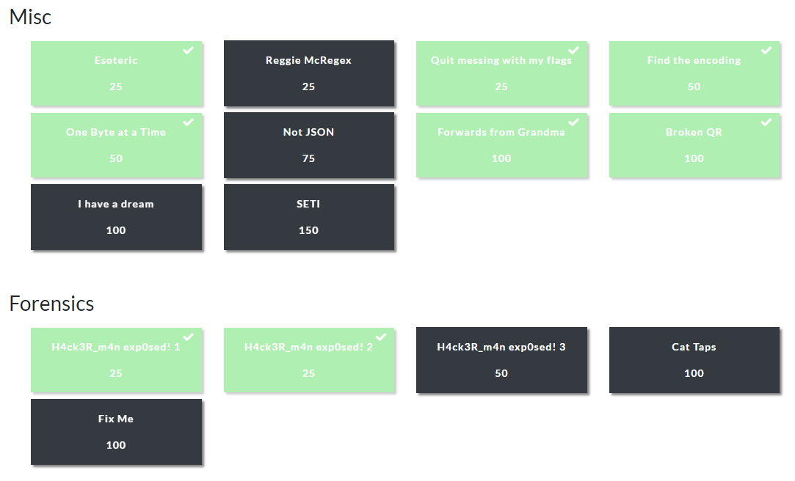

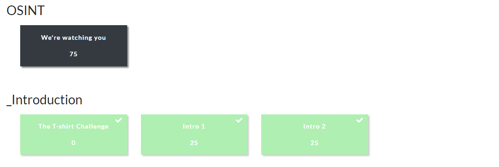

CTFTime event: [https://ctftime.org/event/1266](https://ctftime.org/event/1266)
